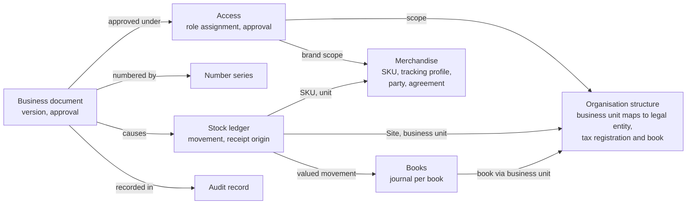
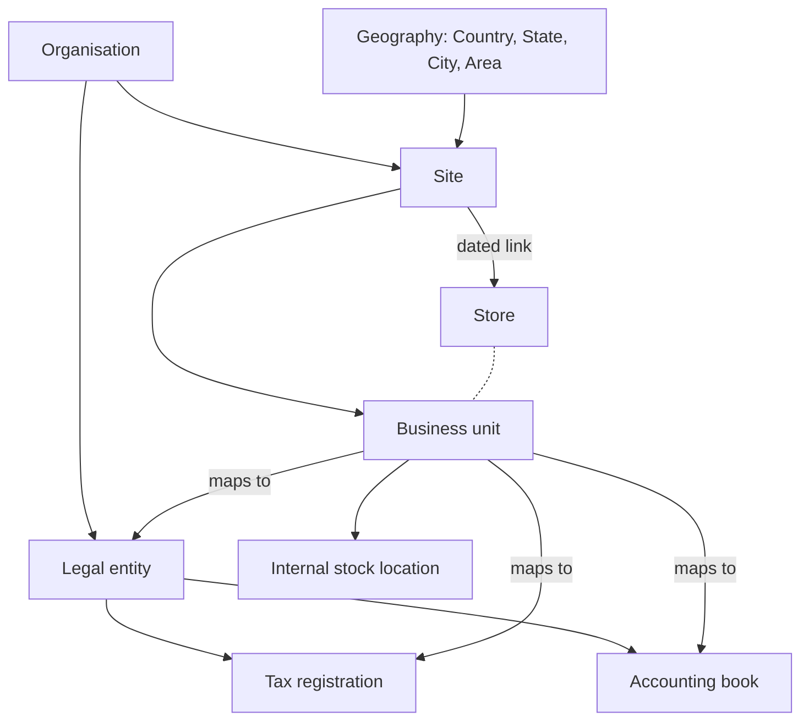

# Domain model

> **Rank 3 of 4: design.** Must not contradict the PRD or the KDPS policies. See [README.md](../../README.md).

Status: **Current**, 3 Oct 2026. If this document disagrees with [prd.md](../../prd.md) or [kdps-policies.md](../../kdps-policies.md), they win. Raise the clash; do not guess.

Implements these PRD sections: Organisation, sites and ownership; People, access and approvals; Merchandise and identifiers; Source conversion and imports; Module and data boundaries; and, for the stage 1 records only, Ledger and official books, Exceptions, reports and planning, Opening, closure, migration and export, and Offline counter. Other sections are outlined (section 2).

- PRD IDs: `PRD-ORG-001`–`PRD-ORG-016`, `PRD-ORG-018`, `PRD-ORG-020`, `PRD-ORG-021`; `PRD-ACS-001`–`PRD-ACS-023`; `PRD-MER-001`–`PRD-MER-018`; `PRD-IMP-001`–`PRD-IMP-013`; `PRD-BKG-004`; `PRD-REC-008`, `PRD-REC-013`, `PRD-REC-017`; `PRD-PTW-001`, `PRD-PTW-006`, `PRD-PTW-010`; `PRD-STK-012`; `PRD-TRF-005`, `PRD-TRF-010`; `PRD-DMG-002`; `PRD-POS-003`, `PRD-POS-016`, `PRD-POS-020`; `PRD-RET-010`, `PRD-RET-017`; `PRD-OFR-001`, `PRD-OFR-002`, `PRD-OFR-011`; `PRD-LED-001`–`PRD-LED-005`, `PRD-LED-009`, `PRD-LED-014`, `PRD-LED-015`, `PRD-LED-019`, `PRD-LED-020`; `PRD-CSH-011`; `PRD-PAY-006`; `PRD-FRN-007`; `PRD-EXC-001`–`PRD-EXC-003`; `PRD-LIF-001`–`PRD-LIF-003`, `PRD-LIF-009`–`PRD-LIF-011`, `PRD-LIF-015`, `PRD-LIF-017`, `PRD-LIF-019`–`PRD-LIF-021`, `PRD-LIF-029`; `PRD-MOD-001`, `PRD-MOD-004`, `PRD-MOD-008`–`PRD-MOD-015`; `PRD-INT-001`, `PRD-INT-002`, `PRD-INT-004`–`PRD-INT-008`; `PRD-OFF-001`–`PRD-OFF-005`, `PRD-OFF-010`; `PRD-SEC-001`, `PRD-SEC-004`–`PRD-SEC-008`, `PRD-SEC-011`, `PRD-SEC-014`, `PRD-SEC-017`, `PRD-SEC-018`; `PRD-ACP-013`, `PRD-ACP-019`.
- Policies: 1 (`POL-01.01`–`POL-01.11`, `POL-01.14`), 2 (`POL-02.01`–`POL-02.04`, `POL-02.06`–`POL-02.13`, `POL-02.15`–`POL-02.23`), 3 (`POL-03.04`), 4 (`POL-04.01`–`POL-04.05`, `POL-04.08`, `POL-04.09`), 5 (`POL-05.02`, `POL-05.03`, `POL-05.09`), 7 (`POL-07.01`, `POL-07.05`, `POL-07.06`, `POL-07.09`), 9 (`POL-09.02`, `POL-09.10`–`POL-09.13`, `POL-09.19`, `POL-09.21`, `POL-09.23`), 10 (`POL-10.01`, `POL-10.06`–`POL-10.08`), 13 (`POL-13.05`), 14 (`POL-14.05`, `POL-14.07`), 16 (`POL-16.07`), 17 (`POL-17.02`, `POL-17.04`, `POL-17.07`, `POL-17.11`), 18 (`POL-18.05`), 19 (`POL-19.03`).
- Decisions: DEC-001, DEC-004, DEC-005, DEC-031, DEC-036, DEC-037, DEC-039, DEC-041, DEC-042, DEC-054, DEC-087, DEC-092, DEC-093, DEC-094, DEC-095, DEC-096, DEC-097, DEC-098, DEC-100, DEC-101, DEC-105, DEC-106, DEC-107, DEC-116.

Depends on: [module-map.md](module-map.md) (which module owns each record), [stock-ledger.md](../stock/stock-ledger.md) (the stock records; not repeated here), [personas.md](../access/personas.md) (user, persona, role, role assignment), [design-language.md](../ui/design-language.md) section 7 (the settled state names).

Used by: [structure-and-masters.md](../masters/structure-and-masters.md) (GC-2), [access-and-approvals.md](../access/access-and-approvals.md) (GC-3), [numbering-and-audit.md](../platform/numbering-and-audit.md) (GC-5), the other stage 1 designs in [gaps-before-code.md](../../history/gaps-before-code.md), and all code.

---

## 1. Conventions

This document names the records, how they relate, how they live and what must always be true of them. It is conceptual: it fixes no table, column, key or index. Those belong to the area designs and to reviewed migrations.

Labels (**design choice**, **Proposed**, **OPEN**) mean what [module-map.md](module-map.md) section 1 says.

| Convention | Rule | IDs |
| --- | --- | --- |
| Identity | Every record has a UUIDv7 internal identifier. A record people refer to also has a business code, unique within a stated scope. A name is a label and can change. The scope given for each code in section 3 is a **design choice** unless an ID sets it | `PRD-MOD-008` |
| Identity is kept | A business identity is never reused, including after closure, restore or export | `PRD-ACP-019`, `PRD-LIF-020` |
| Three times | Event time and recording time, both timezone-aware, and an explicit business date under the Organisation's timezone | `PRD-MOD-009` |
| Effective dating | A configured record has versions with effective dates. Versions in one scope never overlap. A transaction keeps the version it used. History is kept | `PRD-MOD-010`, `PRD-ACS-005` |
| Append-only | Official document payloads and posted stock and accounting entries are never updated or deleted. A correction, reversal or lifecycle change is its own linked, attributable record. Status projections are separate and rebuildable | `PRD-MOD-011`, `PRD-ACS-014` |
| Versions and approval | An approval binds to the exact document version, and to the source, destination, items, quantity, amount and beneficiary as they apply. A material change needs renewed approval | `PRD-ACS-007`, `POL-02.12` |
| Money | Integer paise for INR; the configured integer minor unit for another enabled currency. Explicit currency, units and rounding rules | `PRD-MOD-014`, `PRD-MOD-015` |
| Unknown | An unknown value stays Unknown, distinct from zero (`PRD-MOD-015`, `PRD-MER-005`). It never counts as zero in an approval (`PRD-ACS-016`). Totals leave it out and say so (stock-ledger 7.6) | `PRD-MOD-015`, `PRD-ACS-016`, `PRD-MER-005` |
| Nothing invented | No value, threshold, rate, account, approver or date appears here unless a cited source sets it. Each gap is OPEN with its owner | `AGENTS.md`: "Never invent a value" |

**Kinds of record.** A **design choice** of vocabulary, used below.

| Kind | Behaviour | Examples |
| --- | --- | --- |
| Master | Effective-dated versions; changed through an approved edit; history kept. A version never starts on a past date (GC2-7, DEC-105) | Site, SKU, agreement, role assignment |
| Document | Drafted, submitted, approved under its exact version; its official payload is then frozen; corrected by linked records | PT, booking, transfer, bill |
| Entry | Append-only; undone only by a linked entry | Movement, journal, audit record |
| Status record | Append-only status on something else | Hold, reservation, coverage, acceptance |
| Projection | Rebuildable from entries; never the source of truth | Stock balance, My work list |
| Setting | An effective-dated configured value with no default | Approval limit, posting map |

**State names.** A record shows one lifecycle state, and the names are the settled list in [design-language.md](../ui/design-language.md) section 7, including those the baseline added (DM-4, DEC-105). A new name needs a design review there.

## 2. The whole system in outline

Each module's core records, one line each. Stage 1 records are detailed in section 3. Later records are detailed in their own designs.

| Module · part | Core records | Stage |
| --- | --- | --- |
| `organisation` | Organisation; legal entity; tax registration; accounting book (identity); Site; Store; business unit and its mapping; internal stock location; geography; grouping; route | 1 |
| `access` | User; credential; session; device; service identity; persona held; role; permission; role assignment; approval rule; approval limit; stand-in grant; approval request; approval decision; approval use | 1 |
| `configuration` | Organisation setting; policy status; capability control; activity grant | 1 |
| `audit` | Audit record; access record | 1 |
| `numbering` | Number series; allocation | 1 |
| `files-imports` | Stored file; attachment; layout; mapping; mapping rule and proposal; import batch; staged row; row issue; import outcome | 1 |
| `inbox` | Work item | 1 |
| `notifications` | Message request; template; delivery outcome | See [module-map.md](module-map.md) 4.9 |
| `ai-gateway` | AI request record | 2 (MM-14, DEC-105) |
| `merchandise` · catalogue | Brand; category; style; SKU; size set; attribute and vocabulary; external code mapping; unit and pack conversion; tracking profile; product proposal; vocabulary proposal | 1 |
| `merchandise` · parties | Party; agreement and its terms | 1 |
| `exceptions` | Exception | 1 |
| `finance` · books | Chart of accounts; account; cost-centre dimension; financial period; journal and lines; posting map; cost setting per book | 1 |
| `finance` · tax rules | Goods classification; rate and value rule; registration applicability; price basis; rounding rule | 1 (shape) |
| `stock` · ledger | Movement; receipt origin; piece; balance; coverage; acceptance; hold; reservation; cost pool; cost layer ([stock-ledger.md](../stock/stock-ledger.md)) | 1 (rules) |
| `site-lifecycle` | Readiness record (1); opening manifest, switch record (4); closure record, relocation link, export (5) | 1, 4, 5 |
| `merchandise` · PT | PT; PT revision and lines; costing profile; label job | 2 |
| `booking` | Booking and lines; open-to-buy budget; supplier confirmation | 2 |
| `receiving` | Arrival; receipt count; GRN; discrepancy; acceptance; inbound ownership record (MM-7, DEC-105) | 2 |
| `stock` · documents | Damage report; transfer and dispatch; count and recount; adjustment; write-off; disposal | 2–3 |
| `supplier-returns` | Return right and deadline; proposed return list; RTV and its shipments; supplier claim | 3 |
| `pos` | Billing device; offline authority; till session; cart; bill and lines; tender allocation; payment attempt; return and exchange; refund; billed-retained record; customer; Store credit; Gift voucher; loyalty balance | 4 |
| `ebo-imports` | Earlier-POS import; EBO report import; applied sale and return | 2, 4 |
| `offers` | Offer; combination rule; price list; markdown | 4 |
| `finance` · operations | Supplier invoice and match; Store day close; cash movement; payable; payment run; receivable; bank line and match; provider settlement; tax document; Tally voucher exchange; fixed asset; net-asset-value snapshot | 2, 4, 5 |
| `partners` | Partner; partner agreement; partner ledger; statement | 5 |
| `hr` | Employee; attendance event; roster; leave; target; incentive calculation; payroll run | 6 |
| `planning` | Forecast run; proposal and its outcome | 6 |
| `reports` | Metric definition; report read model; export | Every |

How the main stage 1 records hang together:

## 3. Stage 1 records in full

### 3.1 Organisation structure

Owner: `organisation`. `PRD-ORG-001`–`PRD-ORG-013`, `PRD-ORG-020`, `PRD-ORG-021`. The eight records of `PRD-ORG-001` are kept separate.

The Organisation contains its legal entities, Sites and books (`PRD-ORG-002`, `PRD-MOD-001`). Each tax registration and each accounting book belongs to one legal entity (`PRD-ORG-020`, DEC-095). Fields, codes, versions and tables are in [structure-and-masters.md](../masters/structure-and-masters.md) (GC-2).

| Record | What it is | Identity | Relationships | IDs |
| --- | --- | --- | --- | --- |
| Organisation | An independent retail business group. Its data is isolated from other Organisations | One per database | Contains its legal entities, Sites and books | `PRD-ORG-002`, `PRD-MOD-001` |
| Legal entity | A registered company or other legal person with its own statutory and accounting identity | Code, unique in the Organisation | — | PRD "Words used"; `PRD-ORG-001` |
| Tax registration | A tax registration. The PRD keeps it as its own record and defines it no further | Code, unique in the Organisation | Belongs to exactly one legal entity, fixed at creation | `PRD-ORG-001`, `PRD-ORG-005`, `PRD-ORG-020` |
| Accounting book | A book with its own ledger. The identity is here; the ledger is in `finance` · books | Code, unique in the Organisation | Belongs to exactly one legal entity, fixed at creation | `PRD-ORG-001`, `PRD-LED-001`, `PRD-LED-002`, `PRD-ORG-020` |
| Site | A physical place with a permanent identity | Site code, unique in the Organisation, permanent | Sits in one Area. Has a physical kind | `PRD-ORG-003`, `PRD-ORG-007`, `PRD-ORG-009` |
| Store | A trading business at a Site, with its own code, name and history | Store code, unique in the Organisation | At one Site on any date, through an effective-dated link; several Stores may trade at one Site. Has a format and an operating model. May have partner associations | `PRD-ORG-003`, `PRD-ORG-008`–`PRD-ORG-010`, `PRD-ORG-021` |
| Business unit | The whole Store, or one of several operating units at a Site. Offices and warehouses also have business units | Unit code, unique in the Organisation | At one Site. Is a whole Store, part of a Store, or a unit of an office or warehouse. A brand counter inside the Organisation's own Store is a unit of that Store. Maps to one legal entity, one tax registration and one accounting book at a time | `PRD-ORG-004`–`PRD-ORG-006`, `PRD-ORG-021` |
| Internal stock location | Floor, backstore, zone, rack, bin, fixture, display or alteration location | Code, unique in its Site | Inside one Site, and belongs to one business unit at that Site (DM-9, settled in GC-2) | `PRD-ORG-012` |
| Geography | Country → State → City → Area → Site | Code per level | A Site sits in one Area | `PRD-ORG-007` |
| Grouping | A region, a cluster or another configurable grouping | Code, unique in the Organisation | The PRD does not say what a grouping groups. Offers apply by Store or group (`PRD-OFR-001`) | `PRD-ORG-007` |
| Route | A Store's default warehouse for replenishment and returns, and other authorised routes | — | From a Store to its default warehouse; the other authorised routes are OPEN (V-62) | `PRD-ORG-013` |

Rules:

- **The mapping is explicit and dated.** Each business unit maps to its legal entity, tax registration and accounting book; the registration and the book must belong to that legal entity (`PRD-ORG-020`). The mapping is never inferred from the Site (`PRD-ORG-005`, `POL-10.01`). The registration must also be in the State of the unit's Site; the mapping check compares them (GC2-1, DEC-105). The mapping is effective-dated, and each transaction keeps the mapping it used (`PRD-MOD-010`, `PRD-ACP-013`).
- **Units at one Site may differ.** Two business units at one Site can map to different entities, registrations and books; a transaction uses its own unit's mapping (`PRD-ORG-005`, `PRD-ACP-013`).
- **Brand coverage by unit kind.** Whole-store and warehouse units can cover several brands; a brand-counter unit covers one brand; an office unit needs no brand (`PRD-ORG-006`).
- **Five things kept independent** on Sites and Stores: physical Site kind, Store format, operating model, inventory ownership and settlement terms (`PRD-ORG-009`). Supported kinds and formats are those in `PRD-ORG-010`; a Site where Stores trade is a retail site (GC2-3, DEC-105).
- **Not locations.** Damage, holds and transit are stock and custody conditions. They never appear as a Site or a location (`PRD-ORG-012`).
- **Names can change; the place cannot.** Renaming never replaces the physical identity. Relocation creates a new linked Site (`PRD-LIF-021`); the Store keeps its code, name and history, and its Site link moves to the new Site (`PRD-LIF-029`). Its business units do not move: it gets new units at the new Site, linked to its old ones, and stock moves between them by transfer (GC2-4, DEC-105). Aliases are kept (`PRD-ORG-008`).
- **Lifecycle.** A Site and a Store carry opening and closing dates and a status (`PRD-ORG-008`). A business unit's activities are enabled through readiness (`PRD-LIF-001`). The events are: created; each activity (receiving, movement, selling) granted after its readiness approval (`PRD-LIF-001`, section 3.6); closure started, which stops new operations (`PRD-LIF-017`); retired, only when every outstanding item is resolved (`PRD-LIF-019`); reopened, only with fresh readiness, mapping and access approval (`PRD-LIF-020`). Identity and history stay after closure. The states of a Site, Store and business unit are Setting up, Active, Closing and Closed (DM-4, DEC-105).
- **OPEN:** KDPS's real structure, registrations and mappings (V-18, `POL-10.06`, `POL-10.08`); routes (V-62). The structural points DM-2 and DM-3 are settled (DEC-095, DEC-096, DEC-105).

### 3.2 People, access and approvals

Owner: `access`. `PRD-ACS-001`–`PRD-ACS-008`, `PRD-ACS-011`, `PRD-ACS-012`, `PRD-ACS-015`–`PRD-ACS-023`; policy 2; [personas.md](../access/personas.md).

| Record | What it is | Identity | Relationships and rules | IDs |
| --- | --- | --- | --- | --- |
| User | One person: one login and one My work | Login identifier, unique in the Organisation | Belongs to one Organisation; a person serving several holds a user in each (`PRD-ACS-020`). Holds personas and role assignments. Customers and suppliers are not users | personas.md 1, 4 |
| Credential | The password and the configured second factor | — | A secret: kept out of logs. Production needs authenticator-app TOTP | `PRD-SEC-001`, `PRD-SEC-014`, `POL-02.17` |
| Session | A signed-in period on a device | — | Idle lock and absolute limit; unfinished work is preserved when it locks or ends. Can be Revoked | `PRD-ACS-017`, `POL-02.18`, `PRD-SEC-008` |
| Device | A registered device | Device code, unique in the Organisation | Can be Revoked. A cloned or restored device cannot continue the identity. Billing facts are in `pos` | `PRD-SEC-008`, `PRD-OFF-010` |
| Service identity | A non-human actor | Code, unique in the Organisation | Its own audit identity, scoped credentials, least privilege; no screens | `PRD-SEC-018` |
| Persona held | One of the 14 personas, held by a user | Persona ID (P-OWN … P-AUD) | Sets home screens, menus and summaries. Grants nothing | `PRD-ACS-002`, `PRD-ACS-003` |
| Role | A named set of permissions | Role code, unique in the Organisation | KDPS starts from eleven editable templates; a template label grants nothing | `POL-02.01` |
| Permission | One action on one kind of record, or one restricted field | — | Broad labels are expanded into explicit view, create, edit, approve, cancel, export and override. Sensitive fields are controlled apart from module access | `POL-02.03`, `POL-02.04`, `PRD-ACS-008` |
| Role assignment | A user, a role, a scope and effective dates | — | The only thing that grants access. A user may hold several. Each applies only inside its own scope | `PRD-ACS-001`, `PRD-ACS-004`, `PRD-ACS-005`, DEC-001 |
| Approval rule | For one action type: whether independent approval is needed, its value basis, what counts as a material change, and whether bulk or phone approval is allowed | Action type | The independently approved actions are those of `POL-02.07` | `PRD-ACS-006`, `PRD-ACS-015`, `POL-02.12`, `POL-02.19`, `POL-02.22` |
| Approval limit | For an action and an approver role inside a scope, or for a named individual: the limit and its basis | — | A missing limit grants nothing. Unlimited authority and authority over Unknown value must each be explicit | `POL-02.09`, `POL-02.15`, `PRD-ACS-016` |
| Stand-in grant | Named, scoped, time-limited authority | — | Expires by itself. A stand-in never approves their own preparation | `PRD-ACS-018`, `POL-02.20` |
| Approval request | A request to approve one document version | — | Holds the action type, the document and its exact version, the preparers (everyone who recorded a change in the version; GC3-1, DEC-105), and the value on its basis or Unknown | `PRD-ACS-007`, `PRD-ACS-015` |
| Approval decision | The approver's decision on a request | — | Holds the approver, the time, approve or reject, the reason, evidence and comment. **Design choice:** it also names the role assignment, limit or stand-in grant it relied on, so the recheck under the locks can repeat it | `PRD-ACS-010`, `PRD-ACS-013`, `POL-02.23` |
| Approval use | That one decision authorised one posting | — | Written in the posting transaction, so it commits with the stock and money records; it is the approval evidence of `PRD-INT-004`. At most one per decision (DEC-097) | `PRD-INT-004` |

**Scope.** A role assignment's scope names the legal entities, places and brands it covers (`PRD-ACS-001`, `POL-02.02`). For each, it is one of three: all members, which includes future members; selected members, which stays fixed; or empty, which grants nothing (`PRD-ACS-005`). Places form one tree: whole Sites, or single Stores or business units within a Site; a selected Site covers every Store and business unit at it, and a selected Store every business unit of it, including ones added later (`PRD-ACS-021`, DEC-094, DEC-098). Self-service uses a scope of the person's own records, through an assignment of its own role that has no other scope (`PRD-ACS-021`, `PRD-ACS-022`, DEC-041, DEC-100). The tree is built in [structure-and-masters.md](../masters/structure-and-masters.md) 3.9; scope matching, sign-in, sessions and approvals are detailed in [access-and-approvals.md](../access/access-and-approvals.md) (GC-3).

**Lifecycles.**

- Role assignment, approval limit, stand-in grant: effective-dated. A stand-in ends on its date without anyone acting.
- User: Active, Disabled or Ended (DM-4, DEC-105).
- Approval request: Awaiting approval → Approved or Rejected. A material change to the document ends the request's force, and the request is then Superseded (DM-4, DEC-105); the new version needs a new request (`PRD-ACS-007`). A request above the approver's limit moves to the next authorised eligible approver, or stays Awaiting approval; it is never approved by itself (`POL-02.09`).
- Approval decision: an entry. It is never edited. Its use by a posting is a separate entry, written in the posting transaction (DEC-097).
- Session and device: Revoked when lost.

**Rules.**

- Independent approval needs a different authorised person from the preparer. One person cannot approve their own work through another role (`PRD-ACS-006`, `POL-02.07`, `POL-02.08`).
- Routine billing and receiving inside approved rules need no extra approval (`POL-02.08`).
- A phone approval is an authenticated action bound to the exact record version (`PRD-ACS-012`).
- Partner staff are users with Store personas on their own Stores only (`PRD-FRN-007`, DEC-042).
- Role, permission, role-assignment and approval-rule changes are themselves approved by another authorised person, and who changed what is kept (`PRD-ACS-023`, `POL-02.07`, `POL-02.06`). The one exception is a new Organisation's setup step, which creates its first Admin and first approver together under a service identity (`PRD-ACS-023`, DEC-101).
- **OPEN:** all real people, roles, scopes, limits, allowlists, stand-ins and reasons (V-01, V-02, V-04; `POL-02.10`, `POL-02.11`, `POL-02.19`, `POL-02.20`, `POL-02.22`, `POL-02.23`; KDPS Owner, Admin; stage 1 live use). SL-22 is settled: a decision waiting for its posting job stays recorded and unused until the job's transaction records its use (DEC-097; [module-map.md](module-map.md) 6.3).

### 3.3 Work items and exceptions

| Record | Owner | What it is | Rules | IDs |
| --- | --- | --- | --- | --- |
| Work item | `inbox` | A pointer to a task, an approval to decide or an exception, in someone's My work | A projection of the owner's record: kind, reference and version, assignee or scope of people who may act, due time, exposure. Ordered by due time and exposure. Changes no business record | `PRD-ACS-009`, `PRD-ACS-010` |
| Exception | `exceptions` | A tracked unresolved condition or difference | Has an owner, due date, status, evidence and exposure. Linked to the records it is about. Exposure is an amount or Unknown | `PRD-EXC-001`, PRD "Words used" |

- **Exception lifecycle.** An exception is raised and stays Unresolved (DM-4, DEC-105). It is Resolved once the permitted correction, return, reversal or reconciliation is recorded, and Closed only after the linked business outcome is verified (`PRD-EXC-002`). Overdue when past its due date. Reopened when it comes back. Repeated, reopened and unresolved cases are kept (`PRD-EXC-003`).
- An exception is not a price tag and not a support ticket. Closing a support ticket settles no stock or money (`PRD-EXC-003`, PRD "Words used": Price tag).
- Kinds named by the PRD: shortage, excess, damage, mismatch, transit gap, cash variance, uncertain payment, missing report, unfinished operation (`PRD-EXC-001`). A source conflict raises one automatically (`POL-03.04`).
- The owner comes from routing by type and Site (`POL-02.16`, DEC-037). Real owners, due times and escalation are OPEN (V-03).

### 3.4 Audit

Owner: `audit`.

| Record | What it holds | IDs |
| --- | --- | --- |
| Audit record | Actor, event time, recording time, scope, before and after values, version, reason, source and approval evidence, for an important change | `PRD-ACS-013` |
| Access record | Sign-ins, permission changes and sensitive access | `PRD-SEC-007` |

- Both are entries: append-only and protected from unauthorised alteration (`PRD-SEC-007`).
- The actor is a user or a service identity (`PRD-SEC-018`).
- Retention is OPEN (V-13, `POL-18.05`).
- Detail: [numbering-and-audit.md](../platform/numbering-and-audit.md) (GC-5) sections 4 and 5.

### 3.5 Numbering

Owner: `numbering`.

| Record | What it is | Identity | IDs |
| --- | --- | --- | --- |
| Number series | The sequence for one kind of document in one scope | Document kind plus a scope key, and the financial year where the kind needs one | `PRD-MOD-004`, `PRD-MOD-008` |
| Allocation | One number given to one document | The series and the number | `PRD-INT-004` |

- A device bill series is a number series whose scope is one billing device and one tax registration, for one financial year (`PRD-POS-020`, `PRD-OFF-002`, DEC-005). Devices never share a live series.
- A number is allocated in the transaction that creates its document, and commits with it or not at all (`PRD-INT-004`).
- A Store's switch and a replaced device each get a fresh series; the old one is never continued (`PRD-LIF-015`, `PRD-OFF-010`).
- Reprinting keeps the same bill identity (`PRD-POS-016`).
- The format is OPEN (V-40, `POL-10.07`; CA; stage 4).
- **Lifecycle.** A series is open, paused or closed; closed is final (`PRD-LIF-015`, `PRD-OFF-010`). The screen names are Open, Paused and Closed (DM-4, DEC-105).
- Detail: [numbering-and-audit.md](../platform/numbering-and-audit.md) (GC-5) section 3.

### 3.6 Policy status, capability and readiness

| Record | Owner | What it is | IDs |
| --- | --- | --- | --- |
| Organisation setting | `configuration` | An effective-dated setting of the Organisation, such as its timezone and enabled currencies | `PRD-ORG-011`, `PRD-MOD-009`, `PRD-MOD-014` |
| Policy status | `configuration` | For each of the 19 policies: Open until Signed, with who signed and when; and whether its real values are recorded as validated, with the evidence and who validated them (DM-6) | PRD "Required policy configuration"; [kdps-policies.md](../../kdps-policies.md) status table; DEC-092, DEC-105 |
| Capability control | `configuration` | Whether a feature is on for the Organisation | `PRD-SEC-017` |
| Activity grant | `configuration`, written by `site-lifecycle` | Receiving, movement or selling enabled for a Site or business unit | `PRD-LIF-001` |
| Readiness record | `site-lifecycle` | The checks verified for a Site and a business unit before an activity is enabled: mappings, users and access, locations, devices, required policies, stock plan; and the approval | `PRD-LIF-001`, `PRD-LIF-002` |

- A policy-dependent operation is available only when its capability is on, its policy is Signed, its required configuration is valid, and its activity is granted where one applies ([module-map.md](module-map.md) 4.4).
- Setup and configuration operations (access, structure, masters, book setup, readiness and policy readiness) are not policy-gated, because they are how a policy gets configured; they still need their permissions and independent approvals. Operations that record business effects are gated: posting stock or money, publishing opening data and selling on a device. A synthetic Organisation may record labelled synthetic Signed statuses for tests and demos; `kdps-test` and production never do (product owner, 6 Oct 2026, DEC-116; `PRD-SEC-017`; [access-and-approvals.md](../access/access-and-approvals.md) 7.1).
- Signed means the policy's "Signed by, date" line is complete (DEC-092). All 19 policies are Open today.
- Shared Site readiness and each business unit's activity approval are separate (`PRD-LIF-001`). An empty stock-operating unit declares zero opening stock; a non-stock office needs no stock opening (`PRD-LIF-003`).
- **What the readiness checks verify** (product owner, 6 Oct 2026, DEC-116; RR-016). They add no replenishment threshold and no new business prerequisite.
  - Users and access: every permission the activity needs is held by someone with an active role assignment covering the unit, and every independently approved action of it has two different people able to prepare and approve it (`PRD-ACS-006`).
  - Required policies: the Available check ([module-map.md](module-map.md) 4.4) passes for each policy the activity's operations need.
  - Stock plan: an approved, unpublished opening-data batch for the unit (imports-and-opening-data 10), not an already-completed opening posting; or an explicit zero declaration, which means the unit genuinely holds no stock (`PRD-LIF-003`). The batch's approval and scope are checked on their own, independently of activation, so neither waits on the other (product owner, 6 Oct 2026, `DEC-117`).
  - Devices: as [offline-counter.md](../pos/offline-counter.md) section 11.
  - Mappings and locations: as [structure-and-masters.md](../masters/structure-and-masters.md) 3.8.
- A policy's real values are recorded as validated, with the evidence, by a person holding the validate permission who did not enter them (DM-6, DEC-105). The gate's third condition, valid configuration, reads that record ([module-map.md](module-map.md) 4.4). **Design choice.** No rule requires the person who records Signed to differ from the validator (product owner, 6 Oct 2026, DEC-116).
- Readiness and activity approval is given by a different person from the one who ran the checks (module-map MM-8, DEC-105).
- **OPEN:** who holds the readiness and activity approval; that is KDPS's to name (KDPS Owner, question 49; stage 1 live use).

### 3.7 Merchandise

Owner: `merchandise` · catalogue. `PRD-MER-002`–`PRD-MER-018`; policy 4.

| Record | What it is | Identity | Rules | IDs |
| --- | --- | --- | --- | --- |
| Brand | A brand. The PRD defines the word no further | Brand code, unique in the Organisation | Kept apart from suppliers and other parties | `PRD-MER-001` |
| Category | The merchandise category | Code | A tracking profile is configured by category | `PRD-MER-004`, `POL-04.01` |
| Style | A style or article | Code, unique in the Organisation | Carries season, collection, launch date, gender, fabric, fit, category and HSN, each a value or Unknown | `PRD-MER-002`, `PRD-MER-004`, `PRD-MER-005` |
| SKU | One merchandise variant: for apparel and footwear, one style, colour and size | Internal SKU identity, stable | Has one stock unit: piece, pair or pack | `PRD-MER-002`, `POL-04.02`, `POL-04.03` |
| Size set | The sizes of a category, and the size-colour grid | Code | Missing size is distinct from an explicit Free Size | `PRD-MER-002`, `PRD-MER-005` |
| Vocabulary | The approved values of a merchandise attribute | — | Every list-type attribute carries one; which attributes exist is configured per Organisation (GC2-9, DEC-105). A proposed value is not a master until independently confirmed | `PRD-MER-013`, `PRD-IMP-008`, `PRD-ORG-011` |
| External code mapping | An external barcode or supplier code mapped to a SKU and unit | The code, its scope and its validity dates | Identical pieces may share one. An ambiguous active mapping is rejected. Leading zeros and historical aliases are kept | `PRD-MER-006`, `PRD-MER-007` |
| Unit and pack conversion | The stock unit and each purchasing and selling pack's conversion | — | History is kept, so a later change never rewrites past quantities. A SKU's stock unit cannot change while any stock of it is recorded (GC2-5, DEC-105). Mixed packs are itemised by content. Units are never combined silently | `PRD-MER-010`, `PRD-MER-012`, `POL-04.03`, `POL-04.04` |
| Tracking profile | Whether goods are piece-tracked or held as quantity; whether batch and expiry are required; required identifiers; expiry eligibility | Code | Set per profile. A missing required identifier blocks the affected operation | `PRD-MER-010`, `PRD-MER-011`, `PRD-MER-014`, `POL-04.01`, `POL-04.05` |
| Product proposal | A proposed new product or SKU | — | Kept apart from approved masters. Unconfirmed identity cannot enter an official PT | `PRD-MER-013`, `PRD-PTW-001`, `PRD-PTW-006` |

- **Prices are kept apart.** Purchase cost, PT MRP, selling price, tax and discount are separate, and each transaction keeps its own snapshot (`PRD-MER-009`). The approved cost and the ticket MRP come from the PT (`PRD-PTW-010`; stage 2).
- **Piece ID.** A piece-tracked piece has a unique internal ID, kept through custody, PT coverage, sale, return and count (`PRD-MER-003`). The piece record belongs to the stock ledger (stock-ledger section 5). A supplier barcode names the SKU, never the piece (`PRD-MER-016`).
- **Changing a profile.** A change to piece-tracked takes effect only through a labelling count at each Site (`PRD-MER-018`, `POL-04.09`, DEC-054). At a Store still on an earlier POS, piece rules start at its switch count (`PRD-MER-017`).
- **Lifecycle of a proposal.** Proposed, then Confirmed into a master or Rejected (DM-4, DEC-105). A product proposal is confirmed by a different person from its proposer (DM-5, DEC-105); `PRD-IMP-008` already requires it for vocabulary and mapping rules.
- **OPEN:** batch and expiry categories and shelf-life days (V-05, SL-8, `POL-04.08`); further piece-tracked categories (V-06).

### 3.8 Parties and agreements

Owner: `merchandise` · parties. `PRD-MER-001`, `PRD-ORG-014`–`PRD-ORG-016`; policy 1.

| Record | What it is | Identity | Rules | IDs |
| --- | --- | --- | --- | --- |
| Party | A supplier, agent, ordering party, invoicing party or goods mover | Party code, unique in the Organisation | Each kind is maintained independently. Bank details are restricted fields, and every party's bank-detail change needs a different authorised approver (GC2-6, DEC-105) | `PRD-MER-001`, `PRD-ACS-008` |
| Agreement | The commercial terms with a brand or supplier | Agreement code, unique in the Organisation | Effective-dated versions. Bookings inherit it and may override it | `PRD-ORG-016`, `POL-01.02`, `POL-01.03` |

An agreement version holds, as the governing agreement sets them:

- the commercial model: outright, sale-or-return or consignment (`POL-01.01`);
- the ownership-transfer event (`POL-01.05`);
- return rights: whether unsold goods may go back, the window and what starts it, eligible condition, limits, supplier approval, freight and deductions, and how an accepted return settles (`POL-01.08`–`POL-01.10`);
- margins, commissions, payment terms, credit-note terms and brand-funded promotion terms (`PRD-ORG-016`, `POL-01.14`).

Rules:

- Ownership comes from the agreement. The outright or sale-or-return label alone decides neither legal title, valuation nor accounting recognition (`PRD-ORG-014`, `POL-01.06`).
- Sale-or-return rights are separate from ownership transfer. PT approval does not change legal ownership by itself (`POL-01.07`).
- There is no universal return window (`POL-01.11`).
- **Lifecycle.** An agreement has effective-dated versions and may be revised later (`PRD-ORG-016`, `POL-01.03`). On a booking, terms are edited directly while the booking is a Draft; once goods or accounting entries exist, a change is a recorded amendment that keeps history (`POL-01.04`).
- Customers belong to `pos`, partners to `partners` and employees to `hr`. Records stay separate in each module. An optional link by tax identity shows one legal person's records together; payables and receivables are never netted automatically (DM-7, DEC-105).
- **OPEN:** each brand's real model and terms (V-14; KDPS Owner, Accounts; stage 2).

### 3.9 Files and imports

Owner: `files-imports`. `PRD-IMP-001`–`PRD-IMP-013`.

| Record | What it is | Rules | IDs |
| --- | --- | --- | --- |
| Stored file | The original file or photograph | Kept as received, with source system, uploader, time and document reference. Validated for type, size and safe parsing | `PRD-IMP-001`, `PRD-IMP-002`, `PRD-SEC-011` |
| Attachment | A link from a stored file to a record | Served only to an authorised reader | `PRD-SEC-005` |
| Layout | A recognised file structure for a source and document type | Detected from structure. A brand name can suggest candidates but never silently selects an incompatible mapping | `PRD-IMP-004` |
| Mapping | A saved, versioned mapping from a layout to the records it fills | The version used is kept with each import | `PRD-IMP-003` |
| Mapping rule | A rule that normalises a source word | Proposal and independent confirmation. An unapproved proposal changes no operational data | `PRD-IMP-008` |
| Import batch | One upload being turned into records | One kind: create, update, opening balance, historical reference or transaction. Identified by its source identity | `PRD-IMP-010`, `PRD-IMP-011` |
| Staged row | One row before publishing | Keeps the original row and field values beside the normalised ones. Each value is marked supplied, calculated, mapped or an AI suggestion, or entered by a person ([imports-and-opening-data.md](../platform/imports-and-opening-data.md) section 5) | `PRD-IMP-002`, `PRD-IMP-003`, `PRD-IMP-006` |
| Row issue | A row or field error, or a conflict of identity, quantity, price, tax or date | Says what correction is needed | `PRD-IMP-007` |
| Import outcome | What happened | Accepted, rejected, pending and duplicate quantities and values, reconciled. Kept for failures as well as successes | `PRD-IMP-012`, `PRD-IMP-013` |

- **Lifecycle of a batch.** Staged, validated, previewed, reviewed, then published; or failed, with its outcome kept (`PRD-IMP-005`, `PRD-IMP-012`). The states are Staged, Validated, Published and Failed (DM-4, DEC-105).
- **Once.** A repeated upload, a corrected file or a retry never causes a second business effect. A reused source identity with different content is a conflict or a governed revision (`PRD-IMP-011`).
- **Whole or not at all.** A required document is never partly posted because one line failed (`PRD-IMP-012`).
- **Opening data.** Opening stock, dues, advances and deposits have their own import layouts ([phases.md](../../phases.md) stage 1, `POL-14.07`). Opening dues, advances, deposits and outstanding commercial stock are imported separately and reconciled with the last closed books (`PRD-LIF-009`). Opening balances, historical reference and live corrections stay distinct (`PRD-LIF-011`). Historical sales are for reports only (`PRD-LIF-010`). In stage 1 the layouts run on labelled sample data only (`POL-14.07`).

### 3.10 Books

Owner: `finance` · books. `PRD-LED-001`–`PRD-LED-005`, `PRD-LED-009`; policy 9. The detail is in [books-and-posting.md](../finance/books-and-posting.md) (GC-4).

| Record | What it is | Identity | Rules | IDs |
| --- | --- | --- | --- | --- |
| Chart of accounts | The accounts of one accounting book | Per book | Starts from KDPS's current chart, reviewed by Accounts and the CA | `PRD-LED-001`, `POL-09.23` |
| Account | One ledger account | Account code, unique in its book | — | `PRD-LED-001` |
| Cost-centre dimension | Store and brand, carried on journal lines | — | Dimensions, not separate ledgers per Store | `PRD-LED-001`, `POL-09.11` |
| Financial period | A period of a book | Period code, unique in its book | Can be locked. Posting into a locked period needs a reopening, approved by a different authorised person from its requester, that names the correction; only named corrections enter | `PRD-LED-009`, `PRD-LED-019`, `PRD-LED-020` |
| Journal | A balanced set of lines in one book, linked to its source document | Journal number from a series | Immutable once posted. Undone only by a linked reversal or correction | `PRD-LED-004`, `PRD-MOD-011`, `PRD-MOD-013` |
| Posting map | For a posting event kind in a book: the accounts and rules to use | Per Organisation and book, versioned | The applied version is kept with each journal | `PRD-LED-003`, `POL-09.11`, `POL-09.12` |
| Cost setting | The cost formula and the cost-pool mode of a book | Per book, effective-dated | FIFO or moving weighted average; one pool per SKU across the book or per SKU at each Site. A change is effective-dated and reconciled | `PRD-LED-014`, `PRD-LED-015`, DEC-004, DEC-031 |

- **Balanced at commit.** Each journal balances in its book when the transaction commits (`PRD-MOD-013`). Unbalanced journals, duplicate postings and unexplained missing transactions have zero tolerance (`POL-09.13`).
- **Kept distinct:** operational quantities, provisional commercial amounts and accounting recognition (`PRD-LED-005`).
- **Never fabricated.** If the inputs do not support a value, the amount stays Unknown and an exception is raised; no payable, inventory value or journal is invented (`POL-09.02`, `PRD-ORG-018`).
- **Lifecycles.** A journal is posted, and may later be Reversed by a linked entry. A period is opened, locked, and reopened for named corrections with a second person's approval, then locked again once they have posted (`PRD-LED-019`, `PRD-LED-020`); its states are Open, Locked and Reopened (DM-4, DEC-105). A posting map is effective-dated.
- Baseline (SL-23 Outcome A, DEC-105; the CA confirms; [module-map.md](module-map.md) 6.3 sets it against `POL-09.12`): a valued movement with no valid posting map does not commit. The document stays as it was, and an exception is raised in its own transaction.
- **OPEN:** the real accounts and maps (V-10); the framework, AS or Ind AS (V-07, `POL-09.10`); KDPS's formula and pool (V-08, V-09, `POL-09.19`, `POL-09.21`); tolerances (V-11).

### 3.11 Stock

Owner: `stock` · ledger. [stock-ledger.md](../stock/stock-ledger.md) defines these records; this document does not restate them.

| Record | Kind | Where |
| --- | --- | --- |
| Movement | Entry | stock-ledger 2 |
| Receipt origin | The counted source a quantity came from; carries owner, PT revision and cost or Unknown | stock-ledger 4 |
| Piece | One record per piece ID | stock-ledger 5 |
| Coverage, acceptance | Status records | stock-ledger 3 |
| Hold, reservation | Status records, of the kinds of stock-ledger 6.1 | stock-ledger 6 |
| Balance | Projection | stock-ledger 2.1 |
| Cost pool, cost layer | Valued in posting order; each valued movement records the pool's quantity and value before and after | stock-ledger 7 |

Five facts stay separate: custody, PT coverage, availability, ownership and accounting recognition (stock-ledger section 3).

### 3.12 Offline design records

Designed in stage 1, enabled in stage 4 under policy 16 (`PRD-OFF-001`–`PRD-OFF-005`). Outline only; GC-8 details them.

| Record | Owner | What it is | IDs |
| --- | --- | --- | --- |
| Billing device | `pos`; device identity in `access` | A registered device that issues bills and holds its own bill series | PRD "Words used"; `PRD-OFF-002` |
| Offline authority | `pos` | The time-limited right of a Store's one registered offline counter to finalise bills without a connection; renewed online every 24 hours | PRD "Words used"; `PRD-OFF-001`, `PRD-OFF-003` |
| Working set | `pos` | The cached identities, eligible quantity, prices, offers and tax versions, with a validity time. Never cost, margin or receipt-origin value | `PRD-OFF-004`, `PRD-OFF-005` |

The working-set validity time is OPEN (V-66, `POL-16.07`).

## 4. Business invariants

What must always be true, who enforces it, and whether the posting transaction enforces it: rechecked under the locks (stock-ledger 10.4), or guarded by what commits with the write, such as the idempotency key and the one transaction (stock-ledger 10.1, 10.2). Stage 1 builds and tests each on synthetic data.

| # | Invariant | Enforced by | In the transaction | IDs |
| --- | --- | --- | --- | --- |
| 1 | One Organisation's data is never visible to another | `kernel` (a database per Organisation) | — | `PRD-ORG-002`, `PRD-MOD-001` |
| 2 | Access comes only from a role assignment, inside its own scope | `access` | Yes | `PRD-ACS-002`, `PRD-ACS-004`, `PRD-INT-001` |
| 3 | An independent approver is never the preparer | `access` | Yes | `PRD-ACS-006`, `POL-02.08` |
| 4 | An approval authorises only the version it reviewed, and at most one posting | `access` | Yes | `PRD-ACS-007`, DEC-097 |
| 5 | A missing limit grants nothing; Unknown value needs explicit authority | `access` | Yes | `POL-02.09`, `POL-02.15`, `PRD-ACS-016` |
| 6 | An operation whose policy is not configured stays unavailable | `configuration` | — | `PRD-SEC-017`; PRD "Required policy configuration" |
| 7 | An activity stays disabled for a Site or business unit until readiness passes | `configuration`, `site-lifecycle` | — | `PRD-LIF-001`, `PRD-LIF-002` |
| 8 | A business unit always has one explicit legal entity, tax registration and book, and the registration and book belong to that legal entity, and the registration is in the State of the unit's Site (GC2-1, DEC-105); versions never overlap | `organisation` | — | `PRD-ORG-005`, `PRD-ORG-020`, `PRD-MOD-010` |
| 9 | An active external code never maps ambiguously | `merchandise` | — | `PRD-MER-007` |
| 10 | Unconfirmed identity never enters an official PT | `merchandise` | Yes | `PRD-MER-013` |
| 11 | The same request has its effect once; changed content under the same key is rejected and kept | `kernel`, every module | Yes | `PRD-INT-002` |
| 12 | Numbers, stock, money, approval evidence, audit and outbox commit together or not at all | `kernel`, every posting module | Yes | `PRD-INT-004` |
| 13 | Official payloads and posted entries are never updated or deleted | Every owning module | — | `PRD-MOD-011` |
| 14 | Journals balance per book at commit | `finance` · books | Yes | `PRD-MOD-013` |
| 15 | Stock balances come only from movements, and only a physical count creates stock | `stock` · ledger | Yes | `PRD-MOD-012`, `PRD-REC-008` |
| 16 | Nothing is oversold, returned twice, covered twice or reserved twice | `stock` · ledger and the posting module | Yes | `PRD-INT-005` |
| 17 | Unknown stays distinct from zero | Every module | — | `PRD-MOD-015` |
| 18 | Money is never held in binary floating point | `calculations`, every module | — | `PRD-MOD-014` |
| 19 | A number series is never shared by two live billing devices | `numbering`, `pos` | Yes | `PRD-POS-020` |
| 20 | An import never has a second business effect | `files-imports` and the import handler | Yes | `PRD-IMP-011` |
| 21 | AI output never posts stock, money or tax | `ai-gateway`, every module | — | `PRD-SEC-004` |
| 22 | An outside system's outcome is never assumed; a retry follows reconciliation | The adapter's owner | — | `PRD-INT-006`, `PRD-INT-007` |
| 23 | Outbox replay never duplicates a downstream effect | Every consumer | — | `PRD-INT-008` |
| 24 | Restricted fields reach only people whose role assignment allows them | `access`, every interface | — | `PRD-ACS-008`, `PRD-SEC-006` |
| 25 | An exception is closed only after its linked business outcome is verified | `exceptions` | — | `PRD-EXC-002` |

## 5. Approval boundaries

Each approved action, with what the approval binds to.

- **Independent** says whether a source requires an approver other than the preparer. `POL-02.07` lists the independently approved actions. "Not stated" means no source says so.
- **Value basis** is from `PRD-ACS-015`. "—" means the action has no value. Where `PRD-ACS-015` names none, the baseline sets one and the cell says so (DM-8, DEC-105). "No value limit" means the baseline does not limit the action by value.
- **Material change.** `POL-02.12` applies to every row: a change to amount, quantity, price, supplier or customer, destination, commercial terms or payment details, when relevant to the action, needs renewed approval (`PRD-ACS-007`). The column names a narrower or extra rule only where a source gives one.
- Who approves, and every limit, is OPEN under policy 2 (V-01, V-02) unless a policy names a persona.

| Action | Document it binds to | Independent | Value basis | Narrower material-change rule | Stage |
| --- | --- | --- | --- | --- | --- |
| Role, permission, role-assignment and approval-rule change; stand-in grant (GC3-7, DEC-105) | The change version | `PRD-ACS-023`, `POL-02.07`; DEC-105 for stand-in grants | — | — | 1 |
| Supplier bank-detail change | The party version | `POL-02.07` | — | — | 1 |
| Bank-detail change of any other party | The party version | A different authorised person from the preparer (GC2-6, DEC-105); `POL-02.07` names suppliers only | — | — | 1 |
| Structure, business-unit mapping and agreement-version change | The change version | A different authorised person from the preparer (GC2-2, DEC-105); `POL-02.07` lists none of these | — | — | 1 |
| Verification of a business-unit mapping (`POL-10.08`) | The mapping version | A different person from the one who made the mapping, under a separate verify permission (GC2-2, DEC-105) | — | — | 1 |
| Mapping-rule and vocabulary confirmation | The proposal | `PRD-IMP-008`, `POL-02.07` | — | — | 1 |
| Product proposal confirmation (`PRD-MER-013`) | The proposal | A different person from the proposer (DM-5, DEC-105) | — | — | 1 |
| Site readiness and business-unit activity (`PRD-LIF-001`) | The readiness record | Not stated by a source. Baseline: a different person from the one who ran the checks; who holds it is OPEN (KDPS Owner, question 49; MM-8, DEC-105) | — | — | 1 |
| PT approval; change to approved cost or pricing | The PT revision | `PRD-REC-017`, `POL-02.07` | Total proposed acquisition cost: proposed P RATE times covered quantity. Missing or disputed cost blocks it (`PRD-ACS-016`) | — | 2 |
| Booking approval against open-to-buy (`PRD-BKG-004`, `POL-05.02`, `POL-05.09`) | The booking version | Not stated | The booking's value at cost (DM-8, DEC-105) | None beyond `POL-02.12` (`POL-05.03` repeats it) | 2 |
| Damage confirmation | The damage report | `PRD-DMG-002`, `POL-02.07` | Cost (DM-8, DEC-105) | — | 2 |
| Acceptance of good excess (`PRD-REC-013`); of wrong or unidentified goods (`POL-17.02`, `POL-17.11`) | The discrepancy | Not stated. Explicit authority; Booking approves wrong or unidentified goods | Cost (DM-8, DEC-105) | — | 2 |
| Transfer, by a higher authority | The transfer version: source, destination, items, quantity | `PRD-TRF-005`, `POL-02.07` | Cost | Only an increase in quantity, a change of item or a change of destination (`PRD-TRF-010`, `POL-02.12`, DEC-036) | 3 |
| Stock adjustment, write-off, disposal, discrepancy settlement | The adjustment or case | `POL-02.07`, `POL-17.04` | Cost. Unknown pre-PT cost has nothing to write off (`POL-17.07`) | — | 3 |
| Count difference (`PRD-STK-012`, `POL-02.21`) | The count | Every difference is approved before any adjustment (`PRD-STK-012`); `POL-02.07` lists stock adjustments | Cost. The tolerance only selects the approver | — | 3 |
| Supplier-return step | Each leg of the RTV | `PRD-OFR-011`, `POL-02.07` | Cost (DM-8, DEC-105) | — | 3 |
| Offer approval (`PRD-OFR-002`, `POL-19.03`) | The offer version | `POL-02.07` | No value limit (DM-8, DEC-105) | — | 4 |
| Configured exceptional discount (`PRD-POS-003`) | The bill being built | `POL-02.07` | Bill value, or discount percentage where configured | — | 4 |
| Refund cases chosen under policy 7; cash substitution or another tender override | The refund request | `PRD-RET-010`, `POL-07.01`, `POL-07.09` | Bill value | — | 4 |
| No-bill return (`PRD-RET-017`) | The exception request | `POL-07.05`, `POL-02.07` | Documented valuation; Unknown if none is accepted (`POL-07.06`, DEC-039) | — | 4 |
| Day-close cash variance (`PRD-CSH-011`, `POL-02.13`) | The day close | Not stated. The tolerance selects the approver set | The difference (DM-8, DEC-105) | — | 4 |
| Reopening a locked financial period | The reopening request: the period, its reason and the corrections it names | A different authorised person from the requester (`PRD-LED-019`) | — | — | 5 (built in 1) |
| The Store switch | The cutover record | Not stated. Owner, Accounts and Operations approve (`POL-14.05`) | — | — | 4 |
| Supplier payment | The payment request: amount, beneficiary, bank details | `POL-02.07` | The amount paid | For mobile approval: amount, beneficiary, bank details and the reviewed request version (`PRD-PAY-006`) | 5 |
| Payroll inputs, before payment instructions (`POL-13.05`) | The payroll inputs for a period | Not stated in policy 13. personas.md treats it as a different person | The period's net pay (DM-8, DEC-105) | — | 6 |

Bulk approval and phone approval apply only to allowlisted action types (`POL-02.19`, `POL-02.22`); both lists are OPEN.

## 6. Cross-module operations

The records each stage 1 flow touches. The call order and the transaction are in [module-map.md](module-map.md) section 6.

| Flow | Records written, by owner | Together in one transaction |
| --- | --- | --- |
| A master change with approval | Owner: the new master version. `access`: approval request and decision. `audit`: audit record. `kernel`: outbox rows | The decision, the version taking effect, audit and outbox |
| Publishing an import | `files-imports`: batch, outcome. Target module: its own records. `audit`. `kernel`: outbox rows | All of them; a failing line fails a required document |
| Granting an activity | `site-lifecycle`: readiness record. `access`: approval decision. `configuration`: activity grant. `audit` | All of them |
| PT approval that establishes cost (golden scenario) | `merchandise` · PT: the frozen revision. `access`: the approval evidence. `stock` · ledger: coverage, cost-established movement, pool rows. `finance` · books: journals. `numbering`: allocations. `audit`. `kernel`: outbox rows | All of them (`PRD-INT-004`, DEC-087). With no valid posting map at the journals, none of it commits; the document stays as it was and an exception is raised in its own transaction (SL-23, Outcome A, DEC-105) |
| Sale and customer return (golden scenario) | `pos`: the bill or return. `stock` · ledger: sale issue or customer return, pool rows. `finance` · books: journals. `numbering`: the bill number. `audit`. `kernel`: outbox rows | All of them |
| Raising an exception | `exceptions`: the exception. `inbox`: a work item. `audit` | With the transaction that found the problem; or alone, after a rollback |

## 7. Coverage of stage 1

Every in-scope line and exit check of stage 1 in [phases.md](../../phases.md), and where this model answers it.

| Stage 1 scope | Where |
| --- | --- |
| Organisations, legal entities, tax registrations, books, Sites, Stores, business units, locations and their mappings | 3.1 |
| Site and business-unit readiness (`PRD-LIF-001`, `PRD-LIF-002`) | 3.6 |
| Personas, roles, scoped permissions, independent approval, one inbox, audit record | 3.2, 3.3, 3.4, 5 |
| Brands, suppliers and other parties, SKUs, barcodes, units, product proposals | 3.7, 3.8 |
| Effective-dated commercial terms for brands and suppliers | 3.8 |
| File intake, saved mappings, staging, review, duplicate control | 3.9 |
| Technical platform: stack, module and data boundaries, integrity, sign-in and sessions, access enforcement, encryption, backup and restore | The PRD Stack table; [module-map.md](module-map.md) 2, 3, 4.1, 4.3, 6; sign-in and encryption detail in [access-and-approvals.md](../access/access-and-approvals.md) (GC-3); backup detail in GC-9 |
| Recording rules: balances from movements, balanced journals per book, chart of accounts, periods, posting rules, numbering | 3.5, 3.10, 3.11 |
| Offline design: device registration, device bill series, shared calculation logic | 3.5, 3.12; [module-map.md](module-map.md) 4.2 |
| The exception record | 3.3 |
| Opening-data layouts for stock, dues, advances and deposits | 3.9 |

| Stage 1 exit check | What makes it testable |
| --- | --- |
| One physical Site with different business-unit books and registrations keeps correct mappings | 3.1; invariant 8 |
| Shared golden cases for prices, discounts, allocation, tax and rounding pass on server and counter | [module-map.md](module-map.md) 4.2; detail in [shared-calculations.md](../calculations/shared-calculations.md) (GC-7) |
| Golden stock-and-posting scenarios pass under both formulas and both pool modes | 3.10, 3.11; stock-ledger section 11; the journals in [books-and-posting.md](../finance/books-and-posting.md) section 16 (GC-4) |
| A backup restores with linked records and attachments | Identity convention (section 1); attachments in 3.9; detail in GC-9 |
| An operation whose policy is not configured stays unavailable | 3.6; invariant 6 |
| An activity stays disabled for a Site or business unit until its readiness checks pass | 3.6; invariant 7 |

## 8. Open questions

Nothing below has a default. "Kind" says whether the answer is a business choice or a technical one. DM-4 to DM-8 carry their baseline pick (DEC-105); the "Who decides" column of such a row names who confirms the pick or asks for a change. Open values that KDPS, Accounts or the CA must supply are cited where they apply and listed in [alignment-report.md](../../history/alignment-report.md) section 5; they are not repeated here.

| # | Question | Kind | Who decides | Blocks | Impact |
| --- | --- | --- | --- | --- | --- |
| DM-1 | Settled: places form one tree of whole Sites, or single Stores or business units within a Site; self-service uses own-record scope (`PRD-ACS-021`, DEC-094) | — | — | — | — |
| DM-2 | Settled: each tax registration and each accounting book belongs to exactly one legal entity (`PRD-ORG-020`, DEC-095). The CA confirms it for KDPS (CA question 16) | — | — | — | — |
| DM-3 | Settled: several Stores may trade at one Site; a brand counter inside the Organisation's own Store is its business unit; a relocated Store keeps its identity with a dated Site link (`PRD-ORG-021`, `PRD-LIF-029`, DEC-096). Its business units are replaced by new units at the new Site, linked to the old ones (GC2-4, DEC-105) | — | — | — | — |
| DM-4 | Baseline (DEC-105), in design-language section 7. Site, Store and business unit: Setting up, Active, Closing, Closed. Master version: Awaiting approval, Scheduled, In force, Ended, Rejected; and, for a Scheduled version withdrawn before its start (RR-202, product owner, 6 Oct 2026; [code-house-rules.md](../platform/code-house-rules.md) 7.3), Withdrawn, a name the product owner approved on 6 Oct 2026 (CH-11). User: Active, Disabled, Ended. Import batch: Staged, Validated, Published, Failed. Proposal: Proposed, Confirmed, Rejected. Financial period: Open, Locked, Reopened. Number series: Open, Paused, Closed. An exception not yet resolved: Unresolved. An approval request ended by a material change: Superseded | Technical | Design review | — | — |
| DM-5 | Baseline (DEC-105): a product proposal is confirmed by a different person from its proposer | Business | KDPS Owner | — | — |
| DM-6 | Baseline (DEC-105), confirmed by the product owner, 6 Oct 2026 (DEC-116): a policy's real values are recorded as validated, with the evidence, by a person holding the validate permission who did not enter them. No rule requires the person who records Signed to differ from the validator | Business | — | — | — |
| DM-7 | Baseline (DEC-105): records stay separate in each module; an optional link by tax identity shows one legal person's records together; payables and receivables are never netted automatically | Business | — | — | — |
| DM-8 | Baseline (DEC-105), value bases: booking approval, the booking's value at cost; damage confirmation, acceptance of excess, wrong or unidentified goods, and each supplier-return step, cost; day-close cash variance, the difference; payroll inputs, the period's net pay; offers, no value limit. The limits are KDPS's and stay OPEN (V-02) | Business | KDPS Owner (limits) | — | — |
| DM-9 | Settled in [structure-and-masters.md](../masters/structure-and-masters.md) 3.5: a location belongs to one Site and one business unit at that Site | — | — | — | — |
