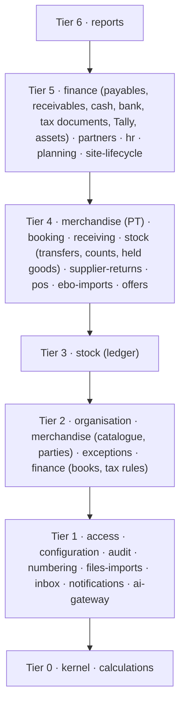
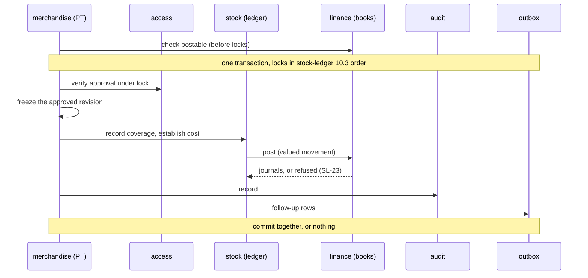
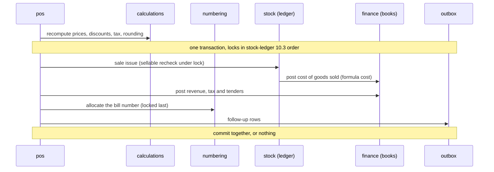

# Module map

> **Rank 3 of 4: design.** Must not contradict the PRD or the KDPS policies. See [README.md](../../README.md).

Status: **Current**, 3 Oct 2026. If this document disagrees with [prd.md](../../prd.md) or [kdps-policies.md](../../kdps-policies.md), they win. Raise the clash; do not guess.

Implements these PRD sections: Module and data boundaries; Transaction and integration integrity; Delivery stages. For ownership only, it places every other PRD section in a module (section 11).

- PRD IDs: `PRD-STG-001`, `PRD-STG-002`; `PRD-ORG-001`–`PRD-ORG-021`; `PRD-ACS-001`–`PRD-ACS-023`; `PRD-MER-001`, `PRD-MER-002`, `PRD-MER-004`–`PRD-MER-007`, `PRD-MER-013`, `PRD-MER-014`, `PRD-MER-018`; `PRD-IMP-002`–`PRD-IMP-013`; `PRD-BKG-001`–`PRD-BKG-013`; `PRD-REC-001`–`PRD-REC-022`; `PRD-PTW-001`–`PRD-PTW-013`; `PRD-STK-008`–`PRD-STK-017`; `PRD-TRF-001`–`PRD-TRF-026`; `PRD-DMG-001`–`PRD-DMG-017`; `PRD-POS-001`–`PRD-POS-022`; `PRD-RET-001`, `PRD-RET-003`–`PRD-RET-023`; `PRD-EBO-001`–`PRD-EBO-011`; `PRD-OFR-001`–`PRD-OFR-020`; `PRD-LED-001`–`PRD-LED-005`, `PRD-LED-007`–`PRD-LED-015`, `PRD-LED-019`, `PRD-LED-020`; `PRD-CSH-001`–`PRD-CSH-011`; `PRD-PAY-001`–`PRD-PAY-014`; `PRD-TAX-001`–`PRD-TAX-009`; `PRD-NAV-001`–`PRD-NAV-017`; `PRD-FRN-001`–`PRD-FRN-007`; `PRD-HRM-001`–`PRD-HRM-019`; `PRD-EXC-001`–`PRD-EXC-021`; `PRD-LIF-001`–`PRD-LIF-023`, `PRD-LIF-025`–`PRD-LIF-029`; `PRD-UXP-003`, `PRD-UXP-006`, `PRD-UXP-007`; `PRD-MOD-001`–`PRD-MOD-011`, `PRD-MOD-013`–`PRD-MOD-016`; `PRD-INT-001`–`PRD-INT-013`; `PRD-OFF-001`–`PRD-OFF-019`; `PRD-SEC-001`–`PRD-SEC-011`, `PRD-SEC-013`–`PRD-SEC-015`, `PRD-SEC-017`, `PRD-SEC-018`; `PRD-PRF-003`, `PRD-PRF-004`; `PRD-ACP-004`, `PRD-ACP-013`, `PRD-ACP-018`. Section 11.1 places every requirement ID of the PRD in a module.
- Policies: 1 (`POL-01.02`–`POL-01.04`, `POL-01.06`, `POL-01.07`), 2 (`POL-02.06`–`POL-02.09`, `POL-02.12`, `POL-02.14`–`POL-02.20`, `POL-02.22`, `POL-02.23`, `POL-02.25`), 3 (`POL-03.05`), 4 (`POL-04.03`, `POL-04.04`, `POL-04.08`, `POL-04.09`), 5 (`POL-05.01`), 9 (`POL-09.01`, `POL-09.02`, `POL-09.04`, `POL-09.11`–`POL-09.13`, `POL-09.24`), 10 (`POL-10.01`, `POL-10.02`, `POL-10.07`, `POL-10.08`), 11 (`POL-11.01`), 14 (`POL-14.07`), 18 (`POL-18.05`). Section 11.2 places all 19 policies.
- Decisions: DEC-003, DEC-005, DEC-013, DEC-015, DEC-016, DEC-037, DEC-041, DEC-043, DEC-044, DEC-051, DEC-054, DEC-056, DEC-066, DEC-071, DEC-084, DEC-086, DEC-087, DEC-092, DEC-093, DEC-097, DEC-099, DEC-100, DEC-101, DEC-105, DEC-106, DEC-107, DEC-113, DEC-114, DEC-116.

Depends on: [stock-ledger.md](../stock/stock-ledger.md) (the stock module's ledger; this map does not restate it), [personas.md](../access/personas.md) (users, personas, roles, role assignments), [deployment.md](../platform/deployment.md) (processes and the database per Organisation).

Used by: [domain-model.md](domain-model.md), [structure-and-masters.md](../masters/structure-and-masters.md) (GC-2), [access-and-approvals.md](../access/access-and-approvals.md) (GC-3), [books-and-posting.md](../finance/books-and-posting.md) (GC-4), [numbering-and-audit.md](../platform/numbering-and-audit.md) (GC-5), [shared-calculations.md](../calculations/shared-calculations.md) (GC-7), [imports-and-opening-data.md](../platform/imports-and-opening-data.md) (GC-6), and the other stage 1 designs listed in [gaps-before-code.md](../../history/gaps-before-code.md) as GC-8 and GC-9. This document is GC-1.

---

## 1. What this document fixes

- Which modules exist, what each owns, and which way calls go (`PRD-MOD-002`, `PRD-MOD-004`, `PRD-MOD-005`).
- The public interface of each stage 1 module: its operations, what each refuses, its events and its read models.
- Where one database transaction starts and ends, above all for stock and accounting (`PRD-MOD-006`, `PRD-INT-004`, DEC-087).
- It outlines the whole system and details the stage 1 shared foundation ([phases.md](../../phases.md), stage 1).

It does not fix tables, columns, API routes or code layout. Those belong to the area designs (GC-2 to GC-9) and to code.

How to read the labels:

| Label | Meaning |
| --- | --- |
| (ID) | A rule taken from the PRD, a policy or a decision. The ID is beside it |
| **Design choice** | A technical choice made here. It settles no business question. It can change without a PRD change |
| **Proposed** | A suggestion that waits for its owner. Not settled |
| **OPEN** | An unanswered question, with its owner and the stage it blocks. No default exists |

**The word "module".** Here it means the PRD's module: it owns its records and exposes a public interface; other modules do not touch its tables (`PRD-MOD-002`). The 16 sections of [ui-blueprint.html](../ui/ui-blueprint.html) are screens, not modules (section 2.4), although that file's script calls them modules.

**Parts.** A module may have parts. A part has its own interface and its own tier (section 2.1). Parts exist only where a module's records are needed at two levels: for example, the finance module's books sit below the stock ledger, and its payables sit above receiving. Ownership stays with the module, so "the stock module" and "the finance module's posting interface" in [stock-ledger.md](../stock/stock-ledger.md) section 1 mean the same thing here. **Design choice.**

## 2. The modules

### 2.1 Tiers

A call goes to the same tier or a lower one, never upward (section 3).

### 2.2 All modules

"PRD name" is the name in `PRD-MOD-004` (shared) or `PRD-MOD-005` (business). "Stage" is the delivery stage that first builds the part ([phases.md](../../phases.md)). Records are named in words; tables are not fixed here.

| Tier | Module · part | PRD name | Owns | Stage |
| --- | --- | --- | --- | --- |
| 0 | `kernel` | Not named. **Design choice** (MM-1) | No business records. Technical records only: outbox rows, job rows | 1 |
| 0 | `calculations` | money/tax calculations | Nothing. Shared logic for pricing, tax, discount allocation, rounding and incentives (`PRD-MOD-007`) | 1; incentive golden cases in 6 |
| 1 | `access` | identity/access | Users, credentials, sessions, device identities, service identities, personas held, roles, permissions, role assignments, approval rules and limits, stand-ins, approval requests, decisions and their uses | 1 |
| 1 | `configuration` | configuration | Organisation settings, policy status, capability controls, activity grants | 1 |
| 1 | `audit` | audit | Audit records; sign-in, permission-change and sensitive-access records | 1 |
| 1 | `numbering` | numbering | Number series and their allocations | 1 |
| 1 | `files-imports` | files/imports | Stored files, attachments, saved layouts and mappings, mapping rules and their proposals, import batches, staged rows, import outcomes | 1 |
| 1 | `inbox` | inbox | Work items shown in My work. No business record of its own | 1 |
| 1 | `notifications` | notifications | Message requests, templates, delivery outcomes | Email, WhatsApp and SMS in 5; no channel before ([phases.md](../../phases.md), DEC-099) |
| 1 | `ai-gateway` | AI gateway | AI request records (`PRD-SEC-002`) | 2, for PT source files (MM-14, DEC-105); switched off by default as a capability control (`PRD-SEC-017`; **Design choice**) |
| 2 | `organisation` | Not named. **Design choice** (MM-1) | Organisation, legal entities, tax registrations, accounting-book identities, Sites, Stores, business units and their mappings, internal stock locations, geography and groupings | 1 |
| 2 | `merchandise` · catalogue | merchandise/PT | Brands, categories, styles, SKUs, size sets, attributes and their approved vocabulary, external barcode and supplier-code mappings, units and pack conversions, tracking profiles, product and vocabulary proposals | 1 |
| 2 | `merchandise` · parties | merchandise/PT | Suppliers, agents, ordering parties, invoicing parties, goods movers; brand and supplier agreements with effective-dated commercial terms | 1 |
| 2 | `exceptions` | exceptions | Exception records and their history | 1 (the record); raised by every stage |
| 2 | `finance` · books | finance | Chart of accounts, cost-centre dimensions, financial periods, journals, posting maps and rules, cost formula and cost-pool mode per book | 1 |
| 2 | `finance` · tax rules | finance | Effective-dated goods classification, rate and value rules, registration applicability (`PRD-TAX-005`); the price basis and rounding rules the calculations read ([shared-calculations.md](../calculations/shared-calculations.md), GC-7) | 1 (shape, for the golden cases); real values by 2 (policy 10) |
| 3 | `stock` · ledger | stock | Movements, balances, piece records, receipt origins, coverage and acceptance records, holds, reservations, cost pools and layers ([stock-ledger.md](../stock/stock-ledger.md)) | 1 (rules, synthetic data); live from 2 |
| 4 | `merchandise` · PT | merchandise/PT | PT documents and revisions, costing profiles, label jobs | 2 |
| 4 | `booking` | booking | Bookings, open-to-buy budgets, supplier confirmations, delivery expectations | 2; buying suggestions in 6 |
| 4 | `receiving` | receiving | Arrivals, receipt counts, GRNs, discrepancies, acceptance and putaway records; inbound ownership records (MM-7, DEC-105) | 2 |
| 4 | `stock` · documents | stock | Damage reports (2); transfers, dispatches, counts, adjustments, write-offs, disposals (3) | 2–3 |
| 4 | `supplier-returns` | supplier returns | Return eligibility and deadlines, proposed return lists, RTV documents, the supplier-claims register | 3 |
| 4 | `pos` | POS | Billing devices and offline authority; till sessions, carts, bills, tenders, customer returns and exchanges, billed-retained records; customers, Store credit, Gift vouchers, loyalty | Device and offline design in 1; the rest in 4 |
| 4 | `ebo-imports` | EBO imports | Historical-reference imports of synthetic SOH and daily sales, for checking only (1); earlier-POS side-by-side test imports (2); EBO report imports and their application (4) | 1, a minimal module holding only the historical-reference handler (DEC-116); 2, 4 |
| 4 | `offers` | offers | Offers, price lists, markdowns | 4; markdown suggestions in 6 |
| 5 | `finance` · operations | finance | Supplier invoices and matching (2); statutory movement documents recorded and linked (3); Store day close and cash, IRN evidence, tax-document cancellation and correction (4); payables, payments, receivables, bank matching, GST registers, e-way bills, TDS, Tally exchange, assets, net asset value (5) | 2, 3, 4, 5 |
| 5 | `partners` | partners | Partner agreements, ledgers, statements | 5 |
| 5 | `hr` | HR | Employees, attendance, rosters, leave, targets, incentives, payroll | 6; records can start after 1 ([phases.md](../../phases.md)) |
| 5 | `planning` | planning | Forecast runs, proposals and their outcomes; talks to the forecasting service | 6 |
| 5 | `site-lifecycle` | Site lifecycle | Readiness records (1); opening data and the switch (4); closure, relocation and complete export (5) | 1, 4, 5 |
| 6 | `reports` | reports | Metric definitions, report read models, exports | Every stage (`PRD-STG-001`) |

All 24 PRD names are present. Two names are added: `kernel` and `organisation` (MM-1, confirmed by DEC-105).

### 2.3 Areas the PRD lists do not name

`PRD-MOD-004` and `PRD-MOD-005` name modules but give no home to the areas below. Each placement is a **design choice**; none changes a rule.

| Area | Placed in | Why | IDs |
| --- | --- | --- | --- |
| Organisation structure | `organisation` (new name) | Access scopes, numbering, books and stock all need it, so it must sit low. Site lifecycle uses it but sits high | `PRD-ORG-001`–`PRD-ORG-013`, `PRD-ORG-020`, `PRD-ORG-021`, `PRD-ACP-013` |
| Parties and agreements | `merchandise` · parties | The PRD lists parties under Merchandise. Barcode mappings and PTs need suppliers and brands at the same level | `PRD-MER-001`, `PRD-ORG-014`–`PRD-ORG-016`, policy 1 |
| Inbound ownership | `receiving` (MM-7, DEC-105) | The receipt count closes it | `PRD-ORG-017`–`PRD-ORG-019`, DEC-003, DEC-086 |
| Approvals | `access` | Authority is rechecked under the locks, so it must sit below every posting module. The inbox only shows approvals | `PRD-ACS-006`, `PRD-ACS-007`, `PRD-INT-003` |
| Device identity | `access`; billing-device facts in `pos` | Lost devices and sessions are revoked together (`PRD-SEC-008`); attendance also uses registered devices (`PRD-HRM-004`) | `PRD-OFF-002`, `PRD-POS-020` |
| Policy gate and capability | `configuration` | Every module asks it; it asks no one | `PRD-SEC-017`, PRD "Required policy configuration" |
| Site and business-unit readiness | `site-lifecycle`, which writes an activity grant into `configuration` | The check sits high (it asks every module); the answer sits low (every module reads it) | `PRD-LIF-001`, `PRD-LIF-002` |
| Transfers, counts, damage, write-off, disposal | `stock` · documents | They are stock workflows that post through the ledger | `PRD-TRF-001`–`PRD-TRF-022`, `PRD-STK-008`–`PRD-STK-015`, `PRD-DMG-001`–`PRD-DMG-017` |
| Customer returns, customers and their balances | `pos` | A return needs the bill's snapshots and the same transaction | `PRD-RET-001`, `PRD-RET-005`, `PRD-RET-006`, `PRD-RET-016`–`PRD-RET-021` |
| Store day close and cash | `finance` · operations; the till session in `pos` | An EBO Store has a day close and a cash deposit without billing in Apparel OS (`PRD-UXP-007`) | `PRD-CSH-001`–`PRD-CSH-005`, `PRD-UXP-006` |
| Tax | `finance` · tax rules (rule data) and `finance` · operations (tax documents) | Accounts and the CA own both (policy 10) | `PRD-TAX-001`–`PRD-TAX-008` |
| Earlier-POS side-by-side test imports | `ebo-imports` | The PRD gives them the same validation and duplicate controls as EBO imports | `PRD-LIF-013`, `PRD-LIF-014`, `PRD-LIF-016` |
| Plumbing: Organisation routing, transactions, idempotency, outbox, jobs, live updates | `kernel` (new name) | The PRD Stack requires them; they hold no business record | `PRD-MOD-001`, `PRD-MOD-006`, `PRD-INT-002`, `PRD-INT-008` |

### 2.4 Screens to modules

The 16 sections of [ui-blueprint.html](../ui/ui-blueprint.html) and the modules behind them. A section is not a module, and menu names are working labels (DEC-056).

| UI section | Modules behind it |
| --- | --- |
| Home | `inbox`, `exceptions`, `notifications`, `reports` |
| Sell | `pos` |
| Booking | `booking`, `merchandise` · parties |
| Receive Goods | `receiving`, `merchandise` · PT, `files-imports`, `finance` · operations (invoice matching), `site-lifecycle` (opening stock) |
| Transfer | `stock` · documents |
| Stock Count | `stock` · documents |
| Damage & supplier returns | `stock` · documents, `supplier-returns` |
| Stock | `stock` · ledger read models; `planning` (replenishment, stage 6) |
| External sales | `ebo-imports`; `partners` or `finance` · operations for settlement statements |
| Offers & price | `offers` |
| Money | `finance` |
| Reports | `reports` |
| People, Self-service | `hr` |
| Partners | `partners` |
| Setup | `configuration`, `organisation`, `merchandise`, `access`, `files-imports`, `numbering`, `audit`, `finance` · books and tax rules, `site-lifecycle`, `exceptions` |

"Inbox" names two things in the PRD. The `inbox` module is the one inbox per person (`PRD-ACS-009`). The Receive Goods inbox per Site (`PRD-REC-001`) is a `receiving` screen.

## 3. Dependency rules

All are **design choices** that implement the cited rules.

1. **Interfaces only.** A module calls another module's public interface. It never reads or writes another module's tables (`PRD-MOD-002`).
2. **Downward only.** A module calls its own tier or a lower one. Inside a tier, the calls listed in sections 4 and 5 are the only ones allowed, and they form no cycle.
3. **One transaction.** A command's synchronous economic effects run through module interfaces in the caller's transaction (`PRD-MOD-006`). A called module joins that transaction; it never opens or commits its own.
4. **Upward only by event or by contract.** A lower module reaches a higher one in two ways only: an outbox event the higher module consumes (`PRD-MOD-006`), or a contract the lower module defines and the higher module implements (rule 6).
5. **Read models.** A module declares its read models with an as-of time. Reports, and any module that needs another module's totals, read them through the kernel's read-model gateway under the reader's own authorisation (`PRD-MOD-003`, `PRD-SEC-005`, `PRD-PRF-004`).
6. **Contracts used to break cycles:**

| Cycle | How it is broken |
| --- | --- |
| `access` needs place (Site, Store, business unit), legal-entity and brand scopes that `organisation` and `merchandise` own (`PRD-ACS-021`) | A role assignment stores a typed scope reference: kind, and all members, selected members or none (`PRD-ACS-005`). The caller passes the scope facts of its own record to Authorise. `access` defines a scope contract; `organisation` and `merchandise` implement it for validation when an assignment is edited, and to expand a selected Site or Store into the places it covers on a date (`PRD-ACS-021`). `access` reaches them only through that contract and does not depend on them |
| `stock` calls the finance posting interface; finance reconciles inventory value from stock | `stock` · ledger (tier 3) calls `finance` · books (tier 2), which knows posting event kinds and amounts, not stock. The reconciliation (`PRD-LED-008`) is in `finance` · operations (tier 5) and reads the stock ledger's declared read model |
| `inbox` shows approvals and exceptions other modules own | The owner publishes a work item to `inbox`: `exceptions` (tier 2) calls it directly; `access` (same tier) publishes through the outbox. `inbox` keeps only a reference and opens the owner's record; it never reads the owner's tables |
| `numbering` series are scoped by tax registration and billing device | A series is identified by its kind and an opaque scope key the owning module supplies after it has validated the scope. `numbering` calls no one |
| Every module asks the policy gate; the gate depends on every module's configuration | `configuration` calls no one. Each module registers a validity check for its own configured records. `site-lifecycle` writes activity grants into `configuration` |
| `files-imports` publishes rows into other modules' records | The target module registers an import handler. Publish calls the handler; the handler writes its own records |
| `organisation` must not retire a location where stock is still recorded (a design choice, [structure-and-masters.md](../masters/structure-and-masters.md) 3.5) | `organisation` defines a location-in-use contract; `stock` · ledger implements it |
| `merchandise` must not make a profile piece-tracked at a Site holding its stock without a planned labelling count (`PRD-MER-018`; 4.12) | `merchandise` defines a stock-presence contract; `stock` implements it |
| `finance` · books must refuse a cost-setting version that changes the formula or pool mode of a book that has held stock ([books-and-posting.md](../finance/books-and-posting.md) 2.2) | `finance` defines a "has this book held stock?" contract; `stock` · ledger implements it (product owner, 6 Oct 2026; [stock-ledger.md](../stock/stock-ledger.md) 13.7) |
| `exceptions` must verify the business outcome before closure (`PRD-EXC-002`) | `exceptions` defines a resolution-check contract; the module that owns the linked record implements it |
| `kernel` works out business dates under the Organisation's timezone (`PRD-MOD-009`; code-house-rules 9), a setting `configuration` keeps one tier above it | `kernel` defines a timezone contract; `configuration` implements it and answers with the Organisation's timezone setting, which has no default. `kernel` keeps no copy and calls `configuration` only through the contract. **Proposed** (RR-231); built in `S1-F01-T10`: `configuration` provides it under a token the kernel injects (code-house-rules 9) |
| A master change of a module above `access` takes effect in the decision's transaction, which `access` runs (6.2 flow A step 3) | `access` defines a decision-effect contract per action type; the owning module implements it, and the composition root hands the implementations to `access` at start. `access` calls it only through the contract (access-and-approvals 9.8b; `S1-F02-T01`) |
| `kernel`'s idempotency helper must check a replayed secret against a credential `access` owns ([code-house-rules.md](../platform/code-house-rules.md) 12.5) | `kernel` defines a credential-check contract; `access` implements it. `kernel` never reads `access` tables |

7. **External systems.** One module owns each adapter. Outcomes are tracked as pending, unknown, failed or succeeded, outside the local transaction (`PRD-INT-006`, `PRD-INT-007`; section 9).
8. **No bypass.** Jobs, imports, live updates, search and AI answers go through the same interfaces and the same access checks as a person's request (`PRD-SEC-005`). A service identity is an actor with its own audit identity (`PRD-SEC-018`).
9. **Checked.** Module boundaries are validated on every change (`PRD-SEC-015`). The check itself belongs to the code house rules ([gaps-before-code.md](../../history/gaps-before-code.md) section 3).

## 4. Stage 1 modules in full

Where a module has an interface, it lists the operations in words. Names, inputs and outputs become exact in the area designs and in the shared Zod schemas (PRD Stack: API). "Refuses when" lists the business refusals, not every validation error.

### 4.1 `kernel`

**Design choice** (MM-1). It holds mechanisms, not business rules.

| Mechanism | What it does | IDs |
| --- | --- | --- |
| Organisation routing | Finds the Organisation for a request or job and binds its database. One PostgreSQL database per Organisation. Before sign-in, the Organisation comes from the Organisation code the person gives; a small directory outside the Organisation databases holds only each Organisation's code and where its database is. Users, sessions and all business records live in the Organisation's own database (DEC-093) | `PRD-MOD-001`, `PRD-ORG-002`, `PRD-INT-001`, `PRD-ACS-020` |
| Transaction context | One database transaction per command. Called modules join it | `PRD-MOD-006`, `PRD-INT-004` |
| Lock order | Takes row locks in the order of [stock-ledger.md](../stock/stock-ledger.md) 10.3, ascending by ID inside each step | `PRD-INT-003` |
| Idempotency | A helper each module uses to keep, in the command's transaction, the scoped key, a hash of the request and the result. Same key and content: the first result, except an answer that showed a secret or an unmasked restricted value, whose replay is refused, and a replay whose secret cannot be compared ([code-house-rules.md](../platform/code-house-rules.md) 12.5, 12.6). Same key, different content: rejected and kept | `PRD-INT-002`, DEC-113, DEC-114; stock-ledger 10.1 |
| Outbox and jobs | Outbox rows are saved in the business transaction. The worker delivers each at least once; consumers are idempotent on the event's identity. Large postings run as queued jobs, one at a time per accounting book (stock-ledger 10.6) | `PRD-MOD-006`, `PRD-INT-008` |
| Live updates | Events carry identifiers only. The client refetches through the owning module, so access is checked again | PRD Stack: Live updates; `PRD-SEC-005` |
| Read-model gateway | Serves declared read models with their as-of time | `PRD-MOD-003`, `PRD-PRF-004` |
| Identity and time | UUIDv7 identifiers; event time, recording time and business date under the Organisation's timezone | `PRD-MOD-008`, `PRD-MOD-009` |
| Operations view | Failed jobs, stale data, stuck sync and integration failures shown to authorised operators; correlated logs without secrets | `PRD-SEC-013`, `PRD-SEC-014` |

### 4.2 `calculations`

- Pure shared TypeScript: pricing, tax, discount allocation, rounding and incentive logic, written once and used by the server and the counter (`PRD-MOD-007`). No records, no database, no network.
- Every function takes its rule versions as input and returns them with the result, so a bill keeps the calculation-policy snapshot it used (`PRD-MOD-010`, `PRD-POS-014`). Rule data comes from the caller: tax rules from `finance` · tax rules, offers from `offers`, the costing profile from `merchandise` · PT.
- Money is integer paise, or the configured minor unit of another enabled currency. Intermediate steps use decimal arithmetic with explicit rounding rules; never binary floating point (`PRD-MOD-014`). Unknown stays distinct from zero (`PRD-MOD-015`). The exact-cash shorthand becomes its declared amount before anything is stored (`PRD-MOD-016`).
- Basket discounts are allocated across lines before tax and rounding (`PRD-POS-004`). A split-tender refund follows `PRD-RET-022`.
- Shared golden cases prove the same result on server and counter (`PRD-ACP-018`). Incentive golden cases are completed in stage 6 ([phases.md](../../phases.md)).
- Rounding and tolerance values are OPEN (V-11, `POL-09.24`; SL-2). The detailed design is [shared-calculations.md](../calculations/shared-calculations.md) (GC-7).

### 4.3 `access`

**Responsibility.** Who the actor is; what they may do, where and on which fields; who may approve what; the record of each approval. Words follow [personas.md](../access/personas.md) section 1.

**Uses:** `configuration`, `audit`, `kernel`.

| Operation | Called by | What it does | Refuses when |
| --- | --- | --- | --- |
| Authenticate | `kernel`, on every request | Checks the session on every request, and the password and the authenticator code at sign-in; returns the actor (`PRD-SEC-001`, `PRD-INT-001`, `POL-02.17`, DEC-099) | The session is past its idle or absolute limit (`PRD-ACS-017`, `POL-02.18`); the device or session is Revoked (`PRD-SEC-008`) |
| Authorise | Every module, before a command and again under the locks | Finds one role assignment that covers the action, the record type, the record's scope and the fields (`PRD-ACS-001`, `PRD-ACS-004`, `PRD-INT-001`, `PRD-INT-003`) | No single assignment covers it; the scope is empty (`PRD-ACS-005`); the assignment is not in force on that date |
| Restrict fields | Every interface and read model | Masks or leaves out restricted fields: salary, identity documents, bank details, customer contact, cost and margin (`PRD-ACS-008`, `PRD-SEC-006`) | — |
| Scope for the database | `kernel` | Gives PostgreSQL the actor's effective scopes for its scope controls (`PRD-SEC-005`) | — |
| Request approval | A module with an independently approved action | Opens an approval request bound to the document, its exact version, the value on its basis and the preparer (`PRD-ACS-006`, `PRD-ACS-007`, `PRD-ACS-015`) | The action has no approval rule in force (policy gate) |
| Decide | The approver | Records approve or reject with reason, evidence and comment (`PRD-ACS-010`, `POL-02.23`). Checks that the approver is a different person from the preparer through any role (`POL-02.08`), and that the approver's limit covers the value on its basis (`POL-02.09`) | Self-approval; no limit configured, since a missing limit grants nothing (`POL-02.09`, `POL-02.15`); the value is Unknown and the approver's authority does not explicitly cover unknown value (`PRD-ACS-016`) |
| Verify under lock | The posting module | Rechecks that the decision is Approved and not yet used, and version, state, independence and value on its basis (stock-ledger 10.4) | The document changed materially after approval (`PRD-ACS-007`, `POL-02.12`); the value now exceeds the limit or the approved amount (DEC-066); the decision is already used (DEC-097) |
| Record use | The posting module, inside the posting transaction | Records that this decision authorised this posting. It commits with the stock and money records and is the approval evidence of `PRD-INT-004` (DEC-097) | The decision is already used, is not Approved, or the version is not the one decided |
| Decide in bulk | The approver | Only for allowlisted action types. Shows the items and total; rechecks each item's scope, limit, state and independence; routes the rest one by one (`PRD-ACS-011`, `PRD-ACS-019`, `POL-02.19`) | The action type is not on the allowlist |
| Grant a stand-in | An authorised person | Named, scoped, time-limited authority that expires by itself (`PRD-ACS-018`, `POL-02.20`); it takes effect only after a different authorised person approves it (GC3-7, DEC-105) | The stand-in would approve their own preparation |
| Register or revoke a device | `pos`, `hr`, Admin | Keeps the device's identity and its Revoked state (`PRD-SEC-008`). A cloned or restored device cannot continue an identity (`PRD-OFF-010`) | — |
| Maintain users, roles, assignments, limits | Admin | Effective-dated changes with history (`PRD-ACS-005`, `POL-02.06`). Role, permission, role-assignment and approval-rule changes are themselves approved by another authorised person (`PRD-ACS-023`, `POL-02.07`) | A single person both prepares and approves. The one exception is a new Organisation's setup step, run under a service identity (`PRD-ACS-023`, DEC-101) |

- **Routing above a limit.** A request above the approver's limit goes to the next authorised eligible approver. If none exists it stays pending; it is never approved automatically (`POL-02.09`). "Higher authority" means a different person whose limit covers the action on its value basis (PRD "Words used", DEC-043).
- **Phone approvals.** A link to an authenticated action bound to the exact record version; a plain message reply is not approval (`PRD-ACS-012`). Allowed action types are OPEN (V-60, `POL-02.22`); stage 5.
- **Events:** `access.assignment-changed`, `access.approval-requested`, `access.approval-decided`, `access.stand-in-changed`, `access.session-revoked`, `access.device-revoked`.
- **Read models:** users and their assignments as of a date; approval history. Stage 1 report: access history ([phases.md](../../phases.md)).
- **Never:** a persona grants nothing (`PRD-ACS-002`, `PRD-ACS-003`); one assignment's action is never combined with another's scope or fields (`PRD-ACS-004`).
- **Self-service** is granted only by an assignment of its own role, scoped to the person's own records (`PRD-ACS-022`, DEC-100).
- **OPEN:** who holds which role, scope and limit (V-01, V-02; KDPS Owner, Admin; stage 1 live use). SL-22 is settled (DEC-097, section 6.3).
- Sign-in, sessions, encryption of restricted data, row-level security and approvals are detailed in [access-and-approvals.md](../access/access-and-approvals.md) (GC-3).

### 4.4 `configuration`

**Responsibility.** The Organisation's settings, the status of each policy, and the one answer to "is this operation available here, now?".

**Uses:** `audit`, `kernel`. It calls no business module.

| Operation | Called by | What it does | Refuses when |
| --- | --- | --- | --- |
| Check availability | Every module, before a policy-dependent command | Answers available or unavailable with the blocking reason. Available needs all of: the capability is on for the Organisation; the policy that governs the operation is Signed; the owning module's own configured records are valid for this scope, and the policy's real values are recorded as validated (DM-6, DEC-105; **Design choice** of reading that record here); and, for receiving, movement and selling, the Site or business unit holds the activity grant (`PRD-SEC-017`, `PRD-LIF-001`, `PRD-LIF-002`, PRD "Required policy configuration") | — (it only answers) |
| Read a setting | Every module | Returns the version in force on a date. The caller stores the version it used (`PRD-MOD-010`) | — |
| Record policy status | Admin | Keeps, per policy, the "Signed by, date" line of [kdps-policies.md](../../kdps-policies.md); a policy is Signed when that line is complete (DEC-092). Also keeps the validation evidence for its real values: a policy's real values are recorded as validated, with the evidence, by a person holding the validate permission who did not enter them (baseline, [domain-model.md](domain-model.md) DM-6, DEC-105) | — |
| Set a capability | Admin | Switches a feature on or off for the Organisation (`PRD-SEC-017`) | — |
| Grant or withdraw an activity | `site-lifecycle` only | Records that receiving, movement or selling is enabled for a Site or business unit (`PRD-LIF-001`) | The caller is not `site-lifecycle` |
| Register a validity check | Each module, at start | Lets the gate ask the owner whether its configured records are valid | — |

- Each module keeps its own configured values: approval limits in `access`, posting maps in `finance` · books, tracking profiles in `merchandise`, and so on. `configuration` holds the status and the gate, not a copy of those values.
- Nothing is on by default. A suggested value is never an active default (PRD "Required policy configuration"). Switching a capability on cannot bypass a missing policy or a stock or accounting invariant (`PRD-SEC-017`).
- Versions in one scope never overlap (`PRD-MOD-010`).
- On `kdps-test`, an action whose policy is not signed stays unavailable even with real data (DEC-071).
- **What the gate stops** (`PRD-SEC-017`; product owner, 6 Oct 2026; DEC-116). Operations that record business effects are policy-gated: stock or money posting, opening-data publishing, device selling. Setup and configuration operations (access, structure, masters, book setup, readiness, policy readiness) are not, because they are how a policy gets configured; they still need their permissions and independent approvals.
- A synthetic Organisation may record labelled synthetic Signed statuses for tests and demos. Never on `kdps-test` or production ([code-house-rules.md](../platform/code-house-rules.md) 11.1).
- **Events:** `configuration.policy-status-changed`, `configuration.capability-changed`, `configuration.activity-changed`.
- **Read model:** policy readiness: each policy, its status, what is missing. The screen shows the reason an action is unavailable (`PRD-UXP-003`).
- Stage 1 exit check: an operation whose policy is not configured stays unavailable.

### 4.5 `audit`

**Uses:** `kernel`.

| Operation | Called by | What it does |
| --- | --- | --- |
| Record | Every module, inside its transaction | Appends the actor, event time, recording time, scope, before and after values, version, reason, source and approval evidence of an important change (`PRD-ACS-013`, `PRD-INT-004`) |
| Record access | `access` and any module serving restricted data | Appends sign-ins, permission changes and sensitive access (`PRD-SEC-007`) |
| Read history | Authorised readers | Returns the history of a record or an actor, inside the reader's scope (`PRD-SEC-005`) |

- Append-only. Audit evidence is protected from unauthorised alteration (`PRD-SEC-007`, `PRD-MOD-011`).
- Restricted values inside before and after values follow field permissions (`PRD-ACS-008`, `PRD-SEC-006`).
- Audit is not the business history. Corrections, reversals and lifecycle changes are their own records in the owning module (`PRD-ACS-014`).
- Retention periods are OPEN (V-13, `POL-18.05`; KDPS Owner, Admin, CA; stage 1 live use). The detailed design is [numbering-and-audit.md](../platform/numbering-and-audit.md) (GC-5).

### 4.6 `numbering`

**Uses:** `kernel`.

| Operation | Called by | What it does | Refuses when |
| --- | --- | --- | --- |
| Define a series | The owning module, after it has validated the scope | Creates a series for a document kind and scope key, with its format version | A live series already exists for that kind, scope and year |
| Allocate | The owning module, inside its transaction | Returns the next number, from a series the command locked last, at stock-ledger 10.3 step 8, and the number commits with the document or not at all (`PRD-INT-004`) | The series is closed or paused |
| Read series state | `pos` | Supports the offline pause and release checks, which use financial year plus next sequence (`PRD-OFF-012`) | — |
| Pause, release, close | The owning module | Changes the series state; close is final (`PRD-LIF-015`, `PRD-OFF-010`) | The series is closed |
| Record used numbers | `pos`, on an offline upload | Keeps numbers the device already used as allocations (`PRD-OFF-009`) | A number is already recorded with another document |

- Each billing device has its own bill series per tax registration and financial year, online or offline. Devices never share a live series (`PRD-POS-020`, `PRD-OFF-002`, DEC-005). `pos` owns the device facts and defines the series.
- A Store's switch and a replaced device each start a fresh series (`PRD-LIF-015`, `PRD-OFF-010`).
- Business codes are unique within a stated scope; names are labels (`PRD-MOD-008`).
- The bill-number format is set per Organisation within the statutory limits (`PRD-POS-020`). The format is OPEN (V-40, `POL-10.07`; CA; stage 4).
- How the offline counter advances its series locally and reconciles it is GC-8 (`PRD-OFF-007`, `PRD-OFF-009`). The detailed design is [numbering-and-audit.md](../platform/numbering-and-audit.md) (GC-5).

### 4.7 `files-imports`

**Uses:** `access`, `configuration`, `audit`, `numbering` (import batch codes, GC9-9, approved 6 Oct 2026), `ai-gateway`, `kernel`.

| Operation | Called by | What it does | Refuses when |
| --- | --- | --- | --- |
| Store a file | Any module | Keeps the original file with its source system, uploader, time and document reference (`PRD-IMP-002`) | The type, size or parsing result is not allowed; the content holds macros, active scripts or unapproved links (`PRD-SEC-011`) |
| Attach, read a file | Any module | Links a stored file to a record; serves it only to an authorised reader (`PRD-SEC-005`) | — |
| Start an import | A person or an adapter | Opens a batch of one kind: create, update, opening balance, historical reference or transaction (`PRD-IMP-010`) | The source identity was already used with the same content (duplicate) or with different content (conflict, or a governed revision) (`PRD-IMP-011`) |
| Map and stage | The preparer | Applies a saved, versioned mapping chosen by the layout's structure (`PRD-IMP-003`, `PRD-IMP-004`); keeps the original words beside the normalised values; marks each value as supplied, calculated, mapped or an AI suggestion (`PRD-IMP-006`), or as entered by a person (GC-6 section 5) | A brand name alone would select an incompatible mapping (`PRD-IMP-004`) |
| Validate and preview | The preparer | Checks references and totals; reports row and field errors and conflicts (`PRD-IMP-005`, `PRD-IMP-007`) | — |
| Propose or confirm a mapping rule | Preparer; a different person confirms | Proposal and independent confirmation. An unapproved proposal changes no operational data (`PRD-IMP-008`, `POL-02.07`) | The confirmer is the proposer |
| Publish | The reviewer | Hands the reviewed rows to the target module's import handler, one transaction per document. A required document posts whole or not at all (`PRD-IMP-012`) | The required review is missing; the handler refuses |
| Register an import handler | Each target module, at start | Lets Publish reach the module that owns the records | — |

- Attach is the one operation other modules call in their own transaction (`S1-F06-T05`): the caller names the stored file, the record and version, the kind of evidence with its restricted classes, and the record's scope facts. Store a file and Read a file are routes of `files-imports`, since only the app hands in and serves files (code-house-rules 12.1; imports-and-opening-data 11).
- The framework never writes another module's records. The handler does (rule 6).
- A suggestion is offered for manual selection. Identity and commercial facts are never filled from an unaccepted guess (`PRD-IMP-009`).
- An analytical-history import creates no live stock, receivable or tax document (`PRD-IMP-010`).
- Outcomes keep accepted, rejected, pending and duplicate quantities and values. A correction keeps the original evidence and its links (`PRD-IMP-013`).
- Opening-data layouts for stock, dues, advances and deposits are built and tested here in stage 1 with labelled sample data. Real opening data loads only at each Store's approved switch (`POL-14.07`, DEC-013, `PRD-LIF-009`).
- **Events:** `files-imports.import-published`, `files-imports.import-failed`, `files-imports.mapping-confirmed`.
- **Read model:** import outcomes (a stage 1 report).
- On the test setup, files are held in a Railway bucket, S3-compatible (D-2, GC-10, DEC-105). The detailed design is GC-6, [imports-and-opening-data.md](../platform/imports-and-opening-data.md). Its section 13.1 adds three operations to those above: submit a batch for review, withdraw a batch, and run a comparison of two sets by a key, the reconciliation tool for opening data and side-by-side checks (`POL-14.07`). It adds two read models: layouts and mapping rules in force, and comparison runs.

### 4.8 `inbox`

**Uses:** `access`, `kernel`.

| Operation | Called by | What it does |
| --- | --- | --- |
| Publish a work item | The module that owns the work | Adds a task, an approval to decide or an exception to someone's My work: the kind, a reference to the owner's record and version, the assignee or the scope of people who may act, due time and exposure |
| Update or close a work item | The owning module only | Keeps the item in step with the owner's record |
| List my work | The person | One list of tasks, exceptions and approvals, ordered by due time and exposure (`PRD-ACS-009`) |
| Escalate overdue work | A job | Escalates under the configured rule (`PRD-ACS-010`). Owners, due times and escalation are OPEN (V-03, `POL-02.16`; stage 1 live use) |
| Maintain task and approval routing | Admin | Due times and escalation recipients for tasks and approvals, per action type and Site, effective-dated; values are KDPS's (GC3-8, DEC-105) |

- The inbox is a sink. Acting on an item opens the owner's record and runs the owner's operation: Decide in `access`, Resolve in `exceptions`. The inbox changes no business record.
- A stand-in sees the items their grant covers (`PRD-ACS-010`, `PRD-ACS-018`). The grant itself is in `access`.
- Exposure is an amount in paise or Unknown; unknown never sorts as zero (`PRD-MOD-015`).

### 4.9 `notifications`

**Uses:** `access`, `configuration`, `audit`, `kernel`.

| Operation | Called by | What it does |
| --- | --- | --- |
| Send | Outbox consumers only | Sends a message through a channel adapter and keeps its request identity (`PRD-INT-006`, `PRD-INT-007`) |
| Record an outcome | The adapter, or an authenticated callback | Keeps pending, unknown, failed or succeeded (`PRD-INT-007`) |

- A message is never sent inside a business transaction (`PRD-INT-006`). Replay never sends it twice (`PRD-INT-008`).
- Content obeys the recipient's access and field permissions (`PRD-SEC-005`). Customer messages need the applicable consent; marketing consent is separate (`PRD-EXC-014`, `PRD-POS-012`).
- Email, WhatsApp and SMS arrive in stage 5 ([phases.md](../../phases.md)). Before then nothing is sent: sign-in uses the authenticator-app code, and alerts reach people in My work (`PRD-SEC-001`, `PRD-EXC-013`, DEC-099).
- Alert thresholds and recipients are OPEN (V-70, `POL-02.25`). The daily summary goes by WhatsApp at 9 PM (`POL-02.14`); its recipients are OPEN (V-51).
- On `kdps-test`, messages go only to named test recipients ([deployment.md](../platform/deployment.md) section 7).

### 4.10 `ai-gateway`

**Uses:** `access`, `audit`, `kernel`.

- One operation: request a draft. The request goes through the gateway; the structured output is validated; the permitted input references, model, prompt version, confidence and cost are kept (`PRD-SEC-002`).
- The output is a reviewable draft. Every AI workflow has a manual route (`PRD-SEC-003`). AI never posts stock, money or tax (`PRD-SEC-004`).
- An answer uses only the asker's authorised data (`PRD-EXC-015`, `PRD-SEC-005`).
- The gateway is built in stage 2, for PT source files. Stage 1 imports use the manual route only (MM-14, DEC-105). It ships switched off as a capability control (`PRD-SEC-017`). **Design choice.**

### 4.11 `organisation`

**Design choice** (MM-1). **Uses:** `access`, `configuration`, `audit`, `numbering`, `kernel`.

| Operation | Called by | What it does | Refuses when |
| --- | --- | --- | --- |
| Read the structure | Every module | Returns Sites, Stores, business units and locations, and for a business unit its legal entity, tax registration and accounting book as of a date (`PRD-ORG-001`, `PRD-ORG-005`) | — |
| Answer readiness checks | `site-lifecycle` | Says whether a business unit's mapping is in force and verified, and whether its locations exist (`PRD-LIF-002`, `POL-10.08`) | — |
| Check scope membership | `access`, only through its scope contract (rule 6), when an assignment is edited | Says whether a legal entity, Site, Store or business unit exists and belongs where the assignment says | — |
| List allowed destinations | `stock` · documents | Names and codes of permitted destinations, without access to their operational data (`PRD-TRF-004`); default warehouse and other authorised routes (`PRD-ORG-013`) | — |
| Expand a place for access | `access`, through its scope contract | The Stores and business units a Site or Store covers on a date (`PRD-ACS-021`) | — |
| Maintain the structure | Admin, Operations | Effective-dated changes with history (`PRD-MOD-010`) | A mapping would overlap another version in the same scope; a business unit would have no explicit legal entity, tax registration or book (`PRD-ORG-005`, `POL-10.01`); the unit's tax registration or book belongs to another legal entity (`PRD-ORG-020`); a location to retire still holds stock, asked through the location-in-use contract (section 3) |

- Mappings are never inferred from the Site (`POL-10.01`). Two units at one Site may map differently, and a transaction uses its own unit's mapping (`PRD-ORG-005`, `PRD-ACP-013`).
- Damage, holds and transit are stock conditions, not Sites or locations (`PRD-ORG-012`).
- The accounting book's identity is here; its content is in `finance` · books. **Design choice.**
- **Events:** `organisation.structure-changed`, `organisation.mapping-changed`.
- **Read model:** master lists (a stage 1 report).
- Stage 1 exit check: one physical Site with different business-unit books and registrations keeps correct mappings. The detailed design is GC-2, [structure-and-masters.md](../masters/structure-and-masters.md).

### 4.12 `merchandise` (catalogue and parties)

**Uses:** `access`, `configuration`, `audit`, `numbering`, `files-imports`, `organisation`, `kernel`.

| Operation | Called by | What it does | Refuses when |
| --- | --- | --- | --- |
| Resolve a code | `receiving`, `pos`, `stock`, imports | Maps an external barcode or supplier code to the SKU and unit, within its scope and validity dates; keeps leading zeros and historical aliases (`PRD-MER-006`, `PRD-MER-007`) | The active mapping is ambiguous (`PRD-MER-007`) |
| Read a SKU | Every business module | Identity, stock unit, tracking profile, HSN and attributes (`PRD-MER-002`, `PRD-MER-004`, `PRD-MER-014`) | — |
| Propose and confirm a product or a vocabulary entry | Preparer; confirmer | Proposals stay apart from approved masters; unconfirmed identity cannot enter an official PT (`PRD-MER-013`). A vocabulary entry needs independent confirmation (`PRD-IMP-008`). So does a product proposal: a different person from its proposer confirms it (baseline, [domain-model.md](domain-model.md) DM-5, DEC-105; the KDPS Owner confirms) | A confirmer is the proposer of that vocabulary entry or product |
| Maintain masters | Booking, Admin | Brands, categories, size sets, attributes, units, pack conversions with history (`POL-04.03`, `POL-04.04`) | — |
| Change a tracking profile | Booking, Operations | Effective-dated. A change to piece-tracked takes effect only through a labelling count (`PRD-MER-018`, `POL-04.09`, DEC-054) | Stock exists and no labelling count is planned |
| Read a party; read the terms in force | `booking`, `receiving`, `stock`, `finance`, `supplier-returns` | The party, and the agreement version in force for a brand or supplier on a date (`PRD-ORG-016`) | — |
| Maintain an agreement | Booking; approver | Effective-dated versions with history; terms may be revised later (`PRD-ORG-016`, `POL-01.03`). A booking's own terms follow `POL-01.04` in `booking` | A version would overlap another in the same scope (`PRD-MOD-010`) |

- Brands, suppliers, agents, ordering parties, invoicing parties and goods movers are kept independently (`PRD-MER-001`).
- Unknown values are kept. Missing size is distinct from an explicitly supplied Free Size (`PRD-MER-005`).
- An agreement's label never decides ownership, valuation or recognition by itself (`PRD-ORG-014`, `POL-01.06`, `POL-01.07`). Booking-level terms and overrides live in `booking` (`POL-01.02`, `POL-01.03`, `PRD-BKG-002`).
- A supplier's bank details are restricted fields, and a change to them is independently approved (`PRD-ACS-008`, `POL-02.07`).
- `merchandise` implements the scope contract for brand (rule 6).
- **Events:** `merchandise.product-confirmed`, `merchandise.code-mapping-changed`, `merchandise.tracking-profile-changed`, `merchandise.agreement-changed`.
- **OPEN:** batch and expiry categories and shelf-life days (V-05, SL-8, `POL-04.08`); each brand's commercial model and terms (V-14). The detailed design is GC-2, [structure-and-masters.md](../masters/structure-and-masters.md).

### 4.13 `exceptions`

`PRD-MOD-005` lists it as a business module. It sits at tier 2 because every module raises exceptions. **Design choice.**

**Uses:** `access`, `configuration`, `audit`, `inbox`, `numbering`, `files-imports`, `kernel`.

| Operation | Called by | What it does | Refuses when |
| --- | --- | --- | --- |
| Raise | Any module, or a person | Creates an exception with its type, links to the affected records, evidence and exposure, and gives it an owner and due date by the routing for its type and Site (`PRD-EXC-001`, `POL-02.16`, DEC-037) | — |
| Reassign, comment, add evidence | The owner or an authorised person | Keeps the history (`POL-03.05`) | — |
| Resolve | The owner | Closes only through the required approval (`POL-03.05`) and after the linked business outcome is verified through the owning module's resolution check (`PRD-EXC-002`) | The required approval is missing, or the outcome is not verified |
| Reopen | An authorised person | Keeps repeated, reopened and unresolved cases (`PRD-EXC-003`) | — |

- An exception settles nothing. Closing it changes no stock, money or saleability (`PRD-EXC-003`, `POL-03.05`). The correction, return, reversal or reconciliation happens in the owning module.
- When a business transaction rolls back, the exception about it is raised in a new transaction, so it is not lost with the rollback. **Design choice.**
- Raise takes the exception's code from a `numbering` series. With no open exception-code series, an operation that would raise a numbered exception is unavailable, and the Available check names the missing series. Failed-job records and their diagnostic evidence are still kept in the operations view (4.1), so nothing is lost (product owner, 6 Oct 2026; DEC-116).
- **Events:** `exceptions.raised`, `exceptions.assigned`, `exceptions.resolved`, `exceptions.reopened`.
- **Read model:** open exceptions by Store, brand and type (`PRD-EXC-004`).
- **OPEN:** real owners, due times and escalation (V-03); alert thresholds (V-70).

### 4.14 `finance` · books and tax rules

**Uses:** `access`, `configuration`, `audit`, `numbering`, `organisation`, `exceptions`, `kernel`.

| Operation | Called by | What it does | Refuses when |
| --- | --- | --- | --- |
| Post | `stock` · ledger for a valued movement; any module for its own money effect | Inside the caller's transaction: takes the posting event kind, the business unit (and through it the book), the source reference, amounts in paise and the Store and brand dimensions; finds the posting map version in force; writes balanced journals per book; returns the journals and the map version used (`PRD-LED-001`–`PRD-LED-004`, `PRD-MOD-013`, `POL-09.11`, `POL-09.12`, DEC-087) | No valid posting map (SL-23 Outcome A, section 6.3, DEC-105); the financial period is locked (`PRD-LED-009`), or reopened only for other corrections (`PRD-LED-020`); the journal would not balance (`POL-09.13`) |
| Check postable | The caller, before any lock | The same map and period lookup, with no write. It is repeated inside Post under the locks. **Design choice** | — |
| Reverse | The module that owns the source record | A linked reversal or correction. A posted entry is never edited (`PRD-LED-004`, `PRD-MOD-011`) | The period is locked, or reopened only for other corrections (`PRD-LED-020`) |
| Lock a period; request and approve a reopening | Accounts, with authority; the reopening is approved by a different authorised person from the requester | Locks a period (`PRD-LED-009`). A reopening names the corrections it is for, and only their postings enter the period; it locks again once they have posted or the reopening is withdrawn (`PRD-LED-019`, `PRD-LED-020`) | — |
| Maintain accounts, maps and rules | Accounts and the CA | Accounts and the CA supply the accounts and approve the framework and rules before activation (`POL-09.01`, `POL-09.11`). Versioned per Organisation and book; the applied version is kept with each posting (`POL-09.12`) | — |
| Read tax rules | `calculations` callers | The classification, rate and value rules, registration applicability, price basis and rounding rules in force on a date, with their versions (`PRD-TAX-005`, `POL-10.02`; [shared-calculations.md](../calculations/shared-calculations.md)) | — |

- Post knows event kinds and amounts. It knows nothing about stock. The stock ledger is one caller among several.
- Post is idempotent on its source reference: replay never doubles a journal (`PRD-INT-008`).
- An Unknown amount is never posted and never turned into zero (`PRD-MOD-015`, `POL-09.02`, `PRD-ORG-018`).
- Books are mapped through the business unit, never the Site (`PRD-LED-002`, `PRD-ORG-005`). Store and brand are dimensions, not separate ledgers (`POL-09.11`).
- The cost formula and cost-pool mode per book are settings here; the stock ledger reads them (`PRD-LED-014`, `PRD-LED-015`).
- **Events:** `finance.journal-posted`, `finance.period-locked`, `finance.period-reopened`, `finance.posting-map-changed`.
- **Read models:** ledgers and trial balance per book, on synthetic data in stage 1.
- **Baseline (DEC-105).** SL-23 is Outcome A: a valued movement with no valid posting map does not commit, and an exception is raised in its own transaction (6.3; the CA confirms). The Tally voucher model supports vouchers with and without items, and a setting per book chooses (MM-12; Accounts and the CA confirm).
- **OPEN:** the accounts and posting maps (V-10); AS or Ind AS (V-07); KDPS's cost formula and pool (V-08, V-09, SL-1); which voucher shape each book uses (Accounts; CA; needed by 5, designed in 1); tax values (V-18). The detailed design is [books-and-posting.md](../finance/books-and-posting.md) (GC-4).

### 4.15 `stock` · ledger

[stock-ledger.md](../stock/stock-ledger.md) is its design. This map adds only its place.

- **Uses:** `access`, `configuration`, `audit`, `numbering`, `organisation`, `merchandise` · catalogue, `exceptions`, `finance` · books, `kernel`.
- **Called by:** every tier 4 and tier 5 module that moves or values stock. They post through it in their own transaction (stock-ledger section 1).
- **Its interface, by purpose:** post the movements of a business document (stock-ledger 2.3); record coverage and acceptance; place and release a hold; reserve and release; start and end a count freeze; answer balance, availability and sellable questions (stock-ledger 6.3); serve its read models. The operations, their inputs and refusals, and its tables are in stock-ledger 13 and 14 (approved by the product owner, 6 Oct 2026); the area designs name the documents that call them.
- It writes no journal. For a valued movement it calls Post in `finance` · books inside the same transaction (stock-ledger 7.11, DEC-087).
- **Events:** `stock.movements-posted`, `stock.hold-changed`, `stock.reservation-changed`, `stock.count-freeze-changed`.

### 4.16 `site-lifecycle` · readiness

Only its stage 1 part. **Uses:** all lower tiers.

| Operation | Called by | What it does | Refuses when |
| --- | --- | --- | --- |
| Run readiness checks | Operations, Admin | For a Site and a business unit, asks each module's check: mappings, users and access, locations, devices, required policies, stock plan (`PRD-LIF-002`) | — |
| Approve an activity | The authorised approver | Combines shared Site readiness with a separate business-unit approval for receiving, movement or selling (`PRD-LIF-001`), then writes the activity grant into `configuration` | A check fails |

- Stage 1 exit check: an activity stays disabled for a Site or business unit until its readiness checks pass.
- Baseline (MM-8, DEC-105): readiness and activity approval is given by a different person from the one who ran the checks. The PRD names no approver, and who holds the approval is OPEN (KDPS Owner, policy 2, question 49; stage 1 live use).
- Withdrawing an activity at closure (`PRD-LIF-017`) is stage 5; see section 5.

### 4.17 `pos` · billing device (design only in stage 1)

- A billing device is registered online. `access` holds the device identity; `pos` holds its Store, its tax registrations and its offline authority; `numbering` holds its bill series (`PRD-OFF-002`, `PRD-POS-020`).
- One exclusively authorised offline counter per Store (`PRD-OFF-001`). Offline is designed in stage 1 and enabled only under the signed Offline operation policy (policy 16, DEC-051). The detailed design is GC-8, [offline-counter.md](../pos/offline-counter.md) (sections 3 to 5 and 11 approved by the product owner, 6 Oct 2026; sections 6 to 10 Draft): there `pos` records the business units a device bills for, and its tax registrations follow from their mappings (offline-counter 3.1).

## 5. Later-stage modules in outline

Outline only. Each gets its own design before its stage. Every module below also uses `access`, `configuration`, `audit` and `kernel`.

| Module · part | Stage | Responsibility | Calls on the foundation | Main IDs |
| --- | --- | --- | --- | --- |
| `merchandise` · PT | 2 | PT workbench; submitted revision, review and independent approval make a PT official; frozen values; linked corrections; labels from official values; the KDPS export profile as a view | `files-imports` (source files), `merchandise` · catalogue, `receiving` (GRN lines), `stock` · ledger (coverage, cost established, cost adjustment), `access` (approval on proposed acquisition cost) | `PRD-REC-014`–`PRD-REC-020`, `PRD-PTW-001`–`PRD-PTW-013`, policy 3 |
| `booking` | 2 | Bookings and their lifecycle (`POL-05.01`), open-to-buy, supplier confirmations, late-delivery follow-up | `merchandise`, `organisation`, `numbering`, `exceptions` | `PRD-BKG-001`–`PRD-BKG-013`, policy 5 |
| `receiving` | 2 | Arrival, count, GRN, discrepancies, acceptance and putaway at the actual Site; inbound ownership records | `stock` · ledger (receipt count, holds, acceptance, location move), `booking` (links), `merchandise`, `exceptions`, `files-imports` (evidence) | `PRD-REC-001`–`PRD-REC-013`, `PRD-REC-021`, `PRD-REC-022`, `PRD-ORG-017`–`PRD-ORG-019` |
| `stock` · documents | 2–3 | Damage reports and their independent confirmation; transfers from request to acceptance; full and cycle counts; adjustments; write-offs; disposals | `stock` · ledger, `access` (approval on cost), `organisation` (routes), `exceptions` | `PRD-TRF-001`–`PRD-TRF-026`, `PRD-STK-008`–`PRD-STK-017`, `PRD-DMG-001`–`PRD-DMG-017`, policy 17 |
| `supplier-returns` | 3 | Return rights and deadlines by receipt origin; proposed lists; RTV legs and outcomes; the claims register | `stock` · ledger (reservations, departure, handover), `merchandise` · parties (terms), `exceptions` | `PRD-OFR-008`–`PRD-OFR-020` |
| `pos` | 4 | Till session, bill, tenders, returns and exchanges, billed-retained, customers, Store credit, Gift vouchers, loyalty, the offline counter | `calculations`, `numbering` (bill series), `stock` · ledger (sale issue, customer return), `finance` · books (revenue, tax, tender postings), `offers`, `merchandise` | `PRD-POS-001`–`PRD-POS-022`, `PRD-RET-001`, `PRD-RET-003`–`PRD-RET-023`, `PRD-OFF-001`–`PRD-OFF-019`, policies 6, 7, 8, 16 |
| `ebo-imports` | 1, 2, 4 | In stage 1 only the historical-reference handler, on synthetic SOH and daily sales (2.2); stage 2 extends it. Earlier-POS daily sales and SOH imports, for checking and reports only; EBO sales, returns, stock and payment reports applied once | `files-imports`, `stock` · ledger (EBO only; never for earlier-POS imports, `PRD-LIF-014`), `finance` · books, `exceptions` | `PRD-EBO-001`–`PRD-EBO-011`, `PRD-LIF-013`, `PRD-LIF-014`, `PRD-LIF-016`, `PRD-STK-016` |
| `offers` | 4 | Offers, approval before activation, combination rules, price lists, markdowns; one evaluation for Running Offers and checkout | `calculations`, `merchandise`, `organisation` | `PRD-OFR-001`–`PRD-OFR-007`, policy 19 |
| `finance` · operations | 2, 3, 4, 5 | Supplier invoice capture and matching (2); statutory movement documents (3); Store day close, petty cash and cash in transit, IRN evidence through a GSP (4); payables and payment runs, receivables, provider and bank matching, e-way bills, Tally exchange, assets, net asset value, month close, reconciliations (5) | `finance` · books, read models of `receiving`, `merchandise` · PT, `pos` and `stock`; `exceptions`; `notifications` | `PRD-LED-007`–`PRD-LED-013`, `PRD-CSH-001`–`PRD-CSH-011`, `PRD-PAY-001`–`PRD-PAY-014`, `PRD-TAX-001`–`PRD-TAX-009`, policies 9, 10, 11 |
| `partners` | 5 | Partner agreements, ledgers, credit controls, monthly statements; EBO brand settlement | `finance`, `pos` and `ebo-imports` read models, `organisation` | `PRD-FRN-001`–`PRD-FRN-007`, `PRD-EBO-009`, policy 12 |
| `hr` | 6 | Employee records, attendance, rosters, leave, targets, incentives, payroll | `calculations` (incentives), `access` (devices, own-record access), `finance` · books (payroll postings); sales evidence arrives by outbox | `PRD-HRM-001`–`PRD-HRM-019`, policy 13 |
| `planning` | 6 | Forecasts and proposals; a proposal cannot buy, transfer or change a price without the relevant approval | Read models; the forecasting service; `ai-gateway` | `PRD-EXC-016`–`PRD-EXC-021`, `PRD-BKG-012`, `PRD-OFR-007`, policy 15 |
| `site-lifecycle` | 4, 5 | Opening stock and balances, the Store switch; closure, reopening, relocation; complete export | `stock`, `finance`, `files-imports`, `numbering`, `pos`, `organisation` (the Store's dated Site link on relocation) | `PRD-LIF-003`–`PRD-LIF-012`, `PRD-LIF-015`, `PRD-LIF-017`–`PRD-LIF-023`, `PRD-LIF-025`–`PRD-LIF-029`, policy 14 |
| `reports` | Every | One definition per metric; reports and exports restricted to permitted data; as-of time, estimates and missing data shown | The read-model gateway only | `PRD-EXC-005`–`PRD-EXC-012`, `PRD-NAV-001`–`PRD-NAV-017`, `PRD-STG-001` |

Two boundaries are flagged now so the later designs do not settle them by accident:

- **IRN before issue.** `PRD-POS-019` wants IRN evidence before an applicable tax invoice is issued or goods are released. `PRD-INT-006` keeps GST outside the local transaction. So an applicable bill has two steps: a local commit, then the outside call and its outcome. `pos` asks through the outbox; `finance` · operations talks to the GSP and reports the outcome back by calling `pos`. Baseline (MM-10, DEC-105): an e-invoice-applicable bill waits for its IRN before the tax invoice prints and the goods are handed over. Meanwhile the customer gets nothing that looks like a tax invoice, and an unknown or failed outcome keeps the bill pending until it is resolved. The CA confirms. Which bills are e-invoice applicable stays OPEN (V-41; CA; stage 4).
- **Customer credit at the till.** A Customer credit sale checks the approved limit and records the receivable in the same transaction (`PRD-POS-022`, `PRD-MOD-006`). `pos` is at tier 4 and receivables are at tier 5, so the stage 5 design must place the limit and the receivable where `pos` can call them. OPEN, technical (MM-11).

## 6. Transaction boundaries

### 6.1 The one shape

Every command that changes stock or money follows this shape. Steps 5 to 7 are [stock-ledger.md](../stock/stock-ledger.md) 10.2 to 10.4; this section adds only who is called.

1. **Who.** `kernel` finds the Organisation; `access` authenticates the actor (`PRD-INT-001`).
2. **Once.** The idempotency helper checks the scoped key (`PRD-INT-002`). A replay is recognised here but answered only after step 3's Authorise passes for it, without the availability check, and the command is not run again ([code-house-rules.md](../platform/code-house-rules.md) 12.4).
3. **Allowed here, now.** `configuration` checks availability; `access` authorises the action, scope and fields (`PRD-SEC-017`, `PRD-INT-001`).
4. **Slow work first.** Validation, matching and inflow values are worked out before any lock (stock-ledger 10.6). `finance` · books checks postable (a design choice, 4.14).
5. **Lock.** Row locks in the stock-ledger 10.3 order, all before the first write; the one exception is the empty balance rows that stock-ledger 10.3 step 3 creates and locks (`PRD-INT-003`).
6. **Recheck under the locks.** The actor still Active or enabled; role assignment, scope and limit; document version and state; independent approval; quantity; value on its basis (stock-ledger 10.4).
7. **Write, together.** Number allocation, the document's new state, stock movements with their balance and pool rows, journals, other monetary records, approval evidence, audit and outbox rows. All commit, or none do (`PRD-INT-004`).
8. **After commit.** The worker delivers outbox rows: work items, messages, live-update identifiers, read-model refresh, and exchanges with outside systems (`PRD-MOD-006`, `PRD-INT-006`).

**Lock order for rows outside the stock ledger.** stock-ledger 10.3 lists stock rows, then the financial period row, and ends with number series. It has no step for the rows of later modules (a customer balance, a till session). The financial period row is locked in shared mode after cost pool rows and before number series (MM-6, DEC-105; stock-ledger 10.3, step 7). Each later design names where its own rows sit, and stock-ledger 10.3 is updated then.

### 6.2 Worked flows

**A. A master change that needs independent approval** (stage 1; for example a role assignment or a supplier's bank details, `POL-02.07`).

1. The preparer saves a draft version in the owning module. No effect yet.
2. The owning module calls Request approval in `access`, bound to that version.
3. The approver calls Decide. In one transaction: `access` records the decision; the owning module makes the version effective from its date; `audit` records; outbox rows are saved.
4. A material change after approval needs renewed approval (`PRD-ACS-007`, `POL-02.12`).

**B. Publishing an import** (stage 1, on labelled sample data).

1. Store the file; stage, validate and preview outside any business transaction.
2. Review. Then Publish: one transaction in which the target module's handler writes its records, `audit` records, and outbox rows are saved. One failing line fails a required document (`PRD-IMP-012`).
3. The source identity is the idempotency key (stock-ledger 10.1, `PRD-IMP-011`).

**C. PT approval that establishes cost** (live in stage 2; exercised in the stage 1 golden scenarios on synthetic data).

- The approval limit is checked on total proposed acquisition cost: proposed P RATE times covered quantity, not MRP (`PRD-ACS-015`, `POL-02.09`, DEC-015, DEC-016). Missing or disputed cost blocks value-based approval (`PRD-ACS-016`).
- Coverage cannot overlap another approved PT (`PRD-REC-015`, `PRD-INT-005`).
- PT approval does not make goods sellable and does not change ownership (`PRD-REC-021`, `POL-01.07`).
- A large PT is posted by a queued job (flow E).

**D. An online counter sale** (live in stage 4; the stage 1 golden scenarios exercise its stock and posting half).

- Tender allocation is revalidated against the final amount due (`PRD-POS-006`, `PRD-POS-009`). The completed bill is immutable with its snapshots (`PRD-POS-014`).
- When revenue and cost of goods sold are recognised follows the Financial posting policy (`POL-09.04`); billed-retained timing is OPEN (SL-17, V-35).
- Incentives, digital bills and the Tally exchange follow through the outbox and never double on replay (`PRD-INT-008`).

**E. A large document posted by a job** (stock-ledger 10.6).

1. The approval click records the approval decision, its audit record and a request to post, naming the approved version (stock-ledger 10.6, DEC-097). No stock or money effect.
2. The job, one at a time per accounting book, does the slow work, then runs steps 5 to 7 of 6.1 as one transaction.
3. If the job fails, nothing is posted and the document shows the failure.
4. Between 1 and 2 the approval decision holds the approver's identity and time. The job records the decision's use with the posting; a failed job leaves the decision unused (DEC-097; 6.3).

### 6.3 The two stage 1 posting questions

SL-23 is settled as a baseline: Outcome A below (DEC-105; stock-ledger section 12). The CA confirms it. SL-22 is settled (DEC-097).

**SL-23: no valid posting map at commit** (baseline Outcome A, DEC-105; the CA confirms).

- The clash: journals commit with the valued movement (`PRD-MOD-013`, DEC-087). `POL-09.12` says a missing or invalid map blocks the affected financial posting and raises an exception "while preserving the underlying operational event".
- **Baseline (DEC-105): Outcome A.** A valued movement with no valid posting map does not commit. The document stays as it was, and an exception is raised in its own transaction (4.13). A change the CA asks for is a new decision entry; Outcome B would also need a decision record, because DEC-087 says movement and journals commit together.
- Fixed under either outcome:
  - The policy gate should already have made the operation unavailable, because policy 9's posting configuration is not valid (`PRD-SEC-017`). SL-23 is the case left over at commit.
  - Post answers with a result, posted or refused with its reason. It never skips a journal silently.
  - Check postable runs before the locks; Post repeats the lookup under them.
  - The exception is raised even when the business transaction rolls back (4.13).
  - Replay never doubles a journal (`PRD-INT-008`).
- The two options, kept as the record. Outcome A is chosen (DEC-105):

| | Outcome A: the movement waits (chosen, DEC-105) | Outcome B: the movement posts, the journal is owed |
| --- | --- | --- |
| What commits | Nothing. The document stays as it was | The movement, and a record that its journal is owed |
| Stock and books | Always agree | Disagree until the map is fixed; a reconciling item |
| The physical event | May have happened while the app shows nothing | Is recorded |
| What it needs | Nothing new | A decision record: DEC-087 says movement and journals commit together |
| Left to settle | Follows from A: an online counter sale that meets it is refused with its reason and its cart is kept (`PRD-UXP-003`); an offline bill already issued goes to the reconciliation queue (`PRD-OFF-009`, stock-ledger 10.5). The policy gate should already have stopped the operation (`PRD-SEC-017`) | Which map version and accounting date the late journal uses (see also SL-15) |

- One fact for the CA's confirmation: an offline bill is already issued when it is uploaded. A bill that cannot post goes to the visible reconciliation queue and is never discarded, under either outcome (`PRD-OFF-009`, `PRD-OFF-014`, stock-ledger 10.5).

**SL-22: the approval between the click and the posting job.** Settled by DEC-097. The access design holds the detail ([access-and-approvals.md](../access/access-and-approvals.md) 9.8), which settles MM-5.

- The click commits the approval decision in `access`, with its audit record and the posting request. It has no stock or money effect.
- The job's transaction locks the decision with the document, rechecks it, posts, and records in that same transaction that this decision authorised this posting. That record is the approval evidence `PRD-INT-004` commits with the stock and money records.
- If the job fails, the decision stays recorded and unused. A retry needs no new approval only while the document version is unchanged and its value is still within the decision's limit and the approved amount; otherwise it returns for renewed approval (`PRD-ACS-007`, DEC-066).
- stock-ledger 10.6 says the same.

## 7. The stock and accounting boundary

`PRD-LED-005`, `PRD-REC-009`, stock-ledger section 3: quantities, provisional commercial amounts and accounting recognition stay distinct.

| Fact | Recorded by | How it reaches the books |
| --- | --- | --- |
| A stock movement with a value, such as cost established, sale issue, a transfer between pools, supplier-return departure, count difference, write-off, disposal, cost adjustment, a reversal | `stock` · ledger | It calls Post in `finance` · books in the same transaction (DEC-087). The ledger writes no journal itself |
| A stock movement with no value in a pool: a pre-PT receipt count, a location move, a move in the same pool | `stock` · ledger | No journal. Unknown stays Unknown (`PRD-DMG-005`, `PRD-ACP-004`) |
| Acceptance, coverage, holds and reservations | `stock` · ledger | They are status records, not movements (stock-ledger 2.3). No journal |
| Opening stock | `stock` · ledger | No supplier delivery, booking, invoice, liability or automatic journal (`PRD-LIF-008`) |
| Sale revenue, tax and tenders | `pos` | `pos` calls Post in the same transaction as the sale issue |
| A supplier obligation | `finance` · operations | Under the recognition rule the CA approves (`POL-09.02`); never a fabricated amount |
| A provisional amount on inbound ownership | `receiving` | It stays outside the ledger and is a reconciling item (`PRD-ORG-018`, stock-ledger 7.6). Its accounting is OPEN (V-58) |
| Bank, provider settlement, Tally, GST | `finance` · operations | Outside outcomes, through the outbox; tracked as pending, unknown, failed or succeeded (`PRD-INT-006`, `PRD-INT-007`) |

- Journals balance per book at commit (`PRD-MOD-013`).
- Each stage records its stock and money effects from its first live operation; stage 5 extends them into full accounting (`PRD-STG-002`, DEC-044). Tally remains KDPS's official book (`POL-11.01`); the Tally exchange and full accounting wait for stage 5.
- Inventory value in the books is reconciled against the stock ledger's read model (`PRD-LED-008`).

## 8. Events

**Design choices**, implementing `PRD-MOD-006` and `PRD-INT-008`.

- An event is an outbox row saved in the transaction that caused it. It is named `module.fact`, in the past tense.
- It carries identifiers and versions only. A consumer fetches what it needs through the owner's interface, under its own authorisation (`PRD-SEC-005`).
- Delivery is at least once. A consumer is idempotent on the event's identity: replay never duplicates an incentive, voucher, claim, message or exception (`PRD-INT-008`).
- An event never carries a synchronous economic effect. Those go through interfaces in one transaction (`PRD-MOD-006`).
- Live updates are events sent to the browser, identifiers only.

Stage 1 events:

| Event | Emitted when | Typical consumers |
| --- | --- | --- |
| `access.assignment-changed` | A role, assignment, limit or stand-in changes | Live updates; `audit` report |
| `access.approval-requested`, `access.approval-decided` | A request opens, or leaves Awaiting approval: decided, superseded by a new version or withdrawn (`S1-F01-T13`) | `inbox`, `notifications` |
| `access.session-revoked`, `access.device-revoked` | A device or session is revoked | `pos` (offline authority) |
| `configuration.policy-status-changed`, `configuration.capability-changed`, `configuration.activity-changed` | The gate's inputs change | Live updates; `site-lifecycle` |
| `organisation.structure-changed`, `organisation.mapping-changed` | Structure or a unit's mapping changes | `reports`, `site-lifecycle` |
| `merchandise.product-confirmed`, `merchandise.code-mapping-changed`, `merchandise.tracking-profile-changed`, `merchandise.agreement-changed` | Masters change | `pos` (working set), `reports` |
| `files-imports.import-published`, `files-imports.import-failed`, `files-imports.mapping-confirmed` | An import finishes; a rule is confirmed | `inbox`, `reports` |
| `exceptions.raised`, `exceptions.assigned`, `exceptions.resolved`, `exceptions.reopened` | The exception's life changes | `notifications`, `reports` |
| `finance.journal-posted`, `finance.period-locked`, `finance.period-reopened`, `finance.posting-map-changed` | Books change | `reports`; the Tally exchange in stage 5 |
| `stock.movements-posted`, `stock.hold-changed`, `stock.reservation-changed`, `stock.count-freeze-changed` | The ledger changes | `reports`; later stages |

Later modules add their own events in their designs, with the same rules.

## 9. Outside systems

One owner per adapter (rule 7). Replacing an adapter never changes the meaning of completed records (`PRD-INT-013`). On `kdps-test` each is off or pointed at a sandbox ([deployment.md](../platform/deployment.md) section 7).

| Outside system | Owner | Stage | IDs |
| --- | --- | --- | --- |
| File storage | `files-imports` | 1 (a Railway bucket on the test setup; D-2, DEC-105) | PRD Stack: Files |
| Email, WhatsApp, SMS | `notifications` | Email, WhatsApp and SMS in 5; none before (DEC-099) | `PRD-INT-006`, `PRD-POS-017` |
| AI providers | `ai-gateway` | 2, for PT source files (MM-14, DEC-105) | `PRD-SEC-002` |
| Local helper: receipt printer, cash drawer, label printer | Called by the counter and the web app on the PC that has the printer | 2 (labels), 4 (receipts) | PRD Stack: Hardware; DEC-084; D-6 |
| GSP: IRN, e-invoice, e-way bill | `finance` · operations | 4 (IRN), 5 (e-way) | `PRD-TAX-003`, `PRD-INT-010` |
| Card and UPI providers | `pos` (attempts), `finance` · operations (settlement) | 4, 5 | `PRD-POS-010`, `PRD-POS-011`, `PRD-INT-011` |
| Bank statements and payment files | `finance` · operations | 5 | `PRD-CSH-007`, `PRD-INT-011` |
| TallyPrime | `finance` · operations | 5 | `PRD-LED-012`, `PRD-LED-013`, `PRD-INT-009` |
| EBO brand software | `ebo-imports` | 4 | `PRD-EBO-001`, `PRD-EBO-010`, `PRD-INT-012` |
| Earlier POS reports | `ebo-imports` | 2 | `PRD-LIF-013` |
| Forecasting service | `planning` | 6 | PRD Stack: Forecasting |

## 10. Processes

From [deployment.md](../platform/deployment.md) section 2, with two **design choices** marked. Modules are not services.

- `app` runs every module behind the API, the live-update stream and the static web app and counter PWA. The counter is the package `apps/counter`, served at `/counter/` ([offline-counter.md](../pos/offline-counter.md) section 5, approved 6 Oct 2026).
- `worker` is the same build. It runs the outbox processor and the queued jobs. **Design choice:** a job acts as a service identity with its own audit identity (`PRD-SEC-018`).
- The counter PWA uses `calculations` and its own IndexedDB records, and commits a bill locally in one IndexedDB transaction (`PRD-OFF-007`). It never receives cost, margin or receipt-origin value (`PRD-OFF-004`).
- `forecast` is the separate Python service, added in stage 6. It runs as one more service in the same hosting as the app (DEC-105). **Design choice:** only `planning` calls it.
- Reports, imports and background work must not delay counter finalisation (`PRD-PRF-003`).

## 11. Coverage

### 11.1 PRD requirement IDs

Every requirement ID in [prd.md](../../prd.md) is listed once, with the module that owns the rule. A rule that several modules enforce is listed under the one that owns the record; "with" names the others.

| IDs | Owner |
| --- | --- |
| `PRD-PRO-001`–`PRD-PRO-010` | Product scope statements; delivered by the modules of their sections. `PRD-PRO-010` lists what is outside the product |
| `PRD-STG-001`, `PRD-STG-002` | `reports`; `stock` · ledger with `finance` · books |
| `PRD-ORG-001`–`PRD-ORG-010`, `PRD-ORG-012`, `PRD-ORG-013`, `PRD-ORG-020`, `PRD-ORG-021` | `organisation` |
| `PRD-ORG-011` | `configuration`, with the module that owns each configured record |
| `PRD-ORG-014`–`PRD-ORG-016` | `merchandise` · parties, with `stock` · ledger for the owner on a receipt origin |
| `PRD-ORG-017`–`PRD-ORG-019` | `receiving` (MM-7, DEC-105) |
| `PRD-ACS-001`–`PRD-ACS-008`, `PRD-ACS-011`, `PRD-ACS-012`, `PRD-ACS-015`–`PRD-ACS-019`, `PRD-ACS-022`, `PRD-ACS-023` | `access` |
| `PRD-ACS-020` | `kernel` (Organisation routing), with `access` |
| `PRD-ACS-021` | `access`, with `organisation` for the place tree |
| `PRD-ACS-009`, `PRD-ACS-010` | `inbox`, with `access` |
| `PRD-ACS-013`, `PRD-ACS-014` | `audit`, with every module for its own corrections |
| `PRD-MER-001` | `merchandise` · parties |
| `PRD-MER-002`–`PRD-MER-018` | `merchandise` · catalogue, with `stock` · ledger for piece rules and `merchandise` · PT for labels |
| `PRD-IMP-001`–`PRD-IMP-013` | `files-imports` |
| `PRD-BKG-001`–`PRD-BKG-013` | `booking`, with `planning` for `PRD-BKG-012` |
| `PRD-REC-001`–`PRD-REC-013`, `PRD-REC-021`, `PRD-REC-022` | `receiving`, with `stock` · ledger |
| `PRD-REC-014`–`PRD-REC-020` | `merchandise` · PT |
| `PRD-PTW-001`–`PRD-PTW-013` | `merchandise` · PT |
| `PRD-STK-001`–`PRD-STK-017` | `stock` (ledger and documents) |
| `PRD-TRF-001`–`PRD-TRF-022`, `PRD-TRF-026` | `stock` · documents, with `supplier-returns` for `PRD-TRF-026` |
| `PRD-TRF-023`–`PRD-TRF-025` | `finance` · operations (statutory movement documents), with `stock` · documents |
| `PRD-DMG-001`–`PRD-DMG-017` | `stock` (ledger and documents) |
| `PRD-POS-001`–`PRD-POS-024` | `pos`, with `numbering` for `PRD-POS-020` and `finance` · operations for `PRD-POS-019` |
| `PRD-RET-001`, `PRD-RET-003`–`PRD-RET-024` | `pos` |
| `PRD-EBO-001`–`PRD-EBO-008`, `PRD-EBO-010`, `PRD-EBO-011` | `ebo-imports` |
| `PRD-EBO-009` | `partners` |
| `PRD-OFR-001`–`PRD-OFR-007`, `PRD-OFR-021` | `offers` |
| `PRD-OFR-008`–`PRD-OFR-020` | `supplier-returns` |
| `PRD-LED-001`–`PRD-LED-005`, `PRD-LED-009`, `PRD-LED-019`, `PRD-LED-020` | `finance` · books |
| `PRD-LED-006`, `PRD-LED-014`–`PRD-LED-018` | `stock` · ledger, with `finance` · books for the formula and pool settings |
| `PRD-LED-007`, `PRD-LED-008`, `PRD-LED-010`–`PRD-LED-013` | `finance` · operations |
| `PRD-CSH-001`–`PRD-CSH-011` | `finance` · operations, with `pos` for the till |
| `PRD-PAY-001`–`PRD-PAY-014` | `finance` · operations |
| `PRD-TAX-001`–`PRD-TAX-004`, `PRD-TAX-006`–`PRD-TAX-009` | `finance` · operations |
| `PRD-TAX-005` | `finance` · tax rules |
| `PRD-NAV-001`–`PRD-NAV-017` | `reports`, with `finance` |
| `PRD-FRN-001`–`PRD-FRN-006` | `partners` |
| `PRD-FRN-007` | `access` |
| `PRD-HRM-001`–`PRD-HRM-019` | `hr` |
| `PRD-EXC-001`–`PRD-EXC-004` | `exceptions` |
| `PRD-EXC-005`–`PRD-EXC-012` | `reports` |
| `PRD-EXC-013` | `notifications` for messages from stage 5; before then the alert reaches My work through `inbox` and `exceptions` (DEC-099) |
| `PRD-EXC-014` | `notifications` |
| `PRD-EXC-015` | `ai-gateway`, with `reports` |
| `PRD-EXC-016`–`PRD-EXC-021` | `planning` |
| `PRD-LIF-001`–`PRD-LIF-012`, `PRD-LIF-015`, `PRD-LIF-017`–`PRD-LIF-023`, `PRD-LIF-025`–`PRD-LIF-028` | `site-lifecycle`, with `files-imports` and `stock` |
| `PRD-LIF-029` | `site-lifecycle`, with `organisation` for the Store's dated Site link |
| `PRD-LIF-013`, `PRD-LIF-014`, `PRD-LIF-016` | `ebo-imports` |
| `PRD-UXP-001`–`PRD-UXP-010` | The web app and counter ([design/ui/](../ui/)); every module serves them |
| `PRD-MOD-001`–`PRD-MOD-006`, `PRD-MOD-008`–`PRD-MOD-013` | This document; `kernel` |
| `PRD-MOD-007`, `PRD-MOD-014`–`PRD-MOD-016` | `calculations` |
| `PRD-INT-001`–`PRD-INT-008`, `PRD-INT-013` | `kernel`, with `access` for `PRD-INT-001` |
| `PRD-INT-009`–`PRD-INT-012` | The adapter owners in section 9 |
| `PRD-OFF-001`–`PRD-OFF-019` | `pos`, with `numbering` and `stock` · ledger |
| `PRD-SEC-001`, `PRD-SEC-005`–`PRD-SEC-008`, `PRD-SEC-018` | `access`, with `audit` for `PRD-SEC-007` |
| `PRD-SEC-002`–`PRD-SEC-004` | `ai-gateway` |
| `PRD-SEC-009`, `PRD-SEC-010` | `configuration` (retention and consent settings), applied by each owning module. Retention, deletion and legal holds are designed with backup, restore and export (GC-9); customer consent and notices in the stage 4 counter design; employee data in the stage 6 HR design (MM-15, DEC-105) |
| `PRD-SEC-011` | `files-imports` |
| `PRD-SEC-012`–`PRD-SEC-016` | `kernel` and the platform designs ([deployment.md](../platform/deployment.md), GC-9, the code house rules) |
| `PRD-SEC-017` | `configuration` |
| `PRD-PRF-001`–`PRD-PRF-004` | `kernel`; measured across modules |
| `PRD-ACP-001`–`PRD-ACP-020` | Acceptance conditions; each is an exit check in [phases.md](../../phases.md), tested across modules |

### 11.2 Policies

Where each policy's configured values live. The policy's status and the gate are always in `configuration`.

| Policy | Values live in |
| --- | --- |
| 1 Commercial ownership | `merchandise` · parties (agreements); `booking` (booking-level terms) |
| 2 Permissions and approvals | `access`; routing in `exceptions`; alerts in My work before stage 5 and in `notifications` from stage 5 (DEC-099); the daily summary in `notifications`; count rules in `stock` · documents |
| 3 Source conflicts and pricing | `merchandise` · PT (costing profiles); `exceptions` |
| 4 Merchandise tracking | `merchandise` · catalogue |
| 5 Booking | `booking` |
| 6 Customer returns | `pos` |
| 7 Refunds and no-bill returns | `pos`; Customer credit also in `finance` · operations |
| 8 Billed-retained | `pos`; recognition in `finance` · books |
| 9 Financial posting | `finance` · books; cost rules applied by `stock` · ledger; Tally, tolerances and allocation in `finance` · operations |
| 10 Statutory applicability | `finance` · tax rules and operations; the unit mapping in `organisation`; the bill-number format in `numbering`; payroll rules in `hr` |
| 11 Official book | `finance` · operations |
| 12 Franchise/partner | `partners` |
| 13 Workforce | `hr` |
| 14 Opening and cutover | `site-lifecycle`; layouts in `files-imports` |
| 15 Planning | `planning` |
| 16 Offline operation | `pos`; protected quantity in `stock` · ledger |
| 17 Held-goods outcomes | `stock` · documents |
| 18 Recovery and retention | The platform (GC-9); retention settings in `configuration` |
| 19 Offers and promotions | `offers` |

### 11.3 The missing stage 1 designs

What this map fixes for each design in [gaps-before-code.md](../../history/gaps-before-code.md), and what it leaves.

| Design | Fixed here | Left to it |
| --- | --- | --- |
| GC-1 Module map | This document | — |
| GC-2 Business structure and masters | `organisation` and `merchandise`: ownership, interfaces, events (4.11, 4.12); entities in [domain-model.md](domain-model.md) | Tables, screens, validation detail: written in [structure-and-masters.md](../masters/structure-and-masters.md) |
| GC-3 Access, approvals, inbox and exceptions | `access`, `inbox`, `exceptions`, the policy gate (4.3, 4.4, 4.8, 4.13) | Sign-in, sessions, row-level security, encryption; SL-22: written in [access-and-approvals.md](../access/access-and-approvals.md) |
| GC-4 Books and posting | `finance` · books and the Post boundary (4.14, 6, 7) | Posting maps, the journal model, period rules; applying the SL-23 and MM-6 baselines (DEC-105): written in [books-and-posting.md](../finance/books-and-posting.md) |
| GC-5 Document numbering and audit history | `numbering`, `audit` (4.5, 4.6) | Formats, series detail, retention: written in [numbering-and-audit.md](../platform/numbering-and-audit.md) |
| GC-6 Imports and opening data | `files-imports` (4.7) | Layouts, staging detail: written in [imports-and-opening-data.md](../platform/imports-and-opening-data.md) |
| GC-7 Shared calculations | `calculations` (4.2) | Functions, tax rule records and golden cases: written in [shared-calculations.md](../calculations/shared-calculations.md) |
| GC-8 Offline counter | Ownership split between `access`, `pos`, `numbering`, `stock` (4.17) | Everything else: written in [offline-counter.md](../pos/offline-counter.md); sections 3 to 5 and 11 approved 6 Oct 2026, sections 6 to 10 Draft |
| GC-9 Backup, restore and export | Owners of files and export (section 9, 11.1) | Everything else: drafted in [backup-and-restore.md](../platform/backup-and-restore.md), not yet approved |

## 12. Open questions

Nothing below has a default. "Kind" says whether the answer is a business choice or a technical one. A business choice is settled in the PRD or the policies, never here.

| # | Question | Kind | Who decides | Blocks | Impact |
| --- | --- | --- | --- | --- | --- |
| MM-1 | Baseline (DEC-105): `organisation` and `kernel` are confirmed module names, and modules keep their parts (2.2, 2.3) | Technical | — | — | — |
| MM-2 | Settled: the Organisation comes from its code at sign-in; a small directory outside the Organisation databases holds only routing facts; a person serving several Organisations holds a separate user in each (DEC-093, `PRD-ACS-020`). Routing is in 4.1; the directory is placed in [deployment.md](../platform/deployment.md) section 4 | — | — | — | — |
| MM-3 | SL-23. Baseline (DEC-105): Outcome A. A valued movement with no valid posting map does not commit; the document stays as it was, and an exception is raised in its own transaction (6.3) | Business | CA (confirms) | — | — |
| MM-4 | Settled: the click records the approval decision; the job's transaction records its use, the approval evidence of `PRD-INT-004`; a failed job leaves it unused (DEC-097, 6.3) | — | — | — | — |
| MM-5 | Settled: the access design (GC-3) settles SL-22 (DEC-097; [access-and-approvals.md](../access/access-and-approvals.md) 9.8) | — | — | — | — |
| MM-6 | Baseline (DEC-105): the financial period row is locked in shared mode after cost pool rows and before number series (6.1; stock-ledger 10.3, step 7). Each later design names where its own rows sit | Technical | — | — | — |
| MM-7 | Baseline (DEC-105): `receiving` owns inbound ownership records (`PRD-ORG-017`–`PRD-ORG-019`) | Technical | — | — | — |
| MM-8 | Baseline (DEC-105): readiness and activity approval (`PRD-LIF-001`) is given by a different person from the one who ran the checks. Who holds it is OPEN: the PRD names no approver (KDPS question 49) | Business | KDPS Owner (confirms; decides who holds it), policy 2 | 1 live use | Who holds the approval for readiness |
| MM-9 | Settled: no channel before stage 5. Sign-in uses the authenticator-app code; alerts reach people in My work; email, WhatsApp and SMS arrive in stage 5 (DEC-099) | — | — | — | — |
| MM-10 | Baseline (DEC-105): an e-invoice-applicable bill waits for its IRN before the tax invoice prints and the goods are handed over. Meanwhile the customer gets nothing that looks like a tax invoice, and an unknown or failed outcome keeps the bill pending until it is resolved (`PRD-POS-019`, `PRD-INT-006`; section 5). E-invoice applicability stays OPEN (V-41) | Business | CA (confirms) | — | — |
| MM-11 | Where the Customer credit limit and receivable sit so `pos` can use them in one transaction (section 5) | Technical | Settled in the stage 5 design | 5 | The tier of receivables |
| MM-12 | Baseline (DEC-105): the Tally voucher model supports vouchers with and without items; a setting per book chooses (4.14). The value of that setting stays OPEN | Business | Accounts; CA (confirm) | — | — |
| MM-13 | Baseline (DEC-105): a registration-only change between business units at one Site always needs its statutory document; it is never a location move (stock-ledger 7.1, DEC-066, `PRD-TRF-023`) | Business | CA (confirms) | — | — |
| MM-14 | Baseline (DEC-105): the AI gateway is built in stage 2, for PT source files; stage 1 imports use the manual route only (`PRD-IMP-006`, `PRD-SEC-003`) | Business (delivery order) | — | — | — |
| MM-15 | Baseline (DEC-105): retention, deletion and legal holds are designed with backup, restore and export (GC-9); customer consent and notices in the stage 4 counter design; employee data in the stage 6 HR design (`PRD-SEC-009`, `PRD-SEC-010`; retention is policy 18) | Technical | — | — | — |
