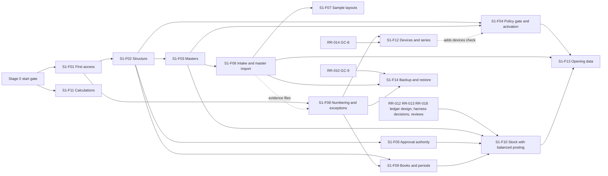
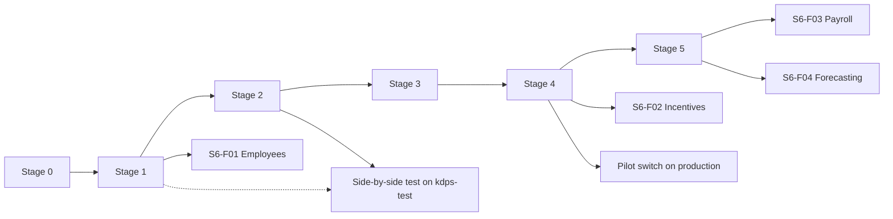

# Stages and features

> **Not ranked.** Part of the [implementation plan](index.md). The stages, their scope and their exit checks are those of [phases.md](../phases.md); this page only splits them into features. If the two disagree, [phases.md](../phases.md) wins, and the PRD and the policies win over both.

Each feature is a vertical slice: a workflow a person can see, with its screen, API and stored records. Only `S1-F01` is broken into tasks ([s1-f01-first-access.md](s1-f01-first-access.md)); every other feature gets its tasks when it starts, from its design's tests. `RR-` numbers point to the [readiness register](readiness-register.md).

## 1. The stages at a glance

| Stage | Outcome for people | Features | Policies needed before live use |
| --- | --- | --- | --- |
| 0. Preparation | Builders can run every check; conventions are fixed | `S0-T01` to `S0-T08` | — |
| 1. Shared foundation | Structure, users, access, masters, imports, numbering, exceptions, books and the stock and money recording rules work on synthetic data | `S1-F01` to `S1-F14` | 2, 4, 9, 18 |
| 2. Goods-in | Booking to accepted stock, with holds, corrections and invoice matching | `S2-F01` to `S2-F12` | 1, 3, 5, 10 (part), 17 |
| 3. Stock movement | Transfers, counts, held goods, supplier returns and claims reconcile | `S3-F01` to `S3-F10` | 17, 1 (return rights), 10 (movement documents) |
| 4. Store day | Opening till to day close, returns, balances, EBO imports, offline and the Store switch | `S4-F01` to `S4-F14` | 6, 7, 8, 14, 16, 19, 10 (invoice format, e-invoice) |
| 5. Financial control | Full accounting, Tally, bank, tax, partners, closure and export, Hindi, messaging | `S5-F01` to `S5-F11` | 9 (rest), 10 (e-way, TDS), 11, 12, 7 (Customer credit) |
| 6. People and planning | HRMS, incentives, payroll, forecasting | `S6-F01` to `S6-F06` | 13, 15, 10 (payroll) |

## 2. Stage 1 — Shared foundation

### 2.1 Outcomes

- An Admin sets up a synthetic Organisation: people sign in with a password and an authenticator code, and every access change is approved by a second person (`PRD-SEC-001`, `PRD-ACS-023`).
- Admin and Operations build legal entities, registrations, books, Sites, Stores, business units and locations; each business unit's mapping is verified by a different person (`PRD-ORG-005`, `POL-10.08`).
- Booking maintains products, vocabularies, codes, tracking profiles, parties and dated agreements, with proposals confirmed by another person (`PRD-MER-013`, `PRD-IMP-008`).
- Masters can be loaded from files through staging, review and publishing, without duplicates (`PRD-IMP-005`, `PRD-IMP-011`).
- An operation whose policy is not configured, or whose Site activity is not granted, stays unavailable and says why (`PRD-SEC-017`, `PRD-LIF-002`).
- Accounts sets up books, maps and periods; on synthetic data the golden scenarios post stock and balanced journals together, and the golden cases price bills identically on server and counter (`PRD-ACP-018`).
- A backup restores with linked records and attachments (`PRD-SEC-012`).

### 2.2 Scope

**Included:** the "In scope" list of [phases.md](../phases.md) stage 1, with the designs GC-1 to GC-7 and the GC-8 and GC-9 designs still to be written. Reports: master lists, access and audit history, import outcomes.

**Excluded:** live Store selling, live policy-dependent stock or financial posting, loading real opening balances, the AI gateway (stage 2, `DEC-105`), messaging (stage 5, `DEC-099`), offline billing itself (stage 4). Paths for these may be exercised on synthetic data only.

### 2.3 Feature sequence, checked against the repository

The sequence asked for was: scoped access approval; Site and business-unit setup and verification; product and party masters; one synthetic master import; then stock movement with balanced posting. It holds, with four adjustments the designs require:

1. **Sign-in comes inside the first feature.** An approval needs two authenticated people, and the first two exist only after the setup step (`PRD-ACS-023`, `DEC-101`). `S1-F01` therefore starts with setup and sign-in, then the approved role assignment. Its assignments use all-members or empty scope; selected Sites, Stores and units arrive with `S1-F02`, because `access` checks them through the `organisation` scope contract (module-map section 3, rule 6).
2. **The policy gate and Site activation come right after structure** (`S1-F04`). Two stage 1 exit checks depend on it, and every later policy-dependent operation asks it.
3. **Numbering, exceptions and books come before stock with posting** (`S1-F08`, `S1-F09`). Journals need periods, maps and numbers; a valued movement with no valid map must raise an exception in its own transaction (SL-23 Outcome A, `DEC-105`); approvals with limits need `S1-F05`.
4. **Stock with balanced posting cannot be coded yet.** The ledger's interface and tables are not designed (RR-012), stage 1 has no business documents to drive its golden scenarios (RR-013), and 25 of its sections were never reviewed (RR-018). A synthetic harness that drives the scenarios through the real services is proposed in [s1-f10-stock-harness.md](s1-f10-stock-harness.md); its decisions H1 to H6 come before any of it is built. These are design and review tasks that can run during `S1-F01` to `S1-F05`.

Shared calculations (`S1-F11`) depend on nothing but the domain package and can run beside everything from the start.

### 2.4 Features

| Feature | Workflow a person can see | Modules | Depends on | Gates (register) | Acceptance evidence |
| --- | --- | --- | --- | --- | --- |
| `S1-F01` First access | Setup creates a synthetic Organisation with its first Admin and approver; they sign in with an authenticator code; the Admin prepares a role assignment; a different person approves it from My work; the new user can do exactly what it grants; all of it shows in history | `kernel`, `access`, `audit`, `inbox`, `configuration` (Organisation settings) | Stage 0 | Code: the stage 0 start gate; inside the feature RR-011 part B and RR-021 before `T04`, RR-017 before `T10`, RR-019 and RR-023 before `T14`. Live: RR-054 to RR-056, RR-064, RR-067, RR-158 | [s1-f01-first-access.md](s1-f01-first-access.md) section 14 |
| `S1-F02` Organisation structure and verified mappings | Admin builds legal entities, registrations, book identities, geography, Sites, Stores, units and locations; a second person approves each change; a different person verifies each unit's mapping; assignments can now select Sites, Stores or units, and a selected Site covers places added later; master lists | `organisation`, `access` (scope contract, place tree, effective grants), `audit` | `S1-F01` | Live: RR-081 (V-18), RR-122 (V-62), RR-176, RR-178 | [structure-and-masters.md](../design/masters/structure-and-masters.md) 9 tests 1 to 6, 14 to 16; [access-and-approvals.md](../design/access/access-and-approvals.md) 15 tests 8, 9; stage 1 exit check 1 (mapping part) |
| `S1-F03` Product and party masters | Booking maintains brands, categories, vocabularies (confirmed by a different person), SKUs and size grids, external codes, units and packs, tracking profiles; parties and dated agreements; product proposals confirmed by a different person; bank details masked, encrypted, and changed only with a second person's approval | `merchandise` catalogue and parties, `access` (field classes, encryption), `audit` | `S1-F01`; `S1-F02` read interface | Live: RR-068, RR-069, RR-077, RR-179. Decide before acceptance: RR-047 | structure-and-masters 9 tests 7 to 13, 18 to 21; access-and-approvals 15 test 23 (bank details) |
| `S1-F04` Policy readiness and Site activation | Admin sees each policy's status and records Signed with evidence; a different person validates real values; capabilities ship off; Operations runs readiness checks; a different person approves receiving, movement or selling for a unit; anything not configured shows unavailable with its reason. The devices check is added later by `S1-F12` | `configuration`, `site-lifecycle` (readiness), `organisation`, `access` | `S1-F01`, `S1-F02`, `S1-F03` access tasks | Code: RR-016 (two checks). Live: RR-057, RR-157 to RR-175 | access-and-approvals 15 test 1; stage 1 exit checks 5 and 6 |
| `S1-F05` Approval authority | Admin sets approval limits per action, role or person, with the basis shown; requests route to the lowest covering limit and otherwise wait; Unknown value needs explicit authority; stand-ins expire by themselves; bulk approval only for allowlisted types; overdue approvals escalate | `access`, `inbox` | `S1-F01`, `S1-F02` | Live: RR-058, RR-059, RR-065 | access-and-approvals 15 tests 13, 13a, 17, 18, 18a, 20a |
| `S1-F06` File intake and a synthetic master import | A preparer uploads a synthetic product file; intake checks it and keeps the encrypted original; the layout is found by structure; a saved, versioned mapping stages rows with each value's origin; the validation report lists problems; a reviewer publishes through the `merchandise` and `organisation` handlers; a repeat upload is a duplicate; the import outcomes report | `files-imports`, `merchandise`, `organisation`, `audit`; S3-compatible storage (MinIO locally) | `S1-F02`, `S1-F03` | Code: RR-035 (one task). Accept on `dev`: RR-187. Live: RR-036, RR-037, RR-134 | [imports-and-opening-data.md](../design/platform/imports-and-opening-data.md) 17 tests 1 (XLSX and CSV, macro and link refusal), 2, 11 to 17, 25, 26 |
| `S1-F07` Sample layouts proved on synthetic replicas | The layout library holds the KDPS PT template and the chosen vendor-PT and earlier-POS layouts as proposed layout records (GC-6 6.7), each proved on a synthetic replica; readers for XLSX, XLS, XLSB, CSV and PDF text; earlier-POS line classes; comparison runs | `files-imports` | `S1-F06` | Code: RR-032, RR-033. Accept: RR-189 (10,000-line parse) | imports-and-opening-data 17 tests 1 (remaining formats), 3 to 10, 19, 27 |
| `S1-F08` Number series and exceptions | Modules take gapless numbers inside their transaction; an exception gets an owner and due time from its routing, appears in My work, takes evidence, escalates, and closes only after the owning module's check; an exception survives a rollback; a job that keeps failing raises an unfinished-operation exception; operators see failed jobs; evidence files attach to exceptions and to approval decisions; live updates carry identifiers to My work | `numbering`, `exceptions`, `inbox`, `kernel` (operations view), `files-imports` (evidence) | `S1-F01`; `S1-F06` for evidence | Live: RR-060, RR-066 (V-03), RR-129 (V-70) | [numbering-and-audit.md](../design/platform/numbering-and-audit.md) 7 tests 1 to 5; access-and-approvals 15 test 21 |
| `S1-F09` Books, posting maps, periods and tax-rule records | Accounts sets up a synthetic book with its cost formula and pool, chart and dimensions, versioned posting maps with approval, and periods; locks a period; a reopening needs a second person and admits only the named corrections; tax-rule records are kept effective-dated; trial balance | `finance` books and tax rules, `numbering`, `exceptions` | `S1-F02`, `S1-F08` | Code: RR-053 (map-approval task). Live: RR-061, RR-070, RR-073, RR-074, RR-081 | [books-and-posting.md](../design/finance/books-and-posting.md) 15 tests 2, 3, 6, 9 to 15, 18 |
| `S1-F10` Stock ledger with balanced posting | On synthetic data the story of stock-ledger 11.1 runs under both cost formulas and both pool modes; each step's journals commit with its movements; the checks of 11.7 hold after every step; scenarios G2 to G13, with G10a (G10b waits for the rounding rule); concurrency on real PostgreSQL; a large posting runs as a job while sales go on; each approval is used once; all driven by the synthetic harness through the real services | `stock` ledger, `finance` books, `access` (verify under lock, record use), `numbering`, `exceptions`, `audit`, `kernel` (lock order, jobs); the test-only harness ([s1-f10-stock-harness.md](s1-f10-stock-harness.md)) | `S1-F02`, `S1-F03`, `S1-F05`, `S1-F08`, `S1-F09` | Design and Code: RR-012, RR-013 (decisions H1 to H6), RR-018. Accept: RR-189. Live: RR-071, RR-072, RR-124 (G10b), RR-182 | [stock-ledger.md](../design/stock/stock-ledger.md) 11.2 to 11.9; books-and-posting 15 tests 1, 4, 5, 7, 8, 16, 17 and section 16; access-and-approvals 15 test 16; stage 1 exit check 3 |
| `S1-F11` Shared calculations on server and counter | `packages/calculations` with its selling and costing entry points; the golden cases of GC-7 12.4 on synthetic rule data; the server suite and the counter test page in Chromium give identical results; the counter bundle provably excludes the costing entry point | `calculations`; the counter build host | Stage 0 | Code: RR-015 (counter run). Accept: RR-042 (cases where readings differ). Live: RR-136 to RR-145 | [shared-calculations.md](../design/calculations/shared-calculations.md) 12.4, 12.5; stage 1 exit check 2 |
| `S1-F12` Billing devices and device bill series | GC-8 is written; an Admin registers a billing device for a Store and its registrations; each device gets its own series per registration and financial year; a second open series is refused; revoking a device ends its sessions; a replacement starts a fresh series. Offline billing itself waits for stage 4 | `access` (devices), `numbering`, `pos` (device facts only), `organisation` | `S1-F01`, `S1-F02`, `S1-F08` | Design and Exit: RR-014. Live: RR-060, RR-101 (V-40) | numbering-and-audit 7 tests 2 to 4; access-and-approvals 15 test 5 |
| `S1-F13` Opening-data layouts and reconciliation | Layouts for opening stock, dues, advances and deposits; synthetic batches staged and validated; comparison runs against synthetic balances and a synthetic SOH; a `dev`-only test handler posts synthetic opening counts through the ledger as a job; publishing stays unavailable without policy 14 Signed and validated; a historical-reference load changes no stock | `files-imports`, `stock` ledger (test handler), `configuration` | `S1-F04`, `S1-F06`, `S1-F10` | Live: RR-132, RR-133, RR-170. Decide before acceptance: RR-047 (gap 18) | imports-and-opening-data 17 tests 18, 20 to 22, 24 |
| `S1-F14` Backup, restore and export proof | GC-9 is written; on `dev` a synthetic Organisation with linked records and attachments is backed up and restored into a fresh environment; every stored file matches its hash and opens from its record; number series stay paused until reconciled; audit seals verify; nothing is deleted while no retention period is set | `kernel` (operations), `files-imports`, `numbering`, `audit` | `S1-F06`, `S1-F08`; data from earlier features | Design and Code: RR-010. Exit: RR-188. Live: RR-075 (V-12), RR-076 (V-13), RR-123 (V-63) | imports-and-opening-data 17 test 23; numbering-and-audit 7 tests 7, 10, 14; stage 1 exit check 4 |

### 2.5 Parallel work

Parallel work follows the lanes and the one-owner-per-module rule of [index.md](index.md) section 7. A feature starts when its dependencies are merged and the lanes owning its modules reach its tasks:

| Feature | Starts when |
| --- | --- |
| `S1-F01` | The stage 0 start gate is met |
| `S1-F11` | The stage 0 start gate is met; its counter run waits for RR-015 |
| `S1-F02` | IC-2 |
| `S1-F08` | IC-2 (numbering first); evidence files after `S1-F06` |
| `S1-F05` | The access lane finishes the `S1-F02` access tasks |
| `S1-F03` | `S1-F02`'s read interface is merged; its access tasks queue after `S1-F05` |
| `S1-F04` | `S1-F02` and the `S1-F03` access tasks are merged |
| `S1-F06` | The `S1-F02` and `S1-F03` maintain operations are merged |
| `S1-F07` | `S1-F06` |
| `S1-F09` | `S1-F02` and `S1-F08` |
| `S1-F12` | `S1-F08`, GC-8 reviewed (DR-3) and the access lane reaching it |
| `S1-F10` | `S1-F03`, `S1-F05`, `S1-F09` and DR-2, after decisions H1 to H6 |
| `S1-F13` | `S1-F04`, `S1-F06`, `S1-F10` |
| `S1-F14` | `S1-F06`, `S1-F08`, GC-9 reviewed (DR-3) |

From the start, the design lane writes the ledger interface and tables (RR-012), takes the harness decisions to the product owner (RR-013), and writes GC-8 (RR-014) and GC-9 (RR-010); the reviewer clears RR-018 before `S1-F10`. How many lanes run at once (RR-031) never blocks the start.

### 2.6 Exit and live activation

- Exit: [exit-checklists.md](exit-checklists.md) section 1.
- Live: on production, stage 1 operations need policies 2, 4, 9 and 18 Signed with their real values validated (RR-158, RR-160, RR-165, RR-174), KDPS's role map and limits (RR-064, RR-065), the restore drill before go-live (RR-188) and production hosting (RR-029). On `kdps-test`, KDPS's real masters and test role assignments need only KDPS's agreement to hold real data (RR-180) and `DEC-103`; gated actions stay unavailable (`DEC-071`).

## 3. Stage 2 — Goods-in

**Outcomes.** Booking → physical receipt → discrepancies → PT approval → labels → accepted stock, with damage holds, corrections and supplier-invoice matching; the side-by-side test imports of the earlier POS ([phases.md](../phases.md) stage 2).

**Excluded.** Inter-Site transfers, supplier returns, disposal, payment runs; buying suggestions (stage 6).

**Prerequisite gates.** Under the stage-overlap rule of [index.md](index.md) section 8: coding from IC-4, each feature once its stage 2 area design (RR-024) is reviewed and the features it depends on are merged; exit only after stage 1 exits. The AI feature also needs the AI gateway design; real side-by-side files need KDPS's agreement to hold real data (RR-180).

**Outside services, simulators first** ([index.md](index.md) section 5): the AI provider stub for `S2-F05`, the fake local helper for `S2-F07`.

| Feature | Workflow | Modules | Depends on | Gates | Acceptance evidence |
| --- | --- | --- | --- | --- | --- |
| `S2-F01` Bookings | Booking creates a booking by brand, season and destination with a size-colour grid and terms from the agreement; approval against open-to-buy on its value at cost; ordered, delivered, outstanding and cancelled quantities; late-delivery follow-up | `booking`, `merchandise`, `numbering`, `exceptions` | Stage 1 | Live: RR-077, RR-079, RR-080, RR-157, RR-161 | Stage 2 reports; booking design tests |
| `S2-F02` Arrival, count and GRN | The Receive Goods inbox per Site; Goods arrived or Receive against booking; count by scan or controlled count without booking, invoice or PT; shortage, excess, wrong, unidentified and damage kept apart; custody only from the count; held goods stay held | `receiving`, `stock` ledger, `booking`, `files-imports` (evidence) | `S2-F01`; `S1-F04` (receiving activity) | Live: RR-068, RR-152 (accept) | Stage 2 exit check 1 (`PRD-ACP-001`) |
| `S2-F03` Inbound ownership | Goods owned before receipt are recorded by agreement, booking, document and quantity, never as stock; an amount only from invoice or agreement-price evidence; closed against the receipt count | `receiving` | `S2-F02` | Live: RR-118 (V-58), RR-157 | Stage 2 exit check 2 (`PRD-ACP-020`) |
| `S2-F04` PT workbench and costing | To prepare, To approve and Mapping rules views; PT from the GRN count, a canonical file or a supplier file; costing profiles derive protected fields; per-cell origin; side-by-side view of concurrent edits; the KDPS export profile for the earlier POS | `merchandise` PT, `files-imports`, `calculations` (costing) | `S2-F02`, `S1-F07` | Live: RR-078, RR-159, RR-184; Design: RR-040 | Stage 2 exit check 3 (no overlap); PT design tests |
| `S2-F05` AI drafts for PT files | The AI gateway reads PT source files and photographs into reviewable drafts with origin "AI suggestion"; every path has a manual route; switched off by default | `ai-gateway`, `files-imports` | `S2-F04` | Capability off until switched on per Organisation | `PRD-SEC-002` to `PRD-SEC-004` tests |
| `S2-F06` PT approval and established cost | Independent approval on total proposed acquisition cost; Unknown cost blocks; the frozen revision records coverage and establishes cost through the ledger and balanced journals in one transaction; large PTs post by job | `merchandise` PT, `access`, `stock` ledger, `finance` books | `S2-F04`, `S1-F10` | Live: RR-159, RR-165 | module-map 6.2 flow C; stage 2 exit check 3 |
| `S2-F07` Labels, verification, acceptance | Piece-ID labels from the receipt count; merchandise and MRP labels from frozen PT values through the local helper; barcode verification, acceptance and putaway at the selling Site; the labelling count for a profile changed to piece-tracked | `merchandise` PT, `receiving`, `stock` ledger, local helper | `S2-F06` | Code: RR-151 (printer adapter). Live: RR-069 | Stage 2 exit check 4 (`PRD-ACP-003`) |
| `S2-F08` Damage holds | Damage reported at or after receipt blocks at once; a different person confirms or rejects; rejection clears only that hold; a mistaken confirmation is reversed by a linked record | `stock` documents, `stock` ledger, `access` | `S2-F02` | Live: RR-083 (V-20), RR-173 | Stage 2 exit check 5 (`PRD-ACP-005`) |
| `S2-F09` PT corrections and reversals | Linked corrections that check dependent accepted, reserved, transferred, returned and sold quantities before coverage changes | `merchandise` PT, `stock` ledger | `S2-F06` | Live: RR-159 | `PRD-ACP-002`; stage 4 exit check 4 |
| `S2-F10` Supplier invoice matching | Capture invoices; nightly compare of invoice, GRN and PT quantities, prices, taxes and charges; differences become exceptions for Accounts and Booking | `finance` operations, read models of `receiving` and PT | `S2-F06`, `S1-F08` | Live: RR-074, RR-157 | Invoice-matching design tests |
| `S2-F11` Stock search and goods-in reports | Stock by product, brand, size, barcode, location, condition and owner; booking status, receipt discrepancies, PT right first time, fill rate | `reports`, `stock` read models | `S2-F02`, `S2-F06` | — | Stage 2 reports list |
| `S2-F12` Side-by-side test imports | Earlier-POS daily sales and SOH loaded through saved layouts with duplicate control, for checking and reports only; a load changes no stock | `ebo-imports`, `files-imports` | `S1-F07`, `S1-F13` | Live: RR-037, RR-038, RR-106 (V-45 run length), RR-135, RR-156, RR-180; Design: RR-041 | Stage 2 exit check 6 (`PRD-LIF-014`) |

**Parallel work.** `S2-F01` (booking lane) and `S2-F12` (ebo-imports lane) can start together. `S2-F02` follows `S2-F01`'s booking interface. `S2-F04` follows `S2-F02`, because PT rows reconcile to receipt quantities (`PRD-REC-016`). `S2-F08` follows `S2-F02`. `S2-F05` and `S2-F06` run beside each other in separate lanes.

**Exit and live activation.** [exit-checklists.md](exit-checklists.md) section 2. Receiving goes live per Site only after its readiness approval (`PRD-LIF-001`) and the stage 2 policies are Signed and validated.

## 4. Stage 3 — Stock movement

**Outcomes.** Allocation → transfer → dispatch → store receipt, counts, held goods, supplier returns and claims, with quantity and value reconciled throughout.

**Excluded.** Replenishment and rebalancing (stage 6), e-way creation (stage 5), supplier payment (stage 5).

**Prerequisite gates.** Under the stage-overlap rule: coding from stage 2's mid-stage checkpoint (after `S2-F06`), each feature once its stage 3 area design (RR-025) is reviewed, with the never-reviewed stage 3 text of [phases.md](../phases.md) (RR-022); exit only after stage 2 exits.

| Feature | Workflow | Modules | Depends on | Gates | Acceptance evidence |
| --- | --- | --- | --- | --- | --- |
| `S3-F01` Transfer approval and reservation | Request by name and code of allowed destinations; independent higher-authority approval on cost; reservation bound to source, custody and condition | `stock` documents, `organisation` (routes), `access` | Stage 2 | Live: RR-122 (V-62) | Stage 3 exit check 1 (`PRD-ACP-006`) |
| `S3-F02` Dispatch, destination count, acceptance | Several dispatches per approval; whole-shipment receipt; good, damaged, wrong, unidentified, excess and missing kept apart; failed delivery returns; completion rules | `stock` documents, `stock` ledger | `S3-F01` | — | Stage 3 exit checks 1, 2, 5 |
| `S3-F03` Statutory movement documents | Documents derived from ownership, entity, registration and movement rules; a missing document is an owned compliance exception | `finance` operations, `stock` documents | `S3-F02` | Live: RR-062, RR-166, RR-176 (MM-13) | Stage 3 scope |
| `S3-F04` Within-Site moves | Exact-quantity moves between floor, backstore, racks and bins, keeping condition and acceptance | `stock` documents | Stage 2 | — | `PRD-STK-005` tests |
| `S3-F05` Counts | Full Store counts with selling stopped and scope frozen; cycle counts with a freeze; every difference explained and approved, the tolerance only choosing the approver; surpluses held as excess; found pieces swapped by a correction | `stock` documents, `stock` ledger, `access` | Stage 2 | Live: RR-084 (V-21), RR-158 | Stage 3 exit check 5; stock-ledger G3, G12 |
| `S3-F06` Quarantine, write-off, disposal | Controlled quarantine movement; write-off of established value; disposal with evidence; pre-PT unknowns stay unknown | `stock` documents, `stock` ledger, `finance` books | `S3-F02` | Live: RR-082 (V-19), RR-173 | Stage 3 exit check 3 (`PRD-ACP-004`) |
| `S3-F07` Return rights and proposed lists | Eligibility and deadlines by receipt origin; reminders in My work; proposed unsold-return lists with exclusions | `supplier-returns`, `merchandise` parties | Stage 2 | Live: RR-077, RR-085 (V-22) | Stage 3 reports |
| `S3-F08` Supplier returns | RTV legs approved independently; departure, handover and receipt kept apart; outcomes Initiated, Completed, Cancelled before departure, Closed partially returned | `supplier-returns`, `stock` ledger | `S3-F07` | Live: RR-157 | Stage 3 exit check 4 (`PRD-ACP-007`) |
| `S3-F09` Claims register | One register for shortage, damage, price differences, promotional funding and display support; debit requests and credit notes linked | `supplier-returns` | `S3-F08` | Live: RR-048 (gap 5, if accepted) | Stage 3 scope |
| `S3-F10` Stock-movement reports | Goods in transit and overdue; count differences; return deadlines; claims; dead and damaged stock; broken size runs | `reports` | `S3-F02` to `S3-F09` | — | Stage 3 reports list |

**Parallel work.** `S3-F07` (supplier-returns lane) can start beside `S3-F01`. `S3-F04` and `S3-F05` share `stock` · documents with `S3-F01`, so they follow it in that lane unless the lane splits the module into separate subfolders ([index.md](index.md) section 7).

**Exit and live activation.** [exit-checklists.md](exit-checklists.md) section 3. Movement goes live per Site after its readiness approval and the stage 3 policies.

## 5. Stage 4 — Store day

**Outcomes.** Opening till → sale → payment → return or exchange → day close → reconciliation; EBO imports; the offline counter under its policy; the pilot Store switch on production hosting.

**Excluded.** Bank and provider matching and Tally (stage 5); Hindi and WhatsApp or SMS bills (stage 5). Earlier-POS-bill and unlinked EBO returns stay unavailable; the customer is served by the no-bill route where policy 7 allows it (`DEC-105`, SL-10).

**Prerequisite gates.** Under the stage-overlap rule: coding from stage 3's mid-stage checkpoint (after `S3-F02`), each feature once its stage 4 area design (RR-026) is reviewed, including consent (MM-15) and the switch design; the offline counter also needs GC-8 reviewed (RR-014); exit only after stage 3 exits; the switch needs production hosting (RR-029).

**Outside services, simulators first:** a card and UPI provider simulator for `S4-F02`, a GSP simulator then the GSP sandbox for `S4-F09`, a simulated brand feed for `S4-F10`.

| Feature | Workflow | Modules | Depends on | Gates | Acceptance evidence |
| --- | --- | --- | --- | --- | --- |
| `S4-F01` Till session and Store opening | Attendance, readiness checklist, opening cash and till start | `pos`, `finance` operations | Stage 3 | — | `PRD-UXP-006` |
| `S4-F02` Online counter sale | Bill by scan, search or size-colour selector from sellable stock; offers and manual discounts with authority; tenders with exact split; cash received apart from cash tender; one immutable bill with snapshots; reprint keeps identity | `pos`, `calculations`, `stock` ledger, `finance` books, `numbering` | `S1-F11`, `S4-F04` | Live: RR-088 (V-25), RR-101 (V-40), RR-142, RR-143 | Stage 4 exit checks 1 to 3 (`PRD-ACP-010`); performance targets (RR-189) |
| `S4-F03` Customers and consent | Optional phone with purpose shown; marketing consent apart; purchase history with access | `pos` | `S4-F02` | Live: RR-093 (V-32) | `PRD-POS-012` |
| `S4-F04` Offers and price lists | Approved offers with combination rules and cost shares; one evaluation for Running Offers and checkout; end-of-season price lists | `offers`, `calculations` | `S1-F11` | Live: RR-104 (V-43), RR-144, RR-175 | Stage 4 exit check 6; `PRD-OFR-021` |
| `S4-F05` Returns, exchanges, refunds | Bill-backed entitlement from what was paid; exchanges at current price; split-tender refunds; no-bill returns only under policy; defective-goods route | `pos`, `calculations`, `stock` ledger | `S4-F02` | Live: RR-086, RR-087, RR-089, RR-126 to RR-128, RR-131, RR-162, RR-163 | Stage 4 exit checks 1, 2 (`PRD-ACP-008`, `PRD-ACP-009`) |
| `S4-F06` Store credit, gift vouchers, loyalty | Balances checked and consumed online; liabilities and history kept | `pos` | `S4-F05` | Live: RR-090 to RR-092 | Stage 4 exit check 2 |
| `S4-F07` Billed-retained | Paid goods held for collection or alteration with protected quantity | `pos`, `stock` ledger | `S4-F02` | Live: RR-094 to RR-096, RR-150, RR-164 | `PRD-POS-018` |
| `S4-F08` Day close and cash | Denomination count, variance approved within the tolerance's approver set, petty cash, pickup and deposit | `finance` operations | `S4-F02` | Live: RR-099 (V-38), RR-100 (V-39), RR-129 (V-70) | `PRD-CSH-001` to `PRD-CSH-005`, `PRD-CSH-011` |
| `S4-F09` IRN and tax documents | E-invoice through a GSP sandbox; the bill waits for its IRN before the tax invoice prints (MM-10); cancellation and correction apart from operational reversal | `finance` operations, `pos` | `S4-F02` | Live: RR-102 (V-41), RR-131 (V-72), RR-176 | Stage 4 exit check 7 (`PRD-TAX-004`) |
| `S4-F10` EBO imports | Brand-software sales, returns, stock and payment reports through saved layouts, applied once; an oversell is held | `ebo-imports`, `stock` ledger | `S1-F07` | Live: RR-103 (V-42) | Stage 4 exit check 5 (`PRD-ACP-012`) |
| `S4-F11` Offline counter | One authorised counter per Store; 24-hour authority; working set without cost; local commit in one IndexedDB transaction; safe upload; pause and release | `pos`, counter PWA | `S1-F12`, `S4-F02`, GC-8 | Live: RR-097 (V-36), RR-098 (V-37), RR-125 (V-66), RR-172 | Stage 4 exit check 8 (`PRD-ACP-011`), before offline is enabled |
| `S4-F12` Opening stock and the Store switch | Switch count, labelling of every piece-tracked piece, reconciliation with the last SOH, verified opening stock, fresh bill series, cutover approval; production only | `site-lifecycle`, `stock` ledger, `numbering`, `files-imports` | `S1-F13`, `S4-F02` | Live: RR-029, RR-043, RR-044, RR-105 (V-44), RR-106 (V-45), RR-117 (V-57), RR-132, RR-133, RR-170 | Switch checks in [phases.md](../phases.md) "Testing and switch-over" |
| `S4-F13` Store operator areas | Billing, Bills, Till and Sync, opening and closing checklists | `pos` screens | `S4-F02` | — | `PRD-UXP-004` |
| `S4-F14` Store-day reports | Sales by Store, brand, category, size, salesperson and hour; day-close variance; offer sales and who funded them | `reports` | `S4-F02`, `S4-F08` | — | Stage 4 reports list |

**Parallel work.** `S4-F04` (offers lane) and `S4-F10` (ebo-imports lane) can start with the stage. The `pos` lane takes `S4-F02`, `S4-F03`, `S4-F05`, `S4-F06`, `S4-F07` and `S4-F13` in that order; `S4-F08` and `S4-F09` run in the finance lane; `S4-F11` follows `S4-F02` and GC-8.

**Exit and live activation.** [exit-checklists.md](exit-checklists.md) section 4. Selling goes live per Site after its readiness approval; offline only under policy 16 and the offline exit check; the switch only on production hosting (`PRD-LIF-026`).

## 6. Stage 5 — Financial control

**Outcomes.** The records written since stage 2 are reconciled, closed by period and exchanged with Tally; bank, payables, receivables, tax, assets, NAV and partners; closure and export; Hindi for stages 1 to 5; messaging.

**Prerequisite gates.** Under the stage-overlap rule: coding from stage 4's mid-stage checkpoint (after `S4-F02`), each feature once its stage 5 area design (RR-027) is reviewed, including MM-11; exit only after stage 4 exits; Tally testing needs a test Tally company (RR-181).

**Outside services, simulators first:** a simulated Tally gateway then the test company for `S5-F02`, synthetic bank and settlement files for `S5-F03` and `S5-F04`, a capture sink then named test recipients for `S5-F11`.

| Feature | Workflow | Depends on | Gates |
| --- | --- | --- | --- |
| `S5-F01` Period close and reconciliation | Month-close checklists, reconciliations, NRV write-downs, official book | Stage 4 | Live: RR-063, RR-146, RR-147, RR-149, RR-167 |
| `S5-F02` Tally exchange | Vouchers through the local gateway, acknowledgments and retries without duplicates | `S5-F01` | Accept: RR-181. Live: RR-107 (V-46), RR-178 (MM-12) |
| `S5-F03` Settlement and bank matching | Provider reports and bank statements imported once; suggested matches; unmatched lines to review | Stage 4 | — |
| `S5-F04` Payables and payment runs | Invoice to payment readiness; payment plans, runs, bank files; paid only on bank evidence | `S2-F10` | Live: RR-121 (V-61), RR-157, RR-165 |
| `S5-F05` Receivables, Customer credit, commission | Ageing, partial receipts, Customer credit at the till, onward commission authority | `S4-F02` | Live: RR-119 (V-59), RR-130 (V-71), RR-163, RR-168 |
| `S5-F06` GST, e-way, TDS | Registers, GSTR-2B matching, e-way through a GSP, TDS, statutory calendar | `S4-F09` | Live: RR-109 (V-48), RR-166 |
| `S5-F07` Assets, NAV, Store P&L | Fixed assets, monthly Store NAV, brand-by-Store profit to profit before tax | `S5-F01` | Live: RR-110 (V-49), RR-111 (V-50), RR-148 |
| `S5-F08` Partners and EBO settlement | Partner agreements, ledgers and statements; partner users on their Stores; EBO brand settlement | `S4-F10` | Design: RR-154. Live: RR-108 (V-47), RR-116 (V-56), RR-168 |
| `S5-F09` Closure, relocation, export | Closure stops new work and settles everything; relocation keeps identities; complete export with control totals | `S1-F14` | — |
| `S5-F10` Hindi for stages 1 to 5 | Every screen of stages 1 to 5 in Hindi from the message catalogue | Stages 1 to 4 screens | — |
| `S5-F11` Messaging | Email, WhatsApp and SMS adapters: digital bills, phone approvals, the 9 PM summary, alerts; only to named test recipients on `kdps-test` | Stage 4 | Live: RR-112 (V-51), RR-120 (V-60) |

## 7. Stage 6 — People and planning

| Feature | Workflow | Depends on | Gates |
| --- | --- | --- | --- |
| `S6-F01` Employees, attendance, rosters, leave | Employee records, attendance with photo and device, rosters, leave; can start after stage 1 ([phases.md](../phases.md)) | Stage 1 | Live: RR-113 (V-52), RR-169, RR-179 (GC3-9) |
| `S6-F02` Targets and incentives | Targets; incentives from approved sales and attendance with policy versions; incentive golden cases | Stage 4 sales evidence | Live: RR-113 (V-52) |
| `S6-F03` Payroll | Native payroll and external exchange; liabilities and payments apart; replay never doubles | Stage 5 books | Live: RR-114 (V-53) |
| `S6-F04` Forecasting and planning | The Python forecasting service; proposals that cannot buy, transfer or reprice without approval; only when history meets the quality rule | Dependable history | Live: RR-115 (V-54), RR-171 |
| `S6-F05` Plain-language questions | Answers only from the asker's authorised data, with inspectable records | Stage 5 read models | — |
| `S6-F06` Hindi for stage 6 | Check-in, targets, incentives, payslips, Self-service and planning in Hindi | `S6-F01` to `S6-F04` | — |

## 8. Across stages

- Every stage follows the one stage-overlap rule of [index.md](index.md) section 8: design once its contracts are frozen; coding from the previous stage's mid-stage checkpoint; exit only after the previous stage exits. The one exception is the order [phases.md](../phases.md) gives inside stage 6: employee records, attendance, rosters and leave may start after stage 1.
- No later-stage feature is switched on early. Building it does not enable it: every policy-dependent operation ships off (`DEC-105`, `PRD-SEC-017`).
