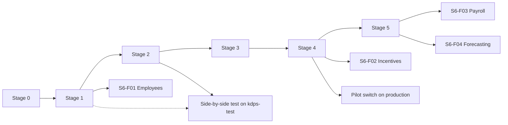

# Roadmap

> **Not ranked.** The six stages of [phases.md](../phases.md), split into features. It decides nothing: if this page and [phases.md](../phases.md) disagree, phases.md wins, and the PRD and the policies win over both.

**Where to look.** The current stage has its own folder: [stage-1/](stage-1/README.md). This page holds the later stages, each with its features, its exit checklist and what must be true before it goes live. Each feature is a vertical slice: a workflow a person can see, with its screen, API and stored records. A feature gets its spec and tickets when its turn comes. `RR-` numbers point to [open-items.md](open-items.md) or [kdps-values.md](kdps-values.md).

**Exit checklists.** A stage exits only when every item of its exit list is ticked with its evidence attached, and, in every stage, each PRD bullet whose "Complete at" falls in the stage passes its whole acceptance while each bullet the stage owns passes the part its owner builds ([coverage.md](coverage.md)). Live activation is a separate list: a stage can exit on synthetic data long before anything goes live. Evidence is a CI run link, a test report, a recorded drill or a reviewed document; a statement alone is not evidence.

## 1. The stages at a glance

| Stage | Outcome for people | Features | Policies needed before live use |
| --- | --- | --- | --- |
| 0. Preparation | Builders can run every check; conventions are fixed. **Done** ([record](../history/stage-0-preparation.md)) | `S0-T01` to `S0-T08` | — |
| 1. Shared foundation | Structure, users, access, masters, imports, numbering, exceptions, books and the stock and money recording rules work on synthetic data. **In progress**: see [stage-1/README.md](stage-1/README.md) | `S1-F01` to `S1-F14` | 2, 4, 9, 18 |
| 2. Goods-in | Booking to accepted stock, with holds, corrections and invoice matching | `S2-F01` to `S2-F13` | 1, 3, 5, 10 (part), 17 |
| 3. Stock movement | Transfers, counts, held goods, supplier returns and claims reconcile | `S3-F01` to `S3-F10` | 17, 1 (return rights), 10 (movement documents) |
| 4. Store day | Opening till to day close, returns, balances, EBO imports, offline and the Store switch | `S4-F01` to `S4-F14` | 6, 7, 8, 14, 16, 19, 10 (invoice format, e-invoice) |
| 5. Financial control | Full accounting, Tally, bank, tax, partners, closure and export, Hindi, messaging | `S5-F01` to `S5-F11` | 9 (rest), 10 (e-way, TDS), 11, 12, 7 (Customer credit) |
| 6. People and planning | HRMS, incentives, payroll, forecasting | `S6-F01` to `S6-F06` | 13, 15, 10 (payroll) |

## 2. Stage 2 — Goods-in

**Outcomes.** Booking → physical receipt → discrepancies → PT approval → labels → accepted stock, with damage holds, corrections and supplier-invoice matching; the side-by-side test imports of the earlier POS ([phases.md](../phases.md) stage 2).

**Excluded.** Inter-Site transfers, supplier returns, disposal, payment runs; buying suggestions (stage 6).

**Prerequisite gates.** Under the stage-overlap rule (section 7): coding once `S1-F04`, `S1-F08` and `S1-F09` are merged, each feature once its stage 2 area design (RR-024) is written and approved (`S2-F13` needs none: its design is imports-and-opening-data, already approved) and the features it depends on are merged; exit only after stage 1 exits. The AI feature also needs the AI gateway design; real side-by-side files need KDPS's agreement to hold real data (RR-180).

**Outside services, simulators first** ([how-we-build.md](how-we-build.md) section 4): the AI provider stub for `S2-F05`, the fake local helper for `S2-F07`.

| Feature | Workflow | Modules | Depends on | Gates | Acceptance evidence |
| --- | --- | --- | --- | --- | --- |
| `S2-F13` Sample layouts and readers | First in stage 2 (`DEC-115`). The layout library holds the KDPS PT template and the chosen vendor-PT and earlier-POS layouts as proposed layout records (GC-6 6.7), each proved on a synthetic replica; readers for XLS, XLSB and CSV beside stage 1's XLSX; earlier-POS line classes; the 10,000-line structured PT parse | `files-imports` | `S1-F06` | Code: RR-033 (the CSV reader). Accept: RR-189 (10,000-line parse) | [imports-and-opening-data.md](../design/platform/imports-and-opening-data.md) 17 tests 1 (other formats), 3 to 10, 19, 27 |
| `S2-F01` Bookings | Booking creates a booking by brand, season and destination with a size-colour grid and terms from the agreement; approval against open-to-buy on its value at cost; ordered, delivered, outstanding and cancelled quantities; late-delivery follow-up | `booking`, `merchandise`, `numbering`, `exceptions` | Stage 1 | Live: RR-077, RR-079, RR-080, RR-157, RR-161 | Stage 2 reports; booking design tests |
| `S2-F02` Arrival, count and GRN | The Receive Goods inbox per Site; Goods arrived or Receive against booking; count by scan or controlled count without booking, invoice or PT; shortage, excess, wrong, unidentified and damage kept apart; custody only from the count; held goods stay held | `receiving`, `stock` ledger, `booking`, `files-imports` (evidence) | `S2-F01`; `S1-F04` (receiving activity) | Live: RR-068, RR-152 (accept) | Stage 2 exit check 1 (`PRD-ACP-001`) |
| `S2-F03` Inbound ownership | Goods owned before receipt are recorded by agreement, booking, document and quantity, never as stock; an amount only from invoice or agreement-price evidence; closed against the receipt count | `receiving` | `S2-F02` | Live: RR-118 (V-58), RR-157 | Stage 2 exit check 2 (`PRD-ACP-020`) |
| `S2-F04` PT workbench and costing | To prepare, To approve and Mapping rules views; PT from the GRN count, a canonical file or a supplier file; costing profiles derive protected fields; per-cell origin; side-by-side view of concurrent edits; the KDPS export profile for the earlier POS | `merchandise` PT, `files-imports`, `calculations` (costing) | `S2-F02`, `S2-F13` | Live: RR-078, RR-159, RR-184; Design: RR-040 | Stage 2 exit check 3 (no overlap); PT design tests |
| `S2-F05` AI drafts for PT files | The AI gateway reads PT source files and photographs into reviewable drafts with origin "AI suggestion"; every path has a manual route; switched off by default | `ai-gateway`, `files-imports` | `S2-F04` | Capability off until switched on per Organisation | `PRD-SEC-002` to `PRD-SEC-004` tests |
| `S2-F06` PT approval and established cost | Independent approval on total proposed acquisition cost; Unknown cost blocks; the frozen revision records coverage and establishes cost through the ledger and balanced journals in one transaction; large PTs post by job | `merchandise` PT, `access`, `stock` ledger, `finance` books | `S2-F04`, `S1-F10` | Live: RR-159, RR-165 | module-map 6.2 flow C; stage 2 exit check 3 |
| `S2-F07` Labels, verification, acceptance | Piece-ID labels from the receipt count; merchandise and MRP labels from frozen PT values through the local helper; barcode verification, acceptance and putaway at the selling Site; the labelling count for a profile changed to piece-tracked | `merchandise` PT, `receiving`, `stock` ledger, local helper | `S2-F06` | Code: RR-151 (printer adapter). Live: RR-069 | Stage 2 exit check 4 (`PRD-ACP-003`) |
| `S2-F08` Damage holds | Damage reported at or after receipt blocks at once; a different person confirms or rejects; rejection clears only that hold; a mistaken confirmation is reversed by a linked record | `stock` documents, `stock` ledger, `access` | `S2-F02` | Live: RR-083 (V-20), RR-173 | Stage 2 exit check 5 (`PRD-ACP-005`) |
| `S2-F09` PT corrections and reversals | Linked corrections that check dependent accepted, reserved, transferred, returned and sold quantities before coverage changes | `merchandise` PT, `stock` ledger | `S2-F06` | Live: RR-159 | `PRD-ACP-002`; stage 4 exit check 4 |
| `S2-F10` Supplier invoice matching | Capture invoices; nightly compare of invoice, GRN and PT quantities, prices, taxes and charges; differences become exceptions for Accounts and Booking | `finance` operations, read models of `receiving` and PT | `S2-F06`, `S1-F08` | Live: RR-074, RR-157 | Invoice-matching design tests |
| `S2-F11` Stock search and goods-in reports | Stock by product, brand, size, barcode, location, condition and owner; booking status, receipt discrepancies, PT right first time, fill rate | `reports`, `stock` read models | `S2-F02`, `S2-F06` | — | Stage 2 reports list |
| `S2-F12` Side-by-side test imports | Earlier-POS daily sales and SOH loaded through saved layouts with duplicate control, for checking and reports only; a load changes no stock | `ebo-imports`, `files-imports` | `S2-F13`, `S1-F13` | Live: RR-038, RR-106 (V-45 run length), RR-135, RR-156, RR-180, RR-197; Design: RR-041 | Stage 2 exit check 6 (`PRD-LIF-014`) |

**Live activation.** Receiving goes live per Site only after its readiness approval (`PRD-LIF-001`) and the stage 2 policies are Signed and validated.

### 2.1 Exit checks

- [ ] Invoice or booking quantities never create uncounted stock; clean accepted quantity proceeds while damage, excess or identity discrepancies stay held (`PRD-ACP-001`).
- [ ] Goods owned before receipt appear as inbound ownership, never as stock; an amount only with invoice or agreement-price evidence; closed against the receipt count (`PRD-ACP-020`).
- [ ] Primary and supplemental PT coverage cannot overlap, including under concurrent approval (`PRD-ACP-002`, `PRD-INT-005`).
- [ ] Supplier, direct-store and opening goods meet the same selling-Site acceptance and hold checks (`PRD-ACP-003`).
- [ ] Damage blocks stock at once; independent rejection clears only the mistaken damage hold (`PRD-ACP-005`).
- [ ] A side-by-side test import changes no stock: after a daily load every stock quantity and value is unchanged (`PRD-LIF-014`; stock-ledger G4).

### 2.2 Checks every stage owes

- [ ] Concurrency, isolation, self-approval (PT, damage, excess and wrong goods, booking), stale versions, duplicates and rollback for every stage 2 posting.
- [ ] Persona journeys for Warehouse, Booking, Accounts and Operations, with recovery.
- [ ] Stage 2 reports: booking status, receipt discrepancies, PT lines right first time, fill rate and timeliness, stock by product, size, location, condition and owner.

### 2.3 Live activation

- [ ] Policies 1, 3, 5, 17 and the stage 2 parts of 10 Signed and validated (RR-157, RR-159, RR-161, RR-173, RR-166).
- [ ] Brand terms, costing profiles, booking rules, budgets, registrations, rates, wrong-goods approvers, framework, cost confirmation, maps, tolerances and the inbound-ownership treatment entered and validated (RR-070, RR-072 to RR-074, RR-077 to RR-081, RR-083, RR-118).
- [ ] Each Site's receiving activity approved after its readiness checks (`PRD-LIF-001`).
- [ ] Before moving-average postings go live: the stock cost rounding rule set and validated (RR-124), and golden scenario G10b accepted with the values under that rule.
- [ ] For the side-by-side test: KDPS's agreement (RR-180), the run length (RR-106), the test-setup field choices (RR-038) and the confirmed import picks (RR-197), the earlier POS's export and PT acceptance (RR-156, RR-184).

## 3. Stage 3 — Stock movement

**Outcomes.** Allocation → transfer → dispatch → store receipt, counts, held goods, supplier returns and claims, with quantity and value reconciled throughout.

**Excluded.** Replenishment and rebalancing (stage 6), e-way creation (stage 5), supplier payment (stage 5).

**Prerequisite gates.** Under the stage-overlap rule: coding once `S2-F06` is merged, each feature once its stage 3 area design (RR-025) is written and approved; exit only after stage 2 exits.

| Feature | Workflow | Modules | Depends on | Gates | Acceptance evidence |
| --- | --- | --- | --- | --- | --- |
| `S3-F01` Transfer approval and reservation | Request by name and code of allowed destinations; independent higher-authority approval on cost; reservation bound to source, custody and condition | `stock` documents, `organisation` (routes), `access` | Stage 2 | Live: RR-122 (V-62) | Stage 3 exit check 1 (`PRD-ACP-006`) |
| `S3-F02` Dispatch, destination count, acceptance | Several dispatches per approval; whole-shipment receipt; good, damaged, wrong, unidentified, excess and missing kept apart; failed delivery returns; completion rules | `stock` documents, `stock` ledger | `S3-F01` | — | Stage 3 exit checks 1, 2, 5 |
| `S3-F03` Statutory movement documents | Documents derived from ownership, entity, registration and movement rules; a missing document is an owned compliance exception | `finance` operations, `stock` documents | `S3-F02` | Live: RR-062, RR-166, RR-176 (MM-13) | Stage 3 scope |
| `S3-F04` Within-Site moves | Exact-quantity moves between floor, backstore, racks and bins, keeping condition and acceptance | `stock` documents | Stage 2 | — | `PRD-STK-005` tests |
| `S3-F05` Counts | Full Store counts with selling stopped and scope frozen; cycle counts with a freeze; every difference explained and approved, the tolerance only choosing the approver; surpluses held as excess; found pieces swapped by a correction | `stock` documents, `stock` ledger, `access` | Stage 2 | Live: RR-084 (V-21), RR-158 | Stage 3 exit check 5; stock-ledger G3, G12 |
| `S3-F06` Quarantine, write-off, disposal | Controlled quarantine movement; write-off of established value; disposal with evidence; pre-PT unknowns stay unknown | `stock` documents, `stock` ledger, `finance` books | `S3-F02` | Live: RR-082 (V-19), RR-173 | Stage 3 exit check 3 (`PRD-ACP-004`) |
| `S3-F07` Return rights and proposed lists | Eligibility and deadlines by receipt origin; reminders in My work; proposed unsold-return lists with exclusions | `supplier-returns`, `merchandise` parties | Stage 2 | Live: RR-077, RR-085 (V-22) | Stage 3 reports |
| `S3-F08` Supplier returns | RTV legs approved independently; departure, handover and receipt kept apart; outcomes Initiated, Completed, Cancelled before departure, Closed partially returned | `supplier-returns`, `stock` ledger | `S3-F07` | Live: RR-157 | Stage 3 exit check 4 (`PRD-ACP-007`) |
| `S3-F09` Claims register | One register for shortage, damage, price differences, promotional funding and display support; debit requests and credit notes linked | `supplier-returns` | `S3-F08` | Live: RR-048 (gap 5, if accepted) | Stage 3 scope |
| `S3-F10` Stock-movement reports | Goods in transit and overdue; count differences; return deadlines; claims; dead and damaged stock; broken size runs | `reports` | `S3-F02` to `S3-F09` | — | Stage 3 reports list |

**Live activation.** Movement goes live per Site after its readiness approval and the stage 3 policies.

### 3.1 Exit checks

- [ ] Transfer approval, several dispatches, whole-shipment counts, cancellation, shortage, damage and failed-delivery return reconcile every quantity without a fake destination receipt (`PRD-ACP-006`).
- [ ] Transferred goods meet the same selling-Site acceptance and hold checks as supplier goods (`PRD-ACP-003`).
- [ ] Missing pre-PT identity or value stays unknown during return, custody movement or disposal (`PRD-ACP-004`).
- [ ] Supplier departure alone does not complete an RTV; partial-pickup closure leaves no pending shipment or undispatched reservation (`PRD-ACP-007`).
- [ ] Stock quantity and value reconcile from receipt through every movement (stock-ledger 11.7 checks run on stage 3 flows).

### 3.2 Checks every stage owes, and live activation

- [ ] Two approvals cannot reserve the same quantity; a count freeze refuses an in-flight sale or move under the lock; persona journeys for Operations and Warehouse.
- [ ] Live: policy 17 (write-off and disposal), the return-rights part of 1 and the movement-document part of 10 Signed and validated; write-off approvers, count limits, reminder schedule, routes and document formats entered (RR-082, RR-084, RR-085, RR-122, RR-062); each Site's movement activity approved.

## 4. Stage 4 — Store day

**Outcomes.** Opening till → sale → payment → return or exchange → day close → reconciliation; EBO imports; the offline counter under its policy; the pilot Store switch on production hosting.

**Excluded.** Bank and provider matching and Tally (stage 5); Hindi and WhatsApp or SMS bills (stage 5). Earlier-POS-bill and unlinked EBO returns stay unavailable; the customer is served by the no-bill route where policy 7 allows it (`DEC-105`, SL-10).

**Prerequisite gates.** Under the stage-overlap rule: coding once `S3-F02` is merged, each feature once its stage 4 area design (RR-026) is written and approved, including consent (MM-15) and the switch design; the offline counter also needs GC-8 approved (RR-014); exit only after stage 3 exits; the switch needs production hosting (RR-029).

**Outside services, simulators first:** a card and UPI provider simulator for `S4-F02`, a GSP simulator then the GSP sandbox for `S4-F09`, a simulated brand feed for `S4-F10`.

| Feature | Workflow | Modules | Depends on | Gates | Acceptance evidence |
| --- | --- | --- | --- | --- | --- |
| `S4-F01` Till session and Store opening | Attendance, readiness checklist, opening cash and till start | `pos`, `finance` operations | Stage 3 | — | `PRD-UXP-006` |
| `S4-F02` Online counter sale | Bill by scan, search or size-colour selector from sellable stock; offers and manual discounts with authority; tenders with exact split; cash received apart from cash tender; one immutable bill with snapshots; reprint keeps identity | `pos`, `calculations`, `stock` ledger, `finance` books, `numbering` | `S1-F11`, `S4-F04` | Live: RR-088 (V-25), RR-101 (V-40), RR-142, RR-143 | Stage 4 exit checks 1 to 3 (`PRD-ACP-010`); performance targets (RR-189) |
| `S4-F03` Customers and consent | Optional phone with purpose shown; marketing consent apart; purchase history with access | `pos` | `S4-F02` | Live: RR-093 (V-32) | `PRD-POS-012` |
| `S4-F04` Offers and price lists | Approved offers with combination rules and cost shares; one evaluation for Running Offers and checkout; end-of-season price lists | `offers`, `calculations` | `S1-F11` | Live: RR-104 (V-43), RR-144, RR-175 | Stage 4 exit check 6; `PRD-OFR-021` |
| `S4-F05` Returns, exchanges, refunds | Bill-backed entitlement from what was paid; exchanges at current price; split-tender refunds; no-bill returns only under policy; defective-goods route | `pos`, `calculations`, `stock` ledger | `S4-F02` | Live: RR-086, RR-087, RR-089, RR-126 to RR-128, RR-131, RR-162, RR-163 | Stage 4 exit checks 1, 2 (`PRD-ACP-008`, `PRD-ACP-009`) |
| `S4-F06` Store credit, gift vouchers, loyalty | Balances checked and consumed online; liabilities and history kept | `pos` | `S4-F05` | Live: RR-090 to RR-092 | Stage 4 exit check 2 |
| `S4-F07` Billed-retained | Paid goods held for collection or alteration with protected quantity | `pos`, `stock` ledger | `S4-F02` | Live: RR-094 to RR-096, RR-150, RR-164 | `PRD-POS-018` |
| `S4-F08` Day close and cash | Denomination count, variance approved within the tolerance's approver set, petty cash, pickup and deposit | `finance` operations | `S4-F02` | Live: RR-099 (V-38), RR-100 (V-39), RR-129 (V-70) | `PRD-CSH-001` to `PRD-CSH-005`, `PRD-CSH-011` |
| `S4-F09` IRN and tax documents | E-invoice through a GSP sandbox; the bill waits for its IRN before the tax invoice prints (MM-10); cancellation and correction apart from operational reversal | `finance` operations, `pos` | `S4-F02` | Live: RR-102 (V-41), RR-131 (V-72), RR-176 | Stage 4 exit check 7 (`PRD-TAX-004`) |
| `S4-F10` EBO imports | Brand-software sales, returns, stock and payment reports through saved layouts, applied once; an oversell is held | `ebo-imports`, `stock` ledger | `S2-F13` | Live: RR-103 (V-42) | Stage 4 exit check 5 (`PRD-ACP-012`) |
| `S4-F11` Offline counter | One authorised counter per Store; 24-hour authority; working set without cost; local commit in one IndexedDB transaction; safe upload; pause and release | `pos`, counter PWA | `S1-F12`, `S4-F02`, GC-8 | Live: RR-097 (V-36), RR-098 (V-37), RR-125 (V-66), RR-172 | Stage 4 exit check 8 (`PRD-ACP-011`), before offline is enabled |
| `S4-F12` Opening stock and the Store switch | Switch count, labelling of every piece-tracked piece, reconciliation with the last SOH, verified opening stock, fresh bill series, cutover approval; production only | `site-lifecycle`, `stock` ledger, `numbering`, `files-imports` | `S1-F13`, `S4-F02` | Live: RR-029, RR-043, RR-044, RR-105 (V-44), RR-106 (V-45), RR-117 (V-57), RR-132, RR-133, RR-170 | Switch checks in [phases.md](../phases.md) "Testing and switch-over" |
| `S4-F13` Store operator areas | Billing, Bills, Till and Sync, opening and closing checklists | `pos` screens | `S4-F02` | — | `PRD-UXP-004` |
| `S4-F14` Store-day reports | Sales by Store, brand, category, size, salesperson and hour; day-close variance; offer sales and who funded them | `reports` | `S4-F02`, `S4-F08` | — | Stage 4 reports list |

**Live activation.** Selling goes live per Site after its readiness approval; offline only under policy 16 and the offline exit check; the switch only on production hosting (`PRD-LIF-026`).

### 4.1 Exit checks

- [ ] Organisation return policy and authorised Store override apply correctly; original paid caps, replacement price, refund state and physical disposition stay separate (`PRD-ACP-008`).
- [ ] Concurrent returns and credit redemption cannot spend the same entitlement twice (`PRD-ACP-009`).
- [ ] Changed offer totals, cash splits, explicit zero, invalid entry and repeated checkout give one correctly paid immutable bill; printer failure makes no new sale (`PRD-ACP-010`).
- [ ] A PT correction after sale or transfer keeps origins and respects dependent quantities (`PRD-ACP-002`).
- [ ] Duplicate or corrected EBO uploads affect stock, incentives and finance once and create no second GST invoice (`PRD-ACP-012`).
- [ ] Opening unknown season excludes season-specific offers; a later correction cannot rewrite past bills or labels (`PRD-ACP-014`).
- [ ] A cancelled or corrected tax document stays distinct from the operational reversal (`PRD-TAX-004`).
- [ ] Before offline is enabled: power loss, restart, expiry, full storage, duplicate tabs, wrong clock, device replacement, repeated upload and year-spanning pause keep bills, quantities and numbering (`PRD-ACP-011`).

### 4.2 Checks every stage owes

- [ ] Counter performance measured against the PRD targets on real Store connections during the side-by-side test (RR-189); counters never wait on background work (`PRD-PRF-003`).
- [ ] Persona journeys for Cashier, Store manager, Salesperson and EBO staff, including till recovery after a browser restart.

### 4.3 Live activation and the pilot switch

- [ ] Policies 6, 7, 8, 14, 16, 19 and the stage 4 parts of 10 Signed and validated (RR-162 to RR-164, RR-170, RR-172, RR-175, RR-166).
- [ ] The stage 4 KDPS values entered and validated (RR-086 to RR-106, RR-117, RR-125 to RR-131).
- [ ] Production hosting in place (RR-029); `DEC-067` and SL-9 answered (RR-043, RR-044).
- [ ] Restore drill on production before go-live (`POL-18.03`, RR-188).
- [ ] Go or no-go pass marks of [phases.md](../phases.md) "Testing and switch-over" met: no unexplained material difference at the switch count, all participating staff trained, no serious exception open, Site readiness verified; signed by Owner, Accounts and Operations (`POL-14.05`, `POL-14.08`).
- [ ] Offline switched on only after 4.1's offline check passes and policy 16 is Signed (`DEC-051`).

## 5. Stage 5 — Financial control

**Outcomes.** The records written since stage 2 are reconciled, closed by period and exchanged with Tally; bank, payables, receivables, tax, assets, NAV and partners; closure and export; Hindi for stages 1 to 5; messaging.

**Prerequisite gates.** Under the stage-overlap rule: coding once `S4-F02` is merged, each feature once its stage 5 area design (RR-027) is written and approved, including MM-11; exit only after stage 4 exits; Tally testing needs a test Tally company (RR-181).

**Outside services, simulators first:** a simulated Tally gateway then the test company for `S5-F02`, synthetic bank and settlement files for `S5-F03` and `S5-F04`, a capture sink then named test recipients for `S5-F11`.

| Feature | Workflow | Depends on | Gates |
| --- | --- | --- | --- |
| `S5-F01` Period close and reconciliation | Month-close checklists, reconciliations, NRV write-downs, official book | Stage 4 | Live: RR-063, RR-146, RR-147, RR-149, RR-167 |
| `S5-F02` Tally exchange | Vouchers through the local gateway, acknowledgments and retries without duplicates | `S5-F01` | Accept: RR-181. Live: RR-107 (V-46), RR-178 (MM-12) |
| `S5-F03` Settlement and bank matching | Provider reports and bank statements imported once; suggested matches; unmatched lines to review | Stage 4 | — |
| `S5-F04` Payables and payment runs | Invoice to payment readiness; payment plans, runs, bank files; paid only on bank evidence | `S2-F10` | Live: RR-121 (V-61), RR-157, RR-165 |
| `S5-F05` Receivables, Customer credit, commission | Ageing, partial receipts, Customer credit at the till, onward commission authority | `S4-F02` | Live: RR-119 (V-59), RR-130 (V-71), RR-163, RR-168 |
| `S5-F06` GST, e-way, TDS | Registers, GSTR-2B matching, e-way through a GSP, TDS, statutory calendar | `S4-F09` | Live: RR-109 (V-48), RR-166 |
| `S5-F07` Assets, NAV, Store P&L | Fixed assets, monthly Store NAV, brand-by-Store profit to profit before tax | `S5-F01` | Live: RR-110 (V-49), RR-111 (V-50), RR-148 |
| `S5-F08` Partners and EBO settlement | Partner agreements, ledgers and statements; partner users on their Stores; EBO brand settlement | `S4-F10` | Design: RR-154. Live: RR-108 (V-47), RR-116 (V-56), RR-168 |
| `S5-F09` Closure, relocation, export | Closure stops new work and settles everything; relocation keeps identities; complete export with control totals | `S1-F14` | — |
| `S5-F10` Hindi for stages 1 to 5 | Every screen of stages 1 to 5 in Hindi from the message catalogue | Stages 1 to 4 screens | — |
| `S5-F11` Messaging | Email, WhatsApp and SMS adapters: digital bills, phone approvals, the 9 PM summary, alerts; only to named test recipients on `kdps-test` | Stage 4 | Live: RR-112 (V-51), RR-120 (V-60) |

### 5.1 Exit checks

- [ ] Purchase, partial receipt, dispute, credit and payment, and sale, return and provider settlement reconcile through operational records, ledgers and Tally (`PRD-ACP-016`).
- [ ] One Site with units in different books and registrations keeps correct mappings and historical snapshots (`PRD-ACP-013`).
- [ ] Closure cannot retire unresolved stock, money or cases; reopening and relocation keep identities and history (`PRD-ACP-015`).
- [ ] The complete export reproduces linked records, attachments and control totals without reusing business identities (`PRD-ACP-019`).

### 5.2 Live activation

- [ ] Policies 9 (remaining parts), 11, 12, the stage 5 parts of 10, and 7 for Customer credit Signed and validated (RR-165 to RR-168, RR-163).
- [ ] Voucher types checked against KDPS's real Tally in a test company first (RR-107, RR-181); the other stage 5 values entered (RR-108 to RR-112, RR-116, RR-119 to RR-121, RR-130).

## 6. Stage 6 — People and planning

| Feature | Workflow | Depends on | Gates |
| --- | --- | --- | --- |
| `S6-F01` Employees, attendance, rosters, leave | Employee records, attendance with photo and device, rosters, leave; can start after stage 1 ([phases.md](../phases.md)) | Stage 1 | Live: RR-113 (V-52), RR-169, RR-179 (GC3-9) |
| `S6-F02` Targets and incentives | Targets; incentives from approved sales and attendance with policy versions; incentive golden cases | Stage 4 sales evidence | Live: RR-113 (V-52) |
| `S6-F03` Payroll | Native payroll and external exchange; liabilities and payments apart; replay never doubles | Stage 5 books | Live: RR-114 (V-53) |
| `S6-F04` Forecasting and planning | The Python forecasting service; proposals that cannot buy, transfer or reprice without approval; only when history meets the quality rule | Dependable history | Live: RR-115 (V-54), RR-171 |
| `S6-F05` Plain-language questions | Answers only from the asker's authorised data, with inspectable records | Stage 5 read models | — |
| `S6-F06` Hindi for stage 6 | Check-in, targets, incentives, payslips, Self-service and planning in Hindi | `S6-F01` to `S6-F04` | — |

### 6.1 Exit checks

- [ ] Attendance correction, returned-sale incentives and payroll replay keep raw evidence and one approved period outcome (`PRD-ACP-017`).
- [ ] Shared golden cases for incentives, including returned-sale reversals and policy versions, pass on the shared logic (`PRD-ACP-018`, `PRD-MOD-007`).
- [ ] Planning proposals cannot purchase, transfer or change prices without the relevant approval (`PRD-EXC-020`).
- [ ] Forecasts are evaluated against the configured horizon, baseline and quality measures (`PRD-EXC-021`).

### 6.2 Live activation

- [ ] Policies 13, 15 and the payroll part of 10 Signed and validated (RR-169, RR-171, RR-166); pay, payroll and forecast values entered (RR-113 to RR-115).
- [ ] Forecasting starts only when the history meets the Planning policy's quality rule ([phases.md](../phases.md) stage 6).

## 7. The stage-overlap rule

- Design of a stage may start once the shared contracts it calls are settled ([how-we-build.md](how-we-build.md) section 5).
- Coding of a stage's feature may start once the previous stage's first posting feature is merged (named in each stage's prerequisite gates), its area design is written and approved, and the features it depends on are merged. The one exception is the order [phases.md](../phases.md) gives inside stage 6: employee records, attendance, rosters and leave may start after stage 1.
- A stage exits only after the previous stage has exited.
- Live use follows each stage's own live-activation list. Building a feature never switches it on (`PRD-SEC-017`, `DEC-105`).

## 8. Across stages

- Every stage follows the stage-overlap rule of section 7. The one exception is the order [phases.md](../phases.md) gives inside stage 6: employee records, attendance, rosters and leave may start after stage 1.
- No later-stage feature is switched on early. Building it does not enable it: every policy-dependent operation ships off (`DEC-105`, `PRD-SEC-017`).
