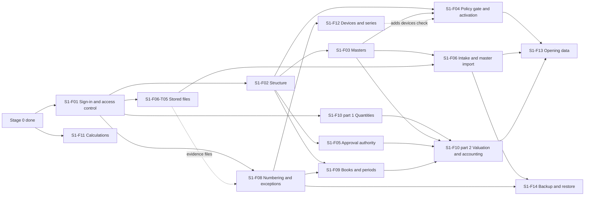

# Stage 1 — Shared foundation

> **Not ranked.** Stage 1 of [phases.md](../../phases.md), split into features. It decides nothing; phases.md, the PRD and the policies win over it.

The whole stage in one document: [spec.md](spec.md). Each feature with a spec has its own folder here: `spec.md` says what it does; `tickets/` holds one file per piece of work, with its status. Later stages are in [roadmap.md](../roadmap.md).

## 1. Goal

- An Admin sets up a synthetic Organisation: people sign in with a password and an authenticator code, and every access change is approved by a second person (`PRD-SEC-001`, `PRD-ACS-023`).
- Admin and Operations build legal entities, registrations, books, Sites, Stores, business units and locations; each business unit's mapping is verified by a different person (`PRD-ORG-005`, `POL-10.08`).
- Booking maintains products, vocabularies, codes, tracking profiles, parties and dated agreements, with proposals confirmed by another person (`PRD-MER-013`, `PRD-IMP-008`).
- Masters can be loaded from XLSX files through staging, review and publishing, without duplicates (`PRD-IMP-005`, `PRD-IMP-011`).
- An operation whose policy is not configured, or whose Site activity is not granted, stays unavailable and says why (`PRD-SEC-017`, `PRD-LIF-002`).
- Accounts sets up books, maps and periods; on synthetic data the golden scenarios post stock and balanced journals together, and the golden cases price bills identically on server and counter (`PRD-ACP-018`).
- A backup restores with linked records and attachments (`PRD-SEC-012`).

## 2. Where we are

Updated 7 Oct 2026.

| Feature | State |
| --- | --- |
| `S1-F01` Sign-in and access control | Built on the branch `s1/f01-first-access` with both rounds of review fixes, merged into `main` and deployed to Railway `dev` on 7 Oct 2026; every check and the six browser journeys pass locally. 21 tickets done, including T22 to T25 (`DEC-118`) and T26 and T27 from 7 Oct 2026: the starting roles can prepare and approve security settings changes, and assignment dates are checked at every request (T26, `DEC-120`); the server serves the screens at one address (T27). The Railway `dev` project `apparel-os` runs `main` with automatic deploys; the two synthetic Organisations are set up there (RR-187; T14's Demo 0 done). CI is green on the pushed branch (run 37603828723) and the product owner approved the screens on 7 Oct 2026 (T09 done). Left: T20 (Demo 1 and acceptance, RR-350). Open questions: RR-380, RR-401, RR-420 |
| `S1-F11` Shared calculations | Done, accepted 8 Oct 2026: 38 golden cases pass on the server and in Chromium on the counter build (`apps/counter`), the counter bundle excludes costing, CI green (run 37679034974). Left in later stages: the live values (RR-136 to RR-145) and RR-042 |
| `S1-F10` Stock ledger | Design choices approved on 6 Oct 2026 with two fixes, with the lock order and row security for stock rows (RR-012, RR-227, RR-228 (b) to (e); `DEC-116`). Part 1 "Stock quantities and movements" (T01, T02) built and reviewed on 8 Oct 2026, merged into `main` and deployed to `dev`; part 2 "Stock valuation and accounting" waits for books, masters and exceptions |
| `S1-F12` Devices, `S1-F14` Backup and restore | GC-8 sections 3 to 5 and 11 approved on 6 Oct 2026; sections 6 to 10 stay Draft, due before the stage 1 exit gate (RR-014). GC9-9 and GC9-10 approved; the rest of GC-9 is finished in `S1-F14-T01` (RR-010) |
| `S1-F06` File intake | `S1-F06-T05` (stored files and evidence attachments) done 8 Oct 2026, merged into `main` and deployed to `dev`; `S1-F06-T06` (protected download, encrypted receipt names; RR-432, RR-433) done 8 Oct 2026. T01 to T04 wait on `S1-F02`, `S1-F03`, `S1-F04` and `S1-F08` |
| `S1-F08` Number series and exceptions | Done 9 Oct 2026: gapless number series (T01), exceptions in My work (T02), evidence files on exceptions and approval decisions (T03), live updates and the failed-jobs view (T04). Open: RR-449 (no screen defines number formats or series yet), RR-453, RR-454, RR-455, RR-456 |
| The other features | Not started; their tickets are written (section 8) and the whole stage is in one [spec](spec.md). `S1-F07` moved to stage 2 as `S2-F13` (`DEC-115`) |

Next: product and party masters (`S1-F03`), after the master PRD bullets are approved (RR-047). `S1-F02-T04` (configurable classifications and grouping kinds) is done, 9 Oct 2026. `S1-F05` (approval authority) is done, 9 Oct 2026. `S1-F08` (number series and exceptions) is done, 9 Oct 2026. `S1-F02` (organisation structure: T01 legal entities, Sites and Stores; T02 business units, verified mappings and locations; T03 scope by place, 9 Oct 2026) and stock ledger part 1 (`S1-F10` T01, T02) are done, merged into `main` and deployed to `dev` on 8 Oct 2026. The build order is in the [stage spec](spec.md).

## 3. Scope

**Included:** the "In scope" list of [phases.md](../../phases.md) stage 1, with the designs GC-1 to GC-7; GC-8 sections 3 to 5 and 11 (approved), with sections 6 to 10 still Draft; GC-9, with GC9-9 and GC9-10 approved and the rest finished in `S1-F14-T01`. Reports: master lists, access and audit history, import outcomes.

**Excluded:** live Store selling, live policy-dependent stock or financial posting, loading real opening balances, the AI gateway (stage 2, `DEC-105`), messaging (stage 5, `DEC-099`), offline billing itself (stage 4). Paths for these may be exercised on synthetic data only. The sample layouts, the XLS, XLSB and CSV readers and the 10,000-line PT parse, once `S1-F07`, are stage 2's `S2-F13` (`DEC-115`); stage 1 reads XLSX. Screens for book settings, the chart of accounts and tax configuration come before the first live posting in stage 2; in stage 1 they are API only (`DEC-116`).

## 4. Why this order

The sequence asked for was: scoped access approval; Site and business-unit setup and verification; product and party masters; one synthetic master import; then stock movement with balanced posting. It holds, with four adjustments the designs require:

1. **Sign-in comes inside the first feature.** An approval needs two authenticated people, and the first two exist only after the setup step (`PRD-ACS-023`, `DEC-101`). `S1-F01` therefore starts with setup and sign-in, then the approved role assignment. Its assignments use all-members or empty scope; selected Sites, Stores and units arrive with `S1-F02`, because `access` checks them through the `organisation` scope contract (module-map section 3, rule 6).
2. **The policy gate and Site activation come right after structure** (`S1-F04`). Two stage 1 exit checks depend on it, and every later policy-dependent operation asks it.
3. **Numbering, exceptions and books come before stock with posting** (`S1-F08`, `S1-F09`). Journals need periods, maps and numbers; a valued movement with no valid map must raise an exception in its own transaction (SL-23 Outcome A, `DEC-105`); approvals with limits need `S1-F05`.
4. **Stock comes in two parts.** The ledger's interface, tables and synthetic harness (stock-ledger 13 to 15, with decisions H1 to H6 of `DEC-112`) were approved on 6 Oct 2026 (`DEC-116`). Part 1, "Stock quantities and movements", is built right after `S1-F01`: its development tests may use stand-ins of the `organisation` and `merchandise` read contracts, and its acceptance uses the real modules. Part 2, "Stock valuation and accounting", waits for books, masters and exceptions. Stage 1 has no business documents to drive the golden scenarios, so a synthetic harness drives them through the real services ([S1-F10 spec](s1-f10-stock-ledger/spec.md)).

Shared calculations (`S1-F11`) depend on nothing but the domain package and can run beside everything from the start.

## 5. Features

| Feature | Workflow a person can see | Modules | Depends on | Gates (open items) | Acceptance evidence |
| --- | --- | --- | --- | --- | --- |
| `S1-F01` Sign-in and access control | In two parts, "Sign-in and screens" and "Roles and approvals". Setup creates a synthetic Organisation with its first Admin and approver; they sign in with an authenticator code; the Admin prepares a role assignment; a different person approves it from My work; the new user can do exactly what it grants; all of it shows in history | `kernel`, `access`, `audit`, `inbox`, `configuration` (Organisation settings) | Stage 0 | Live: RR-054 to RR-056, RR-064, RR-067, RR-158 | [spec](s1-f01-first-access/spec.md) section 14 |
| `S1-F02` Organisation structure and verified mappings | Admin builds legal entities, registrations, book identities, geography, Sites, Stores, units and locations; a second person approves each change; a different person verifies each unit's mapping; assignments can now select Sites, Stores or units, and a selected Site covers places added later; master lists | `organisation`, `access` (scope contract, place tree, effective grants), `audit` | `S1-F01` | Live: RR-081 (V-18), RR-122 (V-62), RR-176, RR-178 | [structure-and-masters.md](../../design/masters/structure-and-masters.md) 9 tests 1 to 6, 14 to 16; [access-and-approvals.md](../../design/access/access-and-approvals.md) 15 tests 8, 9; stage 1 exit check 1 (mapping part) |
| `S1-F03` Product and party masters | Booking maintains brands, categories, vocabularies (confirmed by a different person), SKUs and size grids, external codes, units and packs, tracking profiles; parties and dated agreements; product proposals confirmed by a different person; bank details masked, encrypted, and changed only with a second person's approval | `merchandise` catalogue and parties, `access` (field classes, encryption), `audit` | `S1-F01`; `S1-F02` read interface | Design: RR-047 (PRD bullets and design edits for the `DEC-112` picks, before the code that implements them). Live: RR-068, RR-069, RR-077, RR-179 | structure-and-masters 9 tests 7 to 13, 18 to 21; access-and-approvals 15 test 23 (bank details) |
| `S1-F04` Policy readiness and Site activation | Admin sees each policy's status and records Signed with evidence; a person who did not enter a policy's real values validates them (DM-6); capabilities ship off; operations that record business effects are gated, setup and configuration are not (`DEC-116`); Operations runs the readiness checks of `DEC-116` (users and access, required policies, stock plan); a different person approves receiving, movement or selling for a unit; anything not configured shows unavailable with its reason. The devices check is added later by `S1-F12` | `configuration`, `site-lifecycle` (readiness), `organisation`, `access` | `S1-F01`, `S1-F02`, `S1-F03` access tasks | Live: RR-057, RR-157 to RR-175 | access-and-approvals 15 test 1; stage 1 exit checks 5 and 6 |
| `S1-F05` Approval authority | Admin sets approval limits per action, role or person, with the basis shown; requests route to the lowest covering limit and otherwise wait; Unknown value needs explicit authority; stand-ins expire by themselves; bulk approval only for allowlisted types; overdue approvals escalate | `access`, `inbox` | `S1-F01`, `S1-F02` | Live: RR-058, RR-059, RR-065 | access-and-approvals 15 tests 13, 13a, 17, 18, 18a, 20a |
| `S1-F06` File intake and a synthetic master import | Stored files first (`S1-F06-T05`, right after `S1-F01`): encrypted with the Organisation key, hashed before encryption, keyed by Organisation id, never overwritten or deleted by the app, served only through the app, attachable as evidence. Then a preparer uploads a synthetic XLSX product file; intake checks it and keeps the encrypted original; the layout is found by structure; a saved, versioned mapping stages rows with each value's origin; the validation report lists problems; a reviewer publishes through the `merchandise` and `organisation` handlers; a repeat upload is a duplicate; the import outcomes report | `files-imports`, `merchandise`, `organisation`, `audit`; S3-compatible storage (MinIO locally) | `S1-F01` (T05); `S1-F02`, `S1-F03` | Code: RR-203 (customer-contact check). Accept on `dev`: RR-187. Live: RR-036, RR-134, RR-197 (layout confirmers; customer-contact refusal on `kdps-test`) | [imports-and-opening-data.md](../../design/platform/imports-and-opening-data.md) 17 tests 1 (XLSX only, with macro and link refusal; the other formats are `S2-F13`), 2, 11 to 17, 25, 26, 28; the stored-file and evidence tests of `S1-F06-T05` |
| `S1-F07` | Moved to stage 2 as `S2-F13` (`DEC-115`) | — | — | — | — |
| `S1-F08` Number series and exceptions | Modules take gapless numbers inside their transaction; an exception gets an owner and due time from its routing, appears in My work, takes evidence, escalates, and closes only after the owning module's check; an exception survives a rollback; a job that keeps failing raises an unfinished-operation exception; evidence files attach to exceptions and to approval decisions; live updates carry identifiers to My work and operators see failed jobs in a simple list (`S1-F08-T04`) | `numbering`, `exceptions`, `inbox`, `kernel` (operations view), `files-imports` (evidence) | `S1-F01`; `S1-F06-T05` for evidence | Live: RR-060, RR-066 (V-03), RR-129 (V-70) | [numbering-and-audit.md](../../design/platform/numbering-and-audit.md) 7 tests 1 to 5; access-and-approvals 15 test 21 |
| `S1-F09` Books, posting maps, periods and tax-rule records | Accounts sets up a synthetic book with its cost formula and pool, chart and dimensions, versioned posting maps with approval, and periods; locks a period; a reopening needs a second person and admits only the named corrections; tax-rule records are kept effective-dated and approved like posting maps; trial balance. Book settings, the chart and tax configuration are API only in stage 1 (`DEC-116`) | `finance` books and tax rules, `numbering`, `exceptions` | `S1-F02`, `S1-F08` | Live: RR-061, RR-070, RR-073, RR-074, RR-081, RR-198 (posting-map workflow and journal series confirmed) | [books-and-posting.md](../../design/finance/books-and-posting.md) 15 tests 2, 3, 6, 9 to 15, 18 |
| `S1-F10` Stock ledger | Design approved 6 Oct 2026 (RR-012, RR-227, RR-228 (b) to (e); `DEC-116`). Two parts: "Stock quantities and movements", right after `S1-F01`, and "Stock valuation and accounting". On synthetic data the story of stock-ledger 11.1 runs under both cost formulas and both pool modes; each step's journals commit with its movements; the checks of 11.7 hold after every step; scenarios G2 to G13, with G10a (G10b waits for the rounding rule); concurrency on real PostgreSQL; a large posting runs as a job while sales go on; each approval is used once; all driven by the synthetic harness through the real services | `stock` ledger, `finance` books, `access` (verify under lock, record use), `numbering`, `exceptions`, `audit`, `kernel` (lock order, jobs); the test-only harness ([spec](s1-f10-stock-ledger/spec.md)) | Part 1: `S1-F01`. Part 2: `S1-F02`, `S1-F03`, `S1-F05`, `S1-F08`, `S1-F09` | Accept: RR-189 (large posting), RR-200, RR-239 (anchor-row contention). Live: RR-071, RR-072, RR-124 (G10b), RR-182; RR-228 (a) in stage 3 | [stock-ledger.md](../../design/stock/stock-ledger.md) 11.2 to 11.9; books-and-posting 15 tests 1, 4, 5, 7, 8, 16, 17 and section 16; access-and-approvals 15 test 16; stage 1 exit check 3 |
| `S1-F11` Shared calculations on server and counter | `packages/calculations` with its selling and costing entry points; the golden cases of GC-7 12.4 on synthetic rule data; the server suite and the counter test page in Chromium give identical results; the counter bundle provably excludes the costing entry point | `calculations`; the counter build host (`apps/counter`) | Stage 0 | Accept: RR-042 (cases where readings differ). Live: RR-136 to RR-145 | [shared-calculations.md](../../design/calculations/shared-calculations.md) 12.4, 12.5; stage 1 exit check 2; [spec](s1-f11-shared-calculations/spec.md) section 7 |
| `S1-F12` Billing devices and device bill series | Under GC-8 sections 3 to 5 and 11 (approved 6 Oct 2026): an Admin registers a billing device for a Store and its registrations; enrolment asks a fresh authenticator code; each device gets its own series per registration and financial year; a second open series is refused; revoking a device ends its sessions; a replacement starts a fresh series. Offline billing itself waits for stage 4 | `access` (devices), `numbering`, `pos` (device facts only), `organisation` | `S1-F01`, `S1-F02`, `S1-F08` | Exit: GC-8 sections 6 to 10 decided (RR-014). Live: RR-060, RR-101 (V-40) | numbering-and-audit 7 tests 2 to 4; access-and-approvals 15 test 5 |
| `S1-F13` Opening-data layouts and reconciliation | Layouts for opening stock, dues, advances and deposits; synthetic batches staged and validated; comparison runs against synthetic balances and a synthetic SOH; a test handler posts synthetic opening counts through the ledger as a job, in tests only (`DEC-116`); publishing stays unavailable without policy 14 Signed and validated; a historical-reference load changes no stock | `files-imports`, `stock` ledger (test handler), `configuration`, `ebo-imports` (only the historical-reference handler, `DEC-116`) | `S1-F04`, `S1-F06`, `S1-F10` | Design: RR-047 (gap 18, opening-stock age). Live: RR-132, RR-133, RR-170, RR-197, RR-199 | imports-and-opening-data 17 tests 18, 20 to 22, 24 |
| `S1-F14` Backup, restore and export proof | The rest of GC-9 is finished first (`S1-F14-T01`); on `dev` a synthetic Organisation with linked records and attachments is backed up and restored into a fresh environment; every stored file matches its hash and opens from its record; number series stay paused until reconciled; audit seals verify; nothing is deleted while no retention period is set | `kernel` (operations), `files-imports`, `numbering`, `audit` | `S1-F06`, `S1-F08`; data from earlier features | Code: the rest of GC-9 (RR-010). Exit: RR-188; the `dev` backup-key custodian named before the drill (RR-236). Live: RR-075 (V-12), RR-076 (V-13), RR-123 (V-63), RR-237 (production backup-key custodian) | imports-and-opening-data 17 test 23; numbering-and-audit 7 tests 7, 10, 14; stage 1 exit check 4 |

## 6. When each feature can start

| Feature | Starts when |
| --- | --- |
| `S1-F01` | Built, with T22 to T25 (`DEC-118`); waits for acceptance (RR-350) |
| `S1-F06-T05` (stored files and evidence attachments) | `S1-F01` merged |
| `S1-F11` | Started; the server half is built. The counter run can start (Playwright arrived with `S1-F01-T15`) |
| `S1-F02` | `S1-F01` merged (kernel, access, audit and inbox settled) |
| `S1-F08` | `S1-F01` merged (numbering first); evidence files after `S1-F06-T05` |
| `S1-F05` | The `S1-F02` access tasks merged |
| `S1-F03` | `S1-F02`'s read interface merged; its access tasks after `S1-F05` |
| `S1-F04` | `S1-F02` and the `S1-F03` access tasks merged |
| `S1-F06` (T01 to T04) | The `S1-F02` and `S1-F03` maintain operations merged |
| `S1-F07` | Moved to stage 2 as `S2-F13` (`DEC-115`) |
| `S1-F09` | `S1-F02` and `S1-F08` |
| `S1-F12` | `S1-F08` |
| `S1-F10` | Part 1 when `S1-F01` is merged; part 2 after `S1-F03`, `S1-F05`, `S1-F08`, `S1-F09` |
| `S1-F13` | `S1-F04`, `S1-F06`, `S1-F10` |
| `S1-F14` | `S1-F14-T01` (finishing GC-9) now; the rest after `S1-F06`, `S1-F08` and T01 |

How many people or agents build at once (RR-031) never blocks the start.

## 7. Exit checklist

### 7.1 Exit checks from phases.md

- [ ] **One Site, units in different books and registrations, keeps correct mappings** (`PRD-ACP-013`). Evidence: [structure-and-masters.md](../../design/masters/structure-and-masters.md) 9 test 1 and [books-and-posting.md](../../design/finance/books-and-posting.md) 15 test 7 green in CI.
- [ ] **Shared golden cases pass on server and counter code** (`PRD-ACP-018`, `PRD-MOD-007`). Evidence: the Vitest suite and the Playwright counter run of [shared-calculations.md](../../design/calculations/shared-calculations.md) 12.2 green in the same CI run, with the case list and the IDs each case covers.
- [ ] **Golden stock-and-posting scenarios pass under both cost formulas and both pool modes** (`PRD-LED-014`, `PRD-LED-015`). Evidence: [stock-ledger.md](../../design/stock/stock-ledger.md) 11.2 to 11.7 and books-and-posting 16 green, driven through the real services by the synthetic harness ([S1-F10 spec](s1-f10-stock-ledger/spec.md)). This check is the story of stock-ledger 11.1, as [phases.md](../../phases.md) names it; G10 is not part of it. `S1-F10` proves G10a (with no rounding rule the outflow is refused and commits nothing; an emptying outflow leaves no residue); G10b waits for the rule and is in the stage 2 live activation of [roadmap.md](../roadmap.md) (2.3), never passed by an invented rule.
- [ ] **A backup restores with linked records and attachments** (`PRD-SEC-012`). Evidence: the GC-9 design approved; a restore drill record on `dev` with synthetic data: steps, start and end times, every stored file matching its hash and opening from its record ([imports-and-opening-data.md](../../design/platform/imports-and-opening-data.md) 17 test 23), number series paused until reconciled ([numbering-and-audit.md](../../design/platform/numbering-and-audit.md) 7 test 7), audit seals verified; the `dev` backup-key custodian named by the product owner before the drill (RR-236).
- [ ] **An operation whose policy is not configured stays unavailable** (`PRD-SEC-017`). Evidence: [access-and-approvals.md](../../design/access/access-and-approvals.md) 15 test 1, imports-and-opening-data 17 test 22 and books-and-posting 15 test 15 green; a browser journey showing the reason on screen.
- [ ] **An activity stays disabled for a Site or business unit until its readiness checks pass** (`PRD-LIF-002`). Evidence: the `S1-F04` acceptance tests green.

### 7.2 Checks every stage owes

- [ ] Concurrency on real PostgreSQL: stock-ledger 11.9, `S1-F01-AT14`, imports-and-opening-data 17 test 15, numbering-and-audit 7 test 2.
- [ ] Organisation isolation in every module that holds data: access-and-approvals 15 test 2, structure-and-masters 9 test 14.
- [ ] Self-approval refused for every independently approved action built in stage 1: access changes, structure, mapping verification, agreements, bank details, vocabulary, product proposals, mapping rules, layout and mapping versions (`DEC-112`), posting-map and account versions (`DEC-112`), tax-rule records (`DEC-116`), stand-ins, period reopening.
- [ ] Stale-version refusal, duplicate requests answered once, and partial-failure rollback (one failing line fails its document; an exception survives the rollback that found it).
- [ ] Persona browser journeys for every stage 1 screen, including recovery: a locked session keeps unfinished work, and a reload in the middle of an approval decides nothing twice.
- [ ] The large posting while counters sell (stock-ledger 11.9, RR-189), on synthetic data. The 10,000-line PT parse moved to stage 2 with `S2-F13` (`DEC-115`).

### 7.3 Completeness

- [ ] `S1-F01` to `S1-F14` accepted, each with its evidence; `S1-F07` is now stage 2's `S2-F13` (`DEC-115`).
- [ ] GC-8 sections 6 to 10 and the rest of GC-9 approved by the product owner (RR-014, RR-010). GC-8 sections 3 to 5 and 11, GC9-9, GC9-10 and the stock ledger interface and tables were approved on 6 Oct 2026 (`DEC-116`).
- [ ] Stage 1 reports exist: master lists, access and audit history, import outcomes.
- [ ] Every PRD bullet owned by a stage 1 feature passes the part its owner builds, and every bullet completed in stage 1 passes its whole acceptance ([coverage.md](../coverage.md)).
- [ ] No KDPS-valued setting has a default, and no synthetic value is read as one.
- [ ] The link check passes in CI; [open-items.md](../open-items.md) and [STATUS.md](../../STATUS.md) are up to date.

### 7.4 Live activation (separate from exit)

On production:

- [ ] Policies 2, 4, 9 and 18 Signed, with their real values validated by a person who did not enter them (DM-6; RR-158, RR-160, RR-165, RR-174).
- [ ] KDPS's role map, limits, exception routing, sign-in settings, tracking profiles, cost method, recovery targets and retention entered and validated (RR-064 to RR-068, RR-071, RR-075, RR-076).
- [ ] Production hosting chosen and designed (RR-029).
- [ ] Admin's restore drill done on production before go-live, with Operations and Accounts validating totals (`POL-18.03`, RR-123, RR-188).
- [ ] The production backup-key custodian named by KDPS's Owner and Admin under policy 18 (`POL-18.02`, RR-237).

On `kdps-test`, for KDPS's real masters before the side-by-side test:

- [ ] KDPS agrees to hold real data there (RR-180).
- [ ] Test role assignments prepared from what KDPS says and approved by a second person (`DEC-103`); the first reason list approved with a free-text reason (GC3-12, `DEC-104`).
- [ ] Gated actions stay unavailable (`DEC-071`).

## 8. Tickets

Regrouped on 6 Oct 2026 into vertical slices by the product owner: 52 open then, 42 open on 7 Oct 2026 after `S1-F01` was built (41 once `S1-F01-T09` closed), including `S1-F06-T05` and `S1-F08-T04`, which the answers of `DEC-116` added. Labels are fixed: a merged ticket keeps its file with `Status: merged` and a pointer to the ticket that took its work. "Blocked by" lists open tickets only; "+ gate" means the ticket also waits for a decision or step named in its file. Rows follow the build order of the [stage spec](spec.md).

| Ticket | Status | Blocked by |
| --- | --- | --- |
| [F01-T14 Web shell](s1-f01-first-access/tickets/T14-web-shell.md) | done | — |
| [F01-T20 Acceptance: journeys, concurrency, isolation and leak suite](s1-f01-first-access/tickets/T20-concurrency-isolation-and-leak-suite.md) | ready-for-human | — (acceptance evidence, RR-350) |
| [F11-T10 Counter test page, counter run and bundle exclusion](s1-f11-shared-calculations/tickets/T10-counter-test-page-and-counter-run.md) | in-progress | F01-T15 (done) |
| [F06-T05 Stored files and evidence attachments](s1-f06-file-intake/tickets/T05-stored-files-and-evidence-attachments.md) | blocked | F01-T07, F01-T11 |
| [F10-T01 Stock tables, constraints and row security](s1-f10-stock-ledger/tickets/T01-ledger-tables-and-constraints.md) | blocked | F01-T11 |
| [F10-T02 Quantity operations](s1-f10-stock-ledger/tickets/T02-ledger-operations-of-the-story.md) | blocked | F01-T13, F10-T01 |
| [F02-T01 Legal entities, Sites and Stores](s1-f02-organisation-structure/tickets/T01-legal-entities-sites-and-stores.md) | blocked | F01-T13, F01-T16 |
| [F02-T02 Business units, verified mappings and locations](s1-f02-organisation-structure/tickets/T02-business-units-verified-mappings-and-locations.md) | blocked | F06-T05, F02-T01 |
| [F02-T03 Scope by place](s1-f02-organisation-structure/tickets/T03-scope-by-place.md) | blocked | F01-T11, F02-T02 |
| [F08-T01 Gapless number series](s1-f08-number-series-and-exceptions/tickets/T01-gapless-number-series.md) | blocked | F01-T04 |
| [F08-T02 Exceptions in My work](s1-f08-number-series-and-exceptions/tickets/T02-exceptions-in-my-work.md) | blocked | F01-T06, F01-T13, F08-T01 |
| [F08-T03 Evidence files on exceptions and approvals](s1-f08-number-series-and-exceptions/tickets/T03-evidence-files-on-exceptions-and-approvals.md) | blocked | F06-T05, F08-T02 |
| [F08-T04 Live updates and the failed-jobs view](s1-f08-number-series-and-exceptions/tickets/T04-live-updates-and-the-failed-jobs-view.md) | blocked | F01-T06, F01-T13, F08-T02 |
| [F05-T01 Approval limits and routing](s1-f05-approval-authority/tickets/T01-approval-limits-and-routing.md) | blocked | F01-T13, F02-T03 |
| [F05-T02 Stand-ins, bulk approval and escalation](s1-f05-approval-authority/tickets/T02-stand-ins-bulk-approval-and-escalation.md) | blocked | F08-T02, F05-T01 |
| [F03-T01 Brands, categories and vocabularies](s1-f03-product-and-party-masters/tickets/T01-brands-categories-and-vocabularies.md) | blocked | F02-T02 + gate |
| [F03-T02 Styles, SKUs, codes, packs and tracking profiles](s1-f03-product-and-party-masters/tickets/T02-styles-skus-codes-packs-and-tracking-profiles.md) | blocked | F10-T02, F03-T01, F03-T03 |
| [F03-T03 Parties, agreements and bank details](s1-f03-product-and-party-masters/tickets/T03-parties-agreements-and-bank-details.md) | blocked | F06-T05, F03-T01 |
| [F04-T01 Policy readiness and the Available check](s1-f04-policy-readiness/tickets/T01-policy-readiness-and-the-available-check.md) | blocked | F01-T13, F01-T16, F06-T05 |
| [F04-T02 Readiness checks and unit activation](s1-f04-policy-readiness/tickets/T02-readiness-checks-and-unit-activation.md) | blocked | F02-T02, F03-T02, F04-T01 |
| [F09-T01 Books, cost settings, chart of accounts and dimensions](s1-f09-books-and-periods/tickets/T01-books-cost-settings-chart-and-dimensions.md) | blocked | F06-T05, F02-T02 |
| [F09-T02 Posting maps, Post, open periods and trial balance](s1-f09-books-and-periods/tickets/T02-posting-maps-post-open-periods-and-trial-balance.md) | blocked | F06-T05, F02-T03, F08-T01, F04-T01, F09-T01 |
| [F09-T03 Period lock and reopening](s1-f09-books-and-periods/tickets/T03-period-lock-and-reopening.md) | blocked | F09-T02 |
| [F09-T04 Tax-rule records](s1-f09-books-and-periods/tickets/T04-tax-rule-records.md) | blocked | F06-T05, F02-T01 |
| [F10-T03 Valuation and hand-off to Post](s1-f10-stock-ledger/tickets/T03-hand-off-to-post.md) | blocked | F10-T02, F08-T02, F09-T02 |
| [F10-T04 Harness and the story under four combinations](s1-f10-stock-ledger/tickets/T04-harness-driver-fixtures-and-scenario-files.md) | blocked | F10-T03, F02-T03, F08-T01, F08-T02, F05-T01, F03-T02, F09-T03 |
| [F10-T06 Scenarios G2 to G13 with G10a](s1-f10-stock-ledger/tickets/T06-scenarios-g2-to-g13-with-g10a.md) | blocked | F10-T04, F08-T02 |
| [F10-T07 Failure, concurrency, large posting and acceptance](s1-f10-stock-ledger/tickets/T07-failure-and-concurrency-suites.md) | blocked | F10-T06, F08-T02, F09-T03 |
| [F06-T01 Synthetic XLSX tracer](s1-f06-file-intake/tickets/T01-synthetic-xlsx-tracer.md) | blocked | F06-T05, F08-T01, F03-T02 |
| [F06-T02 Intake refusals and caps](s1-f06-file-intake/tickets/T02-intake-refusals-and-caps.md) | blocked | F06-T01, F06-T03 + gate |
| [F06-T03 Layouts, mappings and the validation report](s1-f06-file-intake/tickets/T03-layouts-mappings-and-the-validation-report.md) | blocked | F06-T01, F02-T02, F02-T03, F04-T01 |
| [F06-T04 Duplicates, concurrent publish and the outcomes report](s1-f06-file-intake/tickets/T04-duplicates-concurrent-publish-and-the-outcomes-report.md) | blocked | F06-T03 |
| [F12-T01 Register and enrol a billing device](s1-f12-billing-devices/tickets/T01-register-and-enrol-a-billing-device.md) | blocked | F01-T09, F11-T10, F02-T02, F08-T01 |
| [F12-T02 Revoke, retire, replace and the devices readiness check](s1-f12-billing-devices/tickets/T02-revoke-retire-replace-and-the-devices-readiness-check.md) | blocked | F04-T02, F12-T01 |
| [F14-T01 Finish the backup and restore design](s1-f14-backup-and-restore/tickets/T01-finish-the-backup-and-restore-design.md) | ready-for-agent | — |
| [F14-T02 Backup](s1-f14-backup-and-restore/tickets/T02-backup.md) | blocked | F06-T01, F06-T05, F08-T01, F14-T01 |
| [F14-T03 Restore into a fresh target](s1-f14-backup-and-restore/tickets/T03-restore-into-a-fresh-target.md) | blocked | F14-T02 |
| [F14-T04 Restore drill on dev](s1-f14-backup-and-restore/tickets/T04-restore-drill-on-dev.md) | blocked | F14-T03 + gate |
| [F13-T01 Opening-stock manifest and comparison runs](s1-f13-opening-data/tickets/T01-opening-stock-manifest-and-comparison-runs.md) | blocked | F06-T03, F10-T03, F04-T02 + gate |
| [F13-T02 Dues, advances and deposits](s1-f13-opening-data/tickets/T02-dues-advances-and-deposits.md) | blocked | F13-T01 |
| [F13-T03 Publish gate and synthetic opening count job](s1-f13-opening-data/tickets/T03-publish-gate-and-synthetic-opening-count-job.md) | blocked | F10-T07, F04-T01, F13-T01 |
