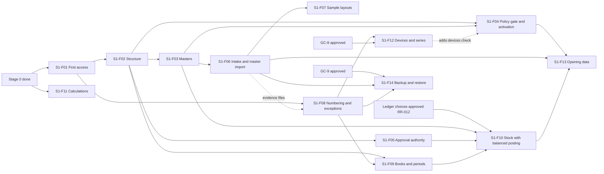

# Stage 1 — Shared foundation

> **Not ranked.** Stage 1 of [phases.md](../../phases.md), split into features. It decides nothing; phases.md, the PRD and the policies win over it.

The whole stage in one document: [spec.md](spec.md). Each feature with a spec has its own folder here: `spec.md` says what it does; `tickets/` holds one file per piece of work, with its status. Later stages are in [roadmap.md](../roadmap.md).

## 1. Goal

- An Admin sets up a synthetic Organisation: people sign in with a password and an authenticator code, and every access change is approved by a second person (`PRD-SEC-001`, `PRD-ACS-023`).
- Admin and Operations build legal entities, registrations, books, Sites, Stores, business units and locations; each business unit's mapping is verified by a different person (`PRD-ORG-005`, `POL-10.08`).
- Booking maintains products, vocabularies, codes, tracking profiles, parties and dated agreements, with proposals confirmed by another person (`PRD-MER-013`, `PRD-IMP-008`).
- Masters can be loaded from files through staging, review and publishing, without duplicates (`PRD-IMP-005`, `PRD-IMP-011`).
- An operation whose policy is not configured, or whose Site activity is not granted, stays unavailable and says why (`PRD-SEC-017`, `PRD-LIF-002`).
- Accounts sets up books, maps and periods; on synthetic data the golden scenarios post stock and balanced journals together, and the golden cases price bills identically on server and counter (`PRD-ACP-018`).
- A backup restores with linked records and attachments (`PRD-SEC-012`).

## 2. Where we are

Updated 6 Oct 2026.

| Feature | State |
| --- | --- |
| `S1-F01` First access | 3 of 21 tickets done (directory routing, command context, contracts). Ticket 4 (idempotency) half-built on a side branch, no tests yet. Ticket 7 (audit) ready to start. See [tickets](s1-f01-first-access/spec.md) section 13 |
| `S1-F11` Shared calculations | Server half done: 38 golden cases pass. The counter half waits for the counter app's home (RR-015) and Playwright (`S1-F01-T19`) |
| `S1-F10` Stock ledger | Design written and reviewed; waits for your approval of its Proposed choices, then for `S1-F02`, `S1-F03`, `S1-F05`, `S1-F08`, `S1-F09` |
| `S1-F12` Devices, `S1-F14` Backup and restore | Designs drafted (GC-8, GC-9), not yet approved |
| The other 9 features | Not started; each gets its spec and tickets when its turn comes |

Next: tickets 4 and 7 of `S1-F01`, then 5, 8, 6, 11, 9, 10, 12, 13; the screens (14 to 18) once their APIs exist.

## 3. Scope

**Included:** the "In scope" list of [phases.md](../../phases.md) stage 1, with the designs GC-1 to GC-7, and GC-8 and GC-9 drafted and awaiting approval. Reports: master lists, access and audit history, import outcomes.

**Excluded:** live Store selling, live policy-dependent stock or financial posting, loading real opening balances, the AI gateway (stage 2, `DEC-105`), messaging (stage 5, `DEC-099`), offline billing itself (stage 4). Paths for these may be exercised on synthetic data only.

## 4. Why this order

The sequence asked for was: scoped access approval; Site and business-unit setup and verification; product and party masters; one synthetic master import; then stock movement with balanced posting. It holds, with four adjustments the designs require:

1. **Sign-in comes inside the first feature.** An approval needs two authenticated people, and the first two exist only after the setup step (`PRD-ACS-023`, `DEC-101`). `S1-F01` therefore starts with setup and sign-in, then the approved role assignment. Its assignments use all-members or empty scope; selected Sites, Stores and units arrive with `S1-F02`, because `access` checks them through the `organisation` scope contract (module-map section 3, rule 6).
2. **The policy gate and Site activation come right after structure** (`S1-F04`). Two stage 1 exit checks depend on it, and every later policy-dependent operation asks it.
3. **Numbering, exceptions and books come before stock with posting** (`S1-F08`, `S1-F09`). Journals need periods, maps and numbers; a valued movement with no valid map must raise an exception in its own transaction (SL-23 Outcome A, `DEC-105`); approvals with limits need `S1-F05`.
4. **Stock with balanced posting waits for its design approval.** The ledger's interface, tables and synthetic harness are written (stock-ledger 13 to 15, with decisions H1 to H6 of `DEC-112`) and were reviewed on 6 Oct 2026; their **Proposed** choices await the product owner (RR-012). Stage 1 has no business documents to drive the golden scenarios, so a synthetic harness drives them through the real services ([S1-F10 spec](s1-f10-stock-ledger/spec.md)).

Shared calculations (`S1-F11`) depend on nothing but the domain package and can run beside everything from the start.

## 5. Features

| Feature | Workflow a person can see | Modules | Depends on | Gates (open items) | Acceptance evidence |
| --- | --- | --- | --- | --- | --- |
| `S1-F01` First access | Setup creates a synthetic Organisation with its first Admin and approver; they sign in with an authenticator code; the Admin prepares a role assignment; a different person approves it from My work; the new user can do exactly what it grants; all of it shows in history | `kernel`, `access`, `audit`, `inbox`, `configuration` (Organisation settings) | Stage 0 | Live: RR-054 to RR-056, RR-064, RR-067, RR-158 | [spec](s1-f01-first-access/spec.md) section 14 |
| `S1-F02` Organisation structure and verified mappings | Admin builds legal entities, registrations, book identities, geography, Sites, Stores, units and locations; a second person approves each change; a different person verifies each unit's mapping; assignments can now select Sites, Stores or units, and a selected Site covers places added later; master lists | `organisation`, `access` (scope contract, place tree, effective grants), `audit` | `S1-F01` | Live: RR-081 (V-18), RR-122 (V-62), RR-176, RR-178 | [structure-and-masters.md](../../design/masters/structure-and-masters.md) 9 tests 1 to 6, 14 to 16; [access-and-approvals.md](../../design/access/access-and-approvals.md) 15 tests 8, 9; stage 1 exit check 1 (mapping part) |
| `S1-F03` Product and party masters | Booking maintains brands, categories, vocabularies (confirmed by a different person), SKUs and size grids, external codes, units and packs, tracking profiles; parties and dated agreements; product proposals confirmed by a different person; bank details masked, encrypted, and changed only with a second person's approval | `merchandise` catalogue and parties, `access` (field classes, encryption), `audit` | `S1-F01`; `S1-F02` read interface | Design: RR-047 (PRD bullets and design edits for the `DEC-112` picks, before the code that implements them). Live: RR-068, RR-069, RR-077, RR-179 | structure-and-masters 9 tests 7 to 13, 18 to 21; access-and-approvals 15 test 23 (bank details) |
| `S1-F04` Policy readiness and Site activation | Admin sees each policy's status and records Signed with evidence; a different person validates real values; capabilities ship off; Operations runs readiness checks; a different person approves receiving, movement or selling for a unit; anything not configured shows unavailable with its reason. The devices check is added later by `S1-F12` | `configuration`, `site-lifecycle` (readiness), `organisation`, `access` | `S1-F01`, `S1-F02`, `S1-F03` access tasks | Code: RR-016 (two checks). Live: RR-057, RR-157 to RR-175 | access-and-approvals 15 test 1; stage 1 exit checks 5 and 6 |
| `S1-F05` Approval authority | Admin sets approval limits per action, role or person, with the basis shown; requests route to the lowest covering limit and otherwise wait; Unknown value needs explicit authority; stand-ins expire by themselves; bulk approval only for allowlisted types; overdue approvals escalate | `access`, `inbox` | `S1-F01`, `S1-F02` | Live: RR-058, RR-059, RR-065 | access-and-approvals 15 tests 13, 13a, 17, 18, 18a, 20a |
| `S1-F06` File intake and a synthetic master import | A preparer uploads a synthetic product file; intake checks it and keeps the encrypted original; the layout is found by structure; a saved, versioned mapping stages rows with each value's origin; the validation report lists problems; a reviewer publishes through the `merchandise` and `organisation` handlers; a repeat upload is a duplicate; the import outcomes report | `files-imports`, `merchandise`, `organisation`, `audit`; S3-compatible storage (MinIO locally) | `S1-F02`, `S1-F03` | Accept on `dev`: RR-187. Live: RR-036, RR-134, RR-197 (layout confirmers; customer-contact refusal on `kdps-test`), RR-201 | [imports-and-opening-data.md](../../design/platform/imports-and-opening-data.md) 17 tests 1 (XLSX, macro and link refusal; CSV is accepted in `S1-F07`, RR-205), 2, 11 to 17, 25, 26 |
| `S1-F07` Sample layouts proved on synthetic replicas | The layout library holds the KDPS PT template and the chosen vendor-PT and earlier-POS layouts as proposed layout records (GC-6 6.7), each proved on a synthetic replica; readers for XLS, XLSB and CSV (XLSX arrives with `S1-F06`); a PDF is kept as stored evidence only, its text extraction coming in stage 2 with `S2-F05` (GC-6 9.2; product owner, 6 Oct 2026, RR-205); earlier-POS line classes; comparison runs | `files-imports` | `S1-F06` | Code: RR-033 (the CSV reader). Accept: RR-189 (10,000-line parse) | imports-and-opening-data 17 tests 1 (remaining formats), 3 to 10, 19, 27 |
| `S1-F08` Number series and exceptions | Modules take gapless numbers inside their transaction; an exception gets an owner and due time from its routing, appears in My work, takes evidence, escalates, and closes only after the owning module's check; an exception survives a rollback; a job that keeps failing raises an unfinished-operation exception; operators see failed jobs; evidence files attach to exceptions and to approval decisions; live updates carry identifiers to My work | `numbering`, `exceptions`, `inbox`, `kernel` (operations view), `files-imports` (evidence) | `S1-F01`; `S1-F06` for evidence | Live: RR-060, RR-066 (V-03), RR-129 (V-70) | [numbering-and-audit.md](../../design/platform/numbering-and-audit.md) 7 tests 1 to 5; access-and-approvals 15 test 21 |
| `S1-F09` Books, posting maps, periods and tax-rule records | Accounts sets up a synthetic book with its cost formula and pool, chart and dimensions, versioned posting maps with approval, and periods; locks a period; a reopening needs a second person and admits only the named corrections; tax-rule records are kept effective-dated; trial balance | `finance` books and tax rules, `numbering`, `exceptions` | `S1-F02`, `S1-F08` | Live: RR-061, RR-070, RR-073, RR-074, RR-081, RR-198 (posting-map workflow and journal series confirmed) | [books-and-posting.md](../../design/finance/books-and-posting.md) 15 tests 2, 3, 6, 9 to 15, 18 |
| `S1-F10` Stock ledger with balanced posting | On synthetic data the story of stock-ledger 11.1 runs under both cost formulas and both pool modes; each step's journals commit with its movements; the checks of 11.7 hold after every step; scenarios G2 to G13, with G10a (G10b waits for the rounding rule); concurrency on real PostgreSQL; a large posting runs as a job while sales go on; each approval is used once; all driven by the synthetic harness through the real services | `stock` ledger, `finance` books, `access` (verify under lock, record use), `numbering`, `exceptions`, `audit`, `kernel` (lock order, jobs); the test-only harness ([spec](s1-f10-stock-ledger/spec.md)) | `S1-F02`, `S1-F03`, `S1-F05`, `S1-F08`, `S1-F09` | Code: the ledger's Proposed choices approved (RR-012, RR-227, RR-228). Accept: RR-189, RR-200. Live: RR-071, RR-072, RR-124 (G10b), RR-182 | [stock-ledger.md](../../design/stock/stock-ledger.md) 11.2 to 11.9; books-and-posting 15 tests 1, 4, 5, 7, 8, 16, 17 and section 16; access-and-approvals 15 test 16; stage 1 exit check 3 |
| `S1-F11` Shared calculations on server and counter | `packages/calculations` with its selling and costing entry points; the golden cases of GC-7 12.4 on synthetic rule data; the server suite and the counter test page in Chromium give identical results; the counter bundle provably excludes the costing entry point | `calculations`; the counter build host | Stage 0 | Code: RR-015 (counter run). Accept: RR-042 (cases where readings differ). Live: RR-136 to RR-145 | [shared-calculations.md](../../design/calculations/shared-calculations.md) 12.4, 12.5; stage 1 exit check 2; [spec](s1-f11-shared-calculations/spec.md) section 7 |
| `S1-F12` Billing devices and device bill series | GC-8 is approved; an Admin registers a billing device for a Store and its registrations; each device gets its own series per registration and financial year; a second open series is refused; revoking a device ends its sessions; a replacement starts a fresh series. Offline billing itself waits for stage 4 | `access` (devices), `numbering`, `pos` (device facts only), `organisation` | `S1-F01`, `S1-F02`, `S1-F08` | Code: GC-8 approved (RR-014). Live: RR-060, RR-101 (V-40) | numbering-and-audit 7 tests 2 to 4; access-and-approvals 15 test 5 |
| `S1-F13` Opening-data layouts and reconciliation | Layouts for opening stock, dues, advances and deposits; synthetic batches staged and validated; comparison runs against synthetic balances and a synthetic SOH; a test handler posts synthetic opening counts through the ledger as a job, in tests only until the product owner says whether it may run on `dev` (`DEC-112`, RR-013); publishing stays unavailable without policy 14 Signed and validated; a historical-reference load changes no stock | `files-imports`, `stock` ledger (test handler), `configuration` | `S1-F04`, `S1-F06`, `S1-F10` | Design: RR-047 (gap 18, opening-stock age). Live: RR-132, RR-133, RR-170, RR-197, RR-199 | imports-and-opening-data 17 tests 18, 20 to 22, 24 |
| `S1-F14` Backup, restore and export proof | GC-9 is approved; on `dev` a synthetic Organisation with linked records and attachments is backed up and restored into a fresh environment; every stored file matches its hash and opens from its record; number series stay paused until reconciled; audit seals verify; nothing is deleted while no retention period is set | `kernel` (operations), `files-imports`, `numbering`, `audit` | `S1-F06`, `S1-F08`; data from earlier features | Code: GC-9 approved (RR-010). Exit: RR-188. Live: RR-075 (V-12), RR-076 (V-13), RR-123 (V-63) | imports-and-opening-data 17 test 23; numbering-and-audit 7 tests 7, 10, 14; stage 1 exit check 4 |

## 6. When each feature can start

| Feature | Starts when |
| --- | --- |
| `S1-F01` | Started |
| `S1-F11` | Started; the server half is built. The counter run waits for RR-015 and Playwright |
| `S1-F02` | `S1-F01` merged (kernel, access, audit and inbox settled) |
| `S1-F08` | `S1-F01` merged (numbering first); evidence files after `S1-F06` |
| `S1-F05` | The `S1-F02` access tasks merged |
| `S1-F03` | `S1-F02`'s read interface merged; its access tasks after `S1-F05` |
| `S1-F04` | `S1-F02` and the `S1-F03` access tasks merged |
| `S1-F06` | The `S1-F02` and `S1-F03` maintain operations merged |
| `S1-F07` | `S1-F06` |
| `S1-F09` | `S1-F02` and `S1-F08` |
| `S1-F12` | `S1-F08`; GC-8 approved |
| `S1-F10` | `S1-F03`, `S1-F05`, `S1-F09`; the ledger's Proposed choices approved |
| `S1-F13` | `S1-F04`, `S1-F06`, `S1-F10` |
| `S1-F14` | `S1-F06`, `S1-F08`; GC-9 approved |

How many people or agents build at once (RR-031) never blocks the start.

## 7. Exit checklist

### 7.1 Exit checks from phases.md

- [ ] **One Site, units in different books and registrations, keeps correct mappings** (`PRD-ACP-013`). Evidence: [structure-and-masters.md](../../design/masters/structure-and-masters.md) 9 test 1 and [books-and-posting.md](../../design/finance/books-and-posting.md) 15 test 7 green in CI.
- [ ] **Shared golden cases pass on server and counter code** (`PRD-ACP-018`, `PRD-MOD-007`). Evidence: the Vitest suite and the Playwright counter run of [shared-calculations.md](../../design/calculations/shared-calculations.md) 12.2 green in the same CI run, with the case list and the IDs each case covers.
- [ ] **Golden stock-and-posting scenarios pass under both cost formulas and both pool modes** (`PRD-LED-014`, `PRD-LED-015`). Evidence: [stock-ledger.md](../../design/stock/stock-ledger.md) 11.2 to 11.7 and books-and-posting 16 green, driven through the real services by the synthetic harness ([S1-F10 spec](s1-f10-stock-ledger/spec.md)). This check is the story of stock-ledger 11.1, as [phases.md](../../phases.md) names it; G10 is not part of it. `S1-F10` proves G10a (with no rounding rule the outflow is refused and commits nothing; an emptying outflow leaves no residue); G10b waits for the rule and is in the stage 2 live activation of [roadmap.md](../roadmap.md) (2.3), never passed by an invented rule.
- [ ] **A backup restores with linked records and attachments** (`PRD-SEC-012`). Evidence: the GC-9 design approved; a restore drill record on `dev` with synthetic data: steps, start and end times, every stored file matching its hash and opening from its record ([imports-and-opening-data.md](../../design/platform/imports-and-opening-data.md) 17 test 23), number series paused until reconciled ([numbering-and-audit.md](../../design/platform/numbering-and-audit.md) 7 test 7), audit seals verified.
- [ ] **An operation whose policy is not configured stays unavailable** (`PRD-SEC-017`). Evidence: [access-and-approvals.md](../../design/access/access-and-approvals.md) 15 test 1, imports-and-opening-data 17 test 22 and books-and-posting 15 test 15 green; a browser journey showing the reason on screen.
- [ ] **An activity stays disabled for a Site or business unit until its readiness checks pass** (`PRD-LIF-002`). Evidence: the `S1-F04` acceptance tests green.

### 7.2 Checks every stage owes

- [ ] Concurrency on real PostgreSQL: stock-ledger 11.9, `S1-F01-AT14`, imports-and-opening-data 17 test 15, numbering-and-audit 7 test 2.
- [ ] Organisation isolation in every module that holds data: access-and-approvals 15 test 2, structure-and-masters 9 test 14.
- [ ] Self-approval refused for every independently approved action built in stage 1: access changes, structure, mapping verification, agreements, bank details, vocabulary, product proposals, mapping rules, layout and mapping versions (`DEC-112`), posting-map and account versions (`DEC-112`), stand-ins, period reopening.
- [ ] Stale-version refusal, duplicate requests answered once, and partial-failure rollback (one failing line fails its document; an exception survives the rollback that found it).
- [ ] Persona browser journeys for every stage 1 screen, including recovery: a locked session keeps unfinished work, and a reload in the middle of an approval decides nothing twice.
- [ ] The 10,000-line PT parse within one minute (RR-189) and the large posting while counters sell (stock-ledger 11.9), on synthetic data.

### 7.3 Completeness

- [ ] `S1-F01` to `S1-F14` accepted, each with its evidence.
- [ ] GC-8, GC-9 and the stock ledger interface and tables approved by the product owner (RR-010, RR-012, RR-014).
- [ ] Stage 1 reports exist: master lists, access and audit history, import outcomes.
- [ ] Every PRD bullet owned by a stage 1 feature passes the part its owner builds, and every bullet completed in stage 1 passes its whole acceptance ([coverage.md](../coverage.md)).
- [ ] No KDPS-valued setting has a default, and no synthetic value is read as one.
- [ ] The link check passes in CI; [open-items.md](../open-items.md) and [STATUS.md](../../STATUS.md) are up to date.

### 7.4 Live activation (separate from exit)

On production:

- [ ] Policies 2, 4, 9 and 18 Signed, with their real values validated by a different person (RR-158, RR-160, RR-165, RR-174).
- [ ] KDPS's role map, limits, exception routing, sign-in settings, tracking profiles, cost method, recovery targets and retention entered and validated (RR-064 to RR-068, RR-071, RR-075, RR-076).
- [ ] Production hosting chosen and designed (RR-029).
- [ ] Admin's restore drill done on production before go-live, with Operations and Accounts validating totals (`POL-18.03`, RR-123, RR-188).

On `kdps-test`, for KDPS's real masters before the side-by-side test:

- [ ] KDPS agrees to hold real data there (RR-180).
- [ ] Test role assignments prepared from what KDPS says and approved by a second person (`DEC-103`); the first reason list approved with a free-text reason (GC3-12, `DEC-104`).
- [ ] Gated actions stay unavailable (`DEC-071`).
